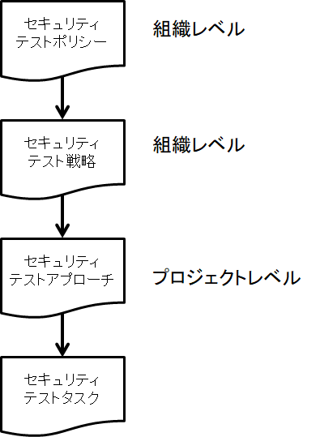

Security Tester Advanced Level Syllabus
=======================================

## 1 セキュリティテストの基礎 -  105分

**キーワード**
データのプライバシー、倫理的なハッカー、情報セキュリティ、侵入テスト、リスクアセスメント、リスクエクスポージャー、リスク軽減、セキュリティ攻撃、セキュリティ監査、セキュリティポリシー、セキュリティ手順、セキュリティリスク

**セキュリティテストの基礎となる学習目標**

**1.1セキュリティリスク**
* AS-1.1.1（K2）セキュリティテストの計画と設計のための情報提供とセキュリティテストとビジネスニーズとの整合におけるリスクアセスメントの役割を理解する
* AS-1.1.2（K4）保護する重要な資産、各資産の価値、および各資産に必要なセキュリティのレベルを評価するために必要なデータを識別します。
* AS-1.1.3（K4）現在および将来のセキュリティ上の脅威を特定するために、与えられた状況におけるリスクアセスメント手法の効果的な使用を分析する

**1.2 情報セキュリティの方針と手順**
* AS-1.2.1（K2）セキュリティ方針と手順の概念、およびそれらが情報システムにどのように適用されるかを理解する
* AS-1.2.2（K4）有効性を判断するためにセキュリティテストの結果と一緒に一連のセキュリティポリシーと手順を分析する

**1.3 セキュリティ監査とセキュリティテストにおけるその役割**
* AS-1.3.1（K2）セキュリティ監査の目的を理解する

機能テストは、リスク、要件、ユースケース、モデルなど、さまざまな項目に基づいています。 セキュリティテストはこれらの仕様のセキュリティ面に基づいていますが、セキュリティリスク、セキュリティ手順とポリシー、攻撃者の行動、および既知のセキュリティの脆弱性の検証と妥当性確認も試みています。

### 1.1 セキュリティリスク
#### 1.1.1 セキュリティテストにおけるリスク評価の役割
セキュリティテストの目的はセキュリティリスクに基づいています。 これらのリスクは、セキュリティリスクアセスメントを実行することによって識別されます。 一般的なリスク管理手法は[ISTQB_FL_SYL]と[ISTQB_ATM_SYL]に記述されています。

リスクは、エンティティが潜在的な状況またはイベントによって脅かされている程度の尺度であり、通常は次の関数です。
* 状況または出来事が発生した場合に発生する可能性のある悪影響
* 発生する可能性

情報セキュリティリスクとは、機密性、完全性、または情報または情報システムの可用性の喪失から生じ、組織の運営（任務、機能、イメージ、または評判）、組織の資産、個人、他の組織、そして国に対する潜在的な悪影響を反映するリスクです。  [NIST 800-30]

セキュリティリスク評価の役割は、どの領域や資産が危険にさらされている可能性があるのかを組織が理解し、それぞれのリスクの規模を判断することを可能にすることです。 セキュリティテスト担当者にとって、セキュリティリスクアセスメントは、セキュリティテストを計画および設計するための豊富な情報源になります。 さらに、セキュリティリスクアセスメントを使用してセキュリティテストに優先順位を付けることができるため、最高レベルのテストの厳格さと適用範囲を、リスクの高い領域に集中させることができます。

セキュリティリスクアセスメントに基づいてセキュリティテストに優先順位を付けることで、テストはビジネスセキュリティの目的に沿ったものになります。 ただし、この調整を行うには、セキュリティリスク評価に組織のセキュリティ上の脅威、影響を受ける関係者、および保護する資産を正確に反映させる必要があります。

リスク評価（セキュリティまたはその他）は、特定の時点におけるスナップショットにすぎず、無効な仮定や結論につながる可能性がある限られた情報に基づいていることを理解することが重要です。 セキュリティリスクは、新しい脅威が日々出現するため、組織やプロジェクト内で絶えず変化しています。 したがって、セキュリティリスク評価は定期的に実行する必要があります。 セキュリティリスクアセスメントを実行するための正確な時間間隔は、組織とそれが経験する変化の程度によって異なります。 一部の組織は3〜6ヶ月ごとにセキュリティリスクアセスメントを実行し、他の組織は年次ベースでそれらを実行します。

リスク評価に関するもう1つの問題は、参加者の知識レベルです。 詳細情報が不足しているため、リスクを見逃す可能性があります。 さらに、人々がセキュリティの脅威とリスクを理解していないと、リスクが見逃される可能性があります。 このため、さまざまな人々からの入力を求め、彼らが提供する情報に含まれている詳細のレベルに注意を払うのが良いでしょう。

重要なセキュリティリスクが評価で見逃される可能性があるという悪い仮定が発生する可能性があることは現実的な予想です。 欠落または不完全なリスク情報の可能性に対処する方法には、確立されたセキュリティリスク評価方法をチェックリストとして使用したり、複数の人々から情報を得たりすることが含まれます。 そのような方法論の1つは[NIST 800-30]にあります。

#### 1.1.2 資産識別

コピーされた文書（契約書、計画書、メモ書き、ログイン、およびパスワード）のように、保護されるすべての情報がデジタル形式であるとは限りません。 デジタル形式ではありませんが、この情報には大きな価値があります。 したがって、どの情報がデジタルでどれがそうでないのかという質問をする必要があります。 おそらく保護される資産はデジタルと物理の両方のフォーマットで存在します。 保護する資産を特定する際には、次の質問をする必要があります。

**どの資産が組織にとって価値がありますか？**
価値の高い機密情報の例は次のとおりです。
* 顧客データ
* 事業計画
* 同社が開発した独自のソフトウェア
* システムマニュアル
* 会社の財産である写真や図表
* 知的財産（プロセス、企業秘密など）
* 財務スプレッドシート
* プレゼンテーションとトレーニングコース
* ドキュメント
* メール
* 従業員レコード
* 税務申告書

多くの資産は情報に基づいていますが、組織内の一部の資産は物理的または無形の性質のものである可能性があります。 これらの資産の例には次のものがあります。

* 開発中の新しいデバイスの物理プロトタイプ
* サービスを提供する能力
* 会社の評判と信頼

**その資産はどれほど価値がありますか？**
多くの機微な資産は明白な価値を持っています。 他の人たちは、損失のコストと結果でもっと測定されます。 たとえば、競合他社がライバルの事業計画をどうするのでしょうか。

価値を確実に評価することは困難です。 ただし、デジタル資産の価値を判断する方法には、次のものがあります。

* 資産によって生み出される将来の収益
* 情報を入手できる競合他社にとっての価値
* 資産の再作成に必要な時間と労力
* 監査や訴訟など、必要なときに情報を提供できなかったことに対する罰金と罰金
* 顧客データの損失に対する罰金と罰金

**デジタル資産はどこにありますか？**
これまでは、デジタル資産はサーバー、デスクトップコンピューター、ディスクやCDなどの周辺機器にありました。これは古くて整理されていないアプローチですが、古いCD、DVD、USBドライブには機密データが残っている可能性があります。 デジタル資産を保存するためのより安全な方法は、すべての機密データに強力な暗号化を使用する、安全なエンタープライズサーバーの使用です。 安全なサーバーに保存されている機密データにアクセスするには、認証と承認が必要です。 さらに、インターネット経由で機密情報にアクセスするためのデジタル証明書など、他のセキュリティ保護が必要になる場合があります。

ストレージは変化しています。 現在、スマートフォン、タブレット、thumbドライブなどのモバイルデバイスに大量のビジネスデータが存在する可能性があります。 デジタル情報がクラウドストレージに移行されると、データアクセスに基づく一連の新しいセキュリティ上の問題が発生します。

データストレージの問題の重要性は、機密データを信頼している人々が、個人の顧客データとビジネスデータでいっぱいになったハードドライブを使用して会社の建物から出て行ったという過去の事例から生じます。 米国におけるそのような事件の1つは、政府の治安機関の安全な場所から盗まれたハードドライブを含み、これには10万人以上の現職および元労働者の給与と銀行の情報が含まれていました。 [Washington Post、2007]。

**デジタル資産はどのようにアクセスされますか？**
デジタル資産にアクセスするための一般的な方法は次のとおりです。
* ローカルエリアネットワークまたはWi-Fiネットワーク経由のコンピュータアクセス
* Virtual Private Network（VPN;バーチャルプライベートネットワーク）またはクラウドドライブを介したリモートアクセス
* 物理的なデータストア（CD、DVD、USBドライブ）を人から人に渡すこと。これはローテクですが非常に一般的な方法です。
* ファイルを電子メールで送信する

**デジタル資産はどのように保護されていますか？**
デジタル資産を保護する方法はいくつかあります。
* 暗号化（どのタイプと強度、誰が鍵を持っていますか？）
* 認証とトークン（デジタル証明書が必要ですか。パスワードポリシーは適切であり、準拠していますか）。
* 認可（デジタル資産を扱うユーザーに付与されている特権のレベルはどれですか？）

#### 1.1.3 リスクアセスメント手法の分析
セキュリティリスクアセスメントプロセスは、標準的なリスクアセスメントと非常によく似ていますが、主な違いはセキュリティ関連分野への焦点です。

セキュリティリスクアセスメントには、外部のセキュリティテストの利害関係者（すなわち、プロジェクトに関与している、または社外にいてプロジェクト/製品のセキュリティに明確な利害関係を持っている製品または関係者または関係者）の視点を含める必要があります。 これらの利害関係者は次のとおりです。

* 顧客とユーザー - 視点を理解し、セキュリティテストのための情報を得て、そして良いコミュニケーションを確立するのに役立ちます。
* 公衆と社会 - 情報セキュリティが地域社会の努力と責任であることを伝えるために重要
* 規制機関 - 情報セキュリティに関する適用法の遵守を確保するために必要

リスク評価の準備には、以下の作業が含まれます[NIST 800-30]。
* 評価の目的を特定する
* 評価の範囲を特定する
* 評価に関連する仮定と制約を特定する
* 評価へのインプットとして使用される情報の出所を特定する。
* 評価中に採用されるリスクモデルと分析的アプローチ（すなわち、評価と分析アプローチ）を特定する。

リスク評価の実施には、以下の具体的な作業が含まれる[NIST 800-30]。
* 組織に関連する脅威の原因を特定する
* これらの情報源によって発生する可能性がある脅威イベントを特定する
* 特定の脅威イベントを介して脅威の発生源によって悪用される可能性がある組織内の脆弱性と、悪用に影響を与える可能性がある素因となる条件を特定する
* 特定された脅威の発生源が特定の脅威イベントを発生させる可能性、および脅威イベントが成功する可能性を判断する
* 脅威による脆弱性の悪用から生じる、組織の運営や資産、個人、他の組織、および国家への悪影響を判断する

情報の伝達と共有は、以下の具体的な作業からなる[NIST 800-30]。
* リスクアセスメントの結果を伝達する
* 他のリスク管理活動を支援するために、リスク評価の実行において開発された情報を共有する。

### 1.2情報セキュリティの方針と手順
#### 1.2.1セキュリティポリシーと手順について
ビジネスモデル、特定の業界、および組織が直面する固有のセキュリティリスクに基づいて、情報セキュリティポリシーが組織間で異なることは一般的です。 さまざまなバリエーションがあっても、セキュリティポリシーの目的は似ています。 すべてのセキュリティポリシーの基礎は、特定のセキュリティの脅威とそれらが組織に与える影響を調べるセキュリティリスク評価です。 [Jackson, 2010]

セキュリティポリシーの例には以下が含まれますが、これらに限定されません。[Jackson、2010]

**許容される用途** - このポリシーは、組織のセキュリティポリシーと手順に準拠するためにコンピュータシステムのユーザーが従うべき慣行を定義します。 このポリシーは、ネットワーク、Webサイト、データなどのデジタルリソースを使用する際の許容できる動作と許容できない動作の両方を対象としています。 また、このポリシーは組織のシステムの内部ユーザーと外部ユーザーの両方に適用できます。 システムのユーザーが常にポリシーを理解して従うことが重要です。 混乱や偶発的なポリシー違反を防ぐために、許容できる行動、許容できない行動、および要求される行動に関する特定の規則を定義する必要があります。

**最小アクセス** - このポリシーは、特定のタスクを実行するために必要な最小アクセスレベルを定義します。 このポリシーの目的は、タスクを実行するために必要な権限を超えて、ユーザーにアクセス権が付与されるのを防ぐことです。 必要以上に高いアクセス権を持つことは、不注意または意図的なユーザー特権の悪用の機会を提供する可能性があります。

**ネットワークアクセス** - このポリシーは、ローカルエリアネットワーク（LAN）やワイヤレスネットワークなどのさまざまな種類のネットワークにアクセスするための基準を定義します。 さらに、このポリシーは、ネットワーク上で許可されているものと許可されていないものを定義できます。 このポリシーは、多くの場合、ルーターやホットスポットなどの未承認のデバイスをネットワークに追加することをユーザーに禁止します。

**リモートアクセス**  - このポリシーでは、リモートネットワークアクセスを社内従業員と社外（従業員以外）の両方のユーザーに許可するために必要なものが必要です。 VPNの使用法はこのポリシーでカバーされることがよくあります。

**インターネットアクセス** - このポリシーは、組織の従業員およびゲストによるインターネットの許可された使用法を定義します。 このポリシーの範囲には、ギャンブルやポルノサイトなど、アクセスされる可能性がある、またはアクセスされない可能性があるWebサイトの種類が含まれ、さらにインターネットの非営利目的での使用が許可されるかどうかが含まれます。 ポリシーでカバーされている項目のいくつかは、利用規定でも取り上げられているかもしれませんが、インターネット上でビジネスをしている人々の数のために、いくつかの組織はこのポリシーを別々に定義します。

**ユーザーアカウント管理** - このポリシーは、ユーザーアカウントの作成、保守、および削除を定義します。 ポリシーへのコンプライアンスを確実にするために、ユーザーアカウントの定期的な監査もこのポリシーでカバーされています。

**データの分類** - セキュリティの観点からデータを分類する方法はたくさんあります。 このシラバスでは、「機密データ」という用語は、損失を防ぐために保護する必要があるデータの総称として使用されています。 データ分類ポリシーは、機密と見なされ、保護する必要があるさまざまな種類のデータを定義します。 データ分類ポリシーを持つことで、組織は、組織とその顧客にとっての価値に基づいてデータを保護するためのコントロールを作成できます。 通常、データを作成する事業領域は、標準の分類構造に基づく分類に対して責任を持ちます。

以下は、（ビジネスコンテキストからの）データ分類構造の例です。

* 公開：組織の内外を問わず、誰でもこのデータを閲覧できます（例：外向きの文書やWebページ）。

* 機密：これは通常、内部で作成された文書のデフォルトの分類です。 これらの文書には、組織の内部で使用されている電子メール、レポート、およびプレゼンテーションを含めることができます。 その一例が売上報告です。 このデータを許可されたユーザーだけがこのレベルの情報を扱うことができるはずです。 この種の情報をコンサルタントなどの第三者と共有する前に、機密保持契約がしばしば必要とされます。

* 機密性が高い：これは、組織内の特定の人々だけが利用できるようにする必要がある機密情報のためのより高いレベルの機密性です。 これには、企業秘密、戦略計画、製品デザイン、および非公開の財務データなどの情報が含まれます。 このタイプのデータの共有は、データ所有者の明示的な許可がある場合を除き、許可されていません。

* 非公開：これは、その情報にアクセスする権限を特別に与えられている必要がある組織の役員に限定されることが多い情報です。 開示された場合、この情報は組織に財務上の悪影響などの大きな悪影響を及ぼす可能性があります。 損失に伴うリスクが高いため、個人情報は細心の注意を払って保護する必要があります。 このデータには、研究開発情報、M&A計画、クレジットカードやアカウント情報などの顧客情報が含まれます。

* 秘密：企業の文脈では、これは組織が変更を加えるために外部の当事者から得る情報ですが、それは組織の内外で知られることは許されていません。企業の文脈における例は、他の会社の共同作業を含む新しいタイプの技術に取り組んでいるコンサルタントによって作成された設計文書であり、それぞれが技術が明らかにされる準備ができるまで情報を秘密のレベルに保たなければなりません。それは、それ自体が組織にとって明白な価値を持たない可能性があるという点を除いて、機密性の高いものと同等です。その点で、それは企業秘密とは異なります。しかし、秘密情報の開示は、組織、他の組織、または国に害を及ぼす可能性があります。軍事および政府の文脈では、これは開発または取得される可能性がある情報ですが、ある程度のセキュリティクリアランスを持つ人々にのみ知られている必要があります。軍事の文脈では、これには、国防に極めて重要な直接的な軍事適用を有する新しい技術開発または技術を組み込んだ科学的または研究プロジェクトの詳細が含まれます。

**設定と変更管理** - このポリシーは、予期しない影響による機能停止を防ぐために、システムへの変更がどのように管理および設定されるかを説明するなど、通常の運用コンテキストを持つことができます。 セキュリティの観点から見ると、構成管理はセキュリティ設定が安全なデバイスやアプリケーションにどのように適用されるかを制御します。 危険なのは、安全なデバイスを不正に変更すると、検出されない可能性があるセキュリティの脆弱性を引き起こす可能性があることです。

もう1つのリスクは、コードまたはアプリケーションの構成に対する許可されていない変更がセキュリティ上の脆弱性を引き起こす可能性があることです。 このポリシーには、使用される標準構成、すべての変更に対する承認プロセス、および問題が発生した場合のロールバックプロセスが含まれます。 このポリシーは、組織内のすべてのITサービス、アプリケーション、およびデバイスに適用できます。

**サーバーセキュリティ** - このポリシーは、企業のセキュリティ慣行、およびサーバーとシステムのインストール、構成、運用に関する業界のベストプラクティスに従う責任をサーバーの所有者に伝えます。 さらに、ベースライン構成は定義および維持することが義務付けられています。 このポリシーで説明されているプラクティスの例には、セキュリティ要件、バックアップと回復、およびアクティブなサービスをアプリケーションの実行に必要なものに限定することが含まれます。 このポリシーには、サーバーが正しく構成および更新されていることを確認するための要件の監視および監査も含まれる場合があります。

**モバイルデバイス** - モバイルデバイスにはセキュリティ上の問題があるため、モバイルデバイスには別のポリシーが必要になる場合があります。 たとえば、ラップトップやスマートフォンは簡単に紛失したり盗まれたりする可能性があり、その結果、会社や個人のデータが失われる可能性があります。 これらのデバイスもマルウェアと接触する危険性が高いです。 これらのリスクには、リスクを軽減し、組織がセキュリティの脅威にさらされるのを制限するために従う必要がある特定の規則と注意事項が必要です。 このポリシーには、データを暗号化する必要がある要件、マルウェア対策ソフトウェアの現在のバージョンのインストールとメンテナンス、およびデバイスにアクセスするためにパスワードが必要な場合が含まれる場合があります。 また、モバイルデバイスに存在できる組織情報の種類もこのポリシーで定義されています。 ラップトップコンピュータのケーブルをロックしたり、紛失または盗難にあったデバイスを報告するための手順を実行するなど、物理的なセキュリティについても対処できます。

**ゲストアクセス** - このポリシーでは、組織を保護するために企業が組織のネットワーク上でゲストや他のユーザーをホストできるようにするために必要なプラクティスを定義します。 このポリシーの1つの側面は、ゲストにネットワークアクセスを許可する前に、許容される使用ポリシーを読み、同意することをゲストに要求することです。 このポリシーは、利用可能な利用ポリシーにゲストに署名してから一時アクセス用のコードを提供するなど、さまざまな方法で実装できます。 このポリシーの主な目的は、組織のセキュリティ標準を強制し、それでもゲストがネットワークまたはインターネットにアクセスできるようにするための手順を提供することです。

**物理的セキュリティ** - セキュリティ保護されたデバイスに物理的に近接しているとセキュリティ侵害の危険性が高まるため、このポリシーは物理的施設に必要な制御を定義します。 この方針は、停電、盗難、火災、自然災害などの他のリスクもカバーできます。 また、ここでは、特に機密情報が保管されている地域で、どのデバイスを会社から取り出したり持ち込んだりできるかについても説明します。

**パスワードポリシー** - このポリシーは、強固なパスワードおよびその他の安全なパスワード慣行の最低要件、たとえば必須パスワードの変更間の許容時間、パスワードのプライバシー保護方法（「パスワードの保存」機能を使用しないなど）を定義します。 パスワードの共有を禁止し、電子メールによるパスワードの送信を禁止します。 このポリシーは、アプリケーション、ユーザーアカウント、およびパスワードが必要なその他の場所に適用できます。

**マルウェア対策** - このポリシーは、マルウェアを防止、検出、削除するための防御と動作のフレームワークを定義します。 マルウェアとスパイウェアはさまざまなソースから拾い上げることができるので、これは組織内の全員にとって理解し従うための重要なポリシーです。 たとえば、このポリシーはUSBドライブの使用を制限することがあります。

**インシデント対応** - このポリシーでは、セキュリティ関連のインシデントに対応する方法について説明します。 これらのインシデントは、マルウェアの発見や許容される使用ポリシーの違反から、機密データへの不正アクセスまでさまざまです。 ケースバイケースで適切な対応を決定する必要性を回避するために、インシデントが発生する前にこのポリシーを設定しておくことが重要です。 この方針は、メディアの対応や法執行機関への通知などのコミュニケーションにも対応しています。

**監査ポリシー** - このポリシーは、監査を実施する目的で監査人がシステムへのアクセスを要求することを承認します。 監査チームは、ログデータ、ネットワークトラフィックレコード、その他のフォレンジックデータにアクセスする必要があるかもしれません。

**ソフトウェアライセンス** - このポリシーは、組織が使用するソフトウェアを取得してライセンスを取得する方法を規定しています。 市販のソフトウェアライセンスが侵害された場合、その組織は罰金や訴訟の危険にさらされています。 このため、ライセンスを識別して監視することが重要です。 未承認のソフトウェアをダウンロードしてインストールすることは、このポリシーでよく見られる重要な禁止事項です。

**電子監視とプライバシー** - 組織は、会社のハードウェアとリソースにまたがる電子通信を監視する権利と責任を持っています。 これには、Eメールのやりとりとソーシャルメディアが含まれます。 この方針は、どのモニタリングが組織によって実行され、どのデータが収集の対象となるかを概説しています。 法律は国によって異なるため、このポリシーを作成する前に弁護士が必要です。[Jackson, 2010]

**セキュリティ手順**
セキュリティ手順では、特定のポリシーまたは統制を実装する際に取るべき手順と、特定のセキュリティインシデントに対応してとるべき手順を指定します。 正式な文書化された手順は、セキュリティポリシーと強制管理の実施を容易にします。

ポリシー、標準、およびガイドラインでは、実施する必要があるセキュリティ管理策について説明し、手順では詳細を説明し、セキュリティ管理策を段階的に実装する方法を説明します。 たとえば、適切なアクセスレベルを確実に付与してユーザーの権利が適用可能なポリシー、標準、およびガイドラインを満たすようにするために必要な各ステップを詳述しながら、ユーザーアクセスレベルを付与する方法を説明する手順を記述できます。

### 1.2.2 セキュリティポリシーと手順の分析
一連のセキュリティポリシーと手順を評価する前に、評価の目的を決定し、ポリシーと手順の妥当性を判断するための一連の基準を定義することが重要です。 場合によっては、この基準は、COBIT [COBIT]、ISO 27001 [ISO 27001]、またはPCI [PCI]などの規格によって定義されることがあります。

さらに、以下を定義する必要があります。
* 評価されている特定の分野でのスキルと知識に関して必要なリソース
* 方針と手続きの妥当性をどのように測定するか
* 測定および評価する対象（例：有効性、効率性、ユーザビリティ、採用）
* 方針と手順が組織内のどこにあるか
* 評価を導き、一貫性を追加するためのチェックリスト

チェックリストは、監査人にどこを見て何を期待するかを指示するガイドとして機能します。 パスワード監査ツールなどのツールは、特定の統制をテストして目標を達成しているかどうかを判断し、後でリスク評価に使用できるデータを生成するのに役立ちます。 監査人は、方針、統制および基準への「証拠」の遵守を見つけるように努めます。 以下のリストのタスクの中には、本質的に静的なものもあれば、実行中のプロセスを観察するなど、動的なものもあります。 監査人は次のことを行います。

* システムのドキュメントを確認する
* 政策や手続きの有効性に対する人々の認識について調査する。
* 管理されているプロセスに関与している主要担当者へのインタビュー
* 目撃しているシステムとプロセス
* 以前の監査結果を分析して傾向を発見する
* ログとレポートの分析
* ファイアウォール設定や侵入検知システム設定などの技術的な制御設定を見直す
* 異常または疑わしいトランザクションのデータトランザクションをサンプリングする[Jackson、2010]

**統制**
セキュリティ管理策は、対応する脆弱性に作用する脅威、すなわちセキュリティリスクによる損失または利用不能を回避、相殺、または最小限に抑えるための技術的または管理上の保護手段または対策である。 [Northcutt、2014]たとえば、給与計算システムのセキュリティ管理策では、2人が別々に従業員の賃金情報への変更を承認する必要があります。 セキュリティテスト担当者は、組織内の特定の管理策を認識し、セキュリティテストにそれらのテストを含める必要があります。

主なセキュリティ管理の種類は、管理、技術、および物理です。 各カテゴリの下で、実装できる具体的な管理策は、予防的、探偵的、是正的、または回復的です。 これらのコントロールの種類は連携して動作します。一般に、資産を効果的に保護するために、各カテゴリからコントロールを提供する必要があります。 [Jackson, 2010]

トップ20の重要なセキュリティ管理策のリストは、www.sans.orgで見つけることができます。 [Web-1]

**セキュリティテスト**
セキュリティポリシーと手順の静的分析と比較した場合のセキュリティテストの主な違いは、セキュリティポリシーと手順の有効性を検証または検証するために特別に設計されたテストの結果を使用することです。 これらのテストでは、セキュリティポリシーが設定されている可能性があり、それに従う可能性があるというリスクに焦点が当てられていますが、資産の保護には効果がありません。

セキュリティポリシーと手順の評価を実行している間に、特定のタスクが実行されたことを通知することもできます。 これらのタスクのセキュリティテストは、セキュリティポリシーと手順が実際にどれほど効果的であるかを判断するのに役立ちます。 たとえば、パスワードポリシーと手順は紙上では合理的かつ効果的に思えるかもしれませんが、パスワード解読ツールを使用すると、その手順はその目標には及ばない場合があります。

セキュリティポリシーと手順は、セキュリティテストの元になります。 ただし、セキュリティテスト担当者は攻撃が常に進化していることを覚えておく必要があります。 新しい攻撃が発生し、他のソフトウェアアプリケーションと同様に、新しい欠陥が明らかになることがあります。これらすべてが、攻撃者の考え方からセキュリティテストを実行する理由です。

### 1.3 セキュリティ監査とセキュリティテストにおけるその役割

セキュリティ監査は、組織のセキュリティプロセスとインフラストラクチャの弱点を特定する手動の検査と評価です。 手続きレベルでのセキュリティ監査（例えば、内部統制の見直し）は手動で行うことができます。 アーキテクチャレベルでのセキュリティ監査は、セキュリティ監査ツールを使用して実行されることが多く、ネットワーキング、サーバーアーキテクチャ、およびワークステーション用の特定のベンダソリューションと整合性があります。セキュリティテストと同様に、セキュリティ監査はすべての脆弱性が発見されることを保証するものではありません。 ただし、監査は問題のある領域を特定し、修復が必要な場所を示すためのセキュリティプロセスのもう1つのアクティビティです。

一部のセキュリティ監査アプローチでは、監査プロセスの一部としてテストが実行されます。 ただし、セキュリティ監査の範囲はセキュリティテストよりはるかに広いです。 セキュリティ監査では、手順、ポリシー、統制など、直接的な方法でテストすることが困難な分野を調査することがよくあります。 セキュリティテストは、ファイアウォールの設定、認証と暗号化の正しい適用、ユーザー権限の適用など、セキュリティをサポートするためのテクノロジにより深く関わっています。

セキュリティ監査には5つの柱があります[Jackson、2010]。

**評価** - 評価では、潜在的な脅威、重要な資産、ポリシーと手順、およびリスクに対する経営陣の許容度を文書化し、識別します。 評価はワンタイムイベントではありません。 環境とビジネスは常に流動的であるため、評価は定期的に実施されなければなりません。 これはまた、セキュリティポリシーが依然として適切で効果的であるかどうかを知る機会を提供します。

**防止策** - これは技術を超えて拡張され、管理上、運用上、および技術上の管理が含まれます。 予防は技術だけではなく、方針、手順、そして意識を通じても達成されます。 ありとあらゆる攻撃の防止は現実的ではありませんが、防御の組み合わせは攻撃者が成功するのをはるかに困難にするのに役立ちます。

**検出** - 検出とは、セキュリティ侵害または侵入がどのように識別されたかを意味します。 適切な検出メカニズムがないと、ネットワークが危険にさらされているかどうかわからないというリスクがあります。 探偵コントロールは、セキュリティインシデントを識別し、ネットワーク上のアクティビティを可視化するのに役立ちます。 早期インシデント検出により、サービスを迅速に回復するための適切な対応が可能になります。

**反応** - 優れたセキュリティ防御と検出メカニズムにより、反応時間は大幅に短縮されます。 セキュリティ侵害は悪い知らせですが、セキュリティ侵害が発生したかどうかを知ることは重要です。 素早い反応時間は、事件への曝露を最小限に抑えるために重要です。 迅速な対応には、対応に必要なデータと状況を提供するための優れた予防的防御と検出メカニズムが必要です。 インシデント対応のスピードと効率は、組織のセキュリティ対策の有効性を示す重要な指標です。

**回復** - 回復は、最初にインシデントの原因となったのと同じ脆弱性や状態を再現することなくシステムを回復できるように、何が起こったのかを判断することから始まります。 回復フェーズは、システムの復元だけでは終わりません。 また、将来同じ種類の脆弱性が発生する可能性を減らすために、プロセス、手順、およびテクノロジにどのような変更を加える必要があるかを判断する根本原因分析もあります。 監査人は、組織が将来の同様の事件を防止する方法を含む回復計画を立てていることを確認しなければなりません。

#### 1.3.1セキュリティ監査の目的

以下は、セキュリティ監査で検出される可能性のある項目の一覧です。

* 不適切な物理的セキュリティ セキュリティポリシーでは、ストレージと送信の両方で、すべての顧客データの暗号化が必要になる場合があります。 たとえば、監査中に、毎週1回、顧客情報ファイルがすべてのマネージャに物理的なレポートで送信されることがわかりました。 この報告は毎週破棄されますが、管理者の中には不用意にゴミを探している人が見つけられるような物理的な報告をゴミ箱に捨てていることが発見されています。

* 不適切なパスワード管理。 セキュリティポリシーにより、各ユーザーは30日ごとにパスワードを変更する必要があります。 セキュリティ監査の結果、パスワードが変更されたことが判明しましたが、多くのユーザーは毎月「PasswordA」と「PasswordB」を交互に使用していました。 （パスワード履歴は、パスワード監査ツールの一般的な機能です。）

* ユーザー権限および共有権限に対する不適切な管理。 否定的な発見の例としては、ユーザーが自分の仕事を実行するのに必要なものよりも多くのアイテムへのアクセス権を付与されている場合があります。 別の例としては、個々のユーザーのファイルをプライベートにする必要があるときに、それらのファイルがネットワーク上で共有される場合があります。 これは、ノートPCを使用しているユーザー、特に自宅または公共の場所でWi-Fi接続を介してイントラネットにアクセスするユーザーにとって特に問題です。

* サーバーレベルのセキュリティが不十分です。 具体的な監査分野は次のとおりです。
  * ポート割り当てとセキュリティ
  * データの保護
  * ユーザアカウントの保護（ログインおよびその他の機密情報）

* ベンダーセキュリティアップデートの不適切な適用

* 不適切な侵入検知メカニズム

* セキュリティ違反が発生した場合の不適切な対応計画

#### 1.3.2 リスクの特定、評価、および軽減

監査によって問題の領域が特定されたら、リスクを評価し、改善計画を立てる必要があります。 監査人の報告書には、推奨事項およびその他のリスクの分野が含まれる場合があります。 この時点から、リスクの特定、評価、および軽減活動を計画することができます。

リスク識別は、リスクまたはリスクの範囲を文書化するプロセスです。 ITセキュリティの文脈では、リスクはセキュリティ関連です。 リスク評価は、特定されたリスクに値を割り当てる活動です。 従来のITリスク評価モデルではITセキュリティリスクに対処するのに十分ではないことを理解することが重要です。 セキュリティリスクアセスメントのモデルやアプローチはすべて、ITセキュリティリスクプロファイルに特化している必要があります。

セキュリティリスクは多くの場合、リスク顕在の観点から測定されます。 リスク顕在は、潜在的な影響または損失に、その損失が発生する可能性を掛けて計算されます。 たとえば、ある顧客のアカウント情報が侵害された場合、どのような影響がありますか？ その顧客が1億ドルの資産を預け入れているとしたらどうでしょうか。

発生の可能性は、NIST Publication 800-30、リスクアセスメント実施の手引き[NIST 800-30]に見られるようなセキュリティリスクアセスメントモデルを適用することによって決定することができる。 セキュリティリスク評価を実行するためのもう1つの優れたガイドは、OWASPリスク評価方法論[OWASP2]です。 以下の情報は[NIST 800-30]から抽象化されたものです。

リスクモデルは、評価されるリスク要因とそれらの要因間の関係を定義します。 リスク要因は、リスク評価においてリスクのレベルを決定するためのインプットとしてリスクモデルで使用される特性です。 リスク要因は、特定の状況、状況、または状況においてリスクのレベルに強く影響するものを強調するためにリスクコミュニケーションでも広く使用されています。

一般的なリスク要因には、脅威、脆弱性、影響、可能性、および素因となる状態が含まれます。 リスク要因は、より詳細な特性に分解することができる（例えば、脅威を脅威源と脅威イベントに分解する）。 これらの定義は、リスク、脆弱性、影響、およびその他のリスク要因の明確に定義された属性に基づいてリスクを効果的に判断するため、組織がリスク評価を行う前に文書化することが重要です。

**脅威**
脅威とは、情報の不正アクセス、破壊、開示、改変、またはサービス拒否を介して情報システムを介して組織の活動や資産、個人、他の組織、または国に悪影響を及ぼす可能性があるあらゆる状況またはイベントです。

脅威イベントは脅威の原因によって引き起こされます。 脅威の原因は次のとおりです。
* 脆弱性の悪用を目的とした意図と方法。 または
* 誤って脆弱性を悪用する可能性がある状況と方法。

一般に、脅威の種類には次のものがあります。
* 敵意のあるサイバー攻撃または物理的攻撃
* 脱落や委託のヒューマンエラー
* 組織が管理するリソース（ハードウェア、ソフトウェア、環境管理など）の構造的な障害
* 組織の制御を超えた自然災害および人為的災害、事故、および失敗。

脅威の発生源に関するさまざまな分類法が開発されています。 脅威の発生源に関する分類法の中には、組織的な原則として一種の悪影響を使用するものがあります。 たとえば、サービス拒否攻撃、悪意のあるシステム管理者による意図的な行為、管理エラー、ハードウェア障害、またはハードウェア障害や停電によって、プロビジョニングサーバがオフラインになることがあります。 

**脆弱性とその素因**
脆弱性とは、情報システム、システムセキュリティ手順、内部統制、または脅威の根源によって悪用される可能性がある実装の弱点です。

情報システムの脆弱性の大部分は、（意図的または意図的ではないが）適用されていない、または適用されているがある程度の弱点を保持しているセキュリティ管理策に関連している可能性がある。 ただし、組織の任務/業務機能の進化、運用環境の変化、新しいテクノロジの急増、および新しい脅威の出現に伴って、時間の経過とともに自然に発生する可能性がある緊急の脆弱性の可能性を考慮することも重要です。 そのような変化の文脈では、既存のセキュリティ管理策は不適切になるかもしれず、有効性のために再評価される必要があるかもしれません。 セキュリティ管理策の有効性が時間の経過とともに低下する可能性があるため、ソフトウェアのライフサイクル全体を通じてリスク評価を維持する必要性、および組織のセキュリティ体制を継続的に状況認識するための継続的な監視プログラムの重要性も高まっています。

脆弱性は情報システム内でのみ識別されません。 より広い意味で情報システムを見ると、脆弱性が組織のガバナンス構造に見いだされる可能性がある（例：効果的なリスク管理戦略および十分なリスク枠組みの欠如、機関内のコミュニケーションの不備、ミッション/事業機能の相対的優先順位に関する矛盾の決定、またはミッション/ビジネス活動をサポートするためのエンタープライズアーキテクチャの不整合 ）。

脆弱性は、外部の関係（例：特定のエネルギー源、サプライチェーン、情報技術、電気通信事業者への依存）、ミッション／ビジネスプロセス（例：定義が不十分なプロセスまたはリスクを意識していないプロセス）、および企業/情報セキュリティアーキテクチャにも見られる。 （例えば、組織の情報システムにおける多様性や回復力の欠如をもたらす不十分なアーキテクチャ上の決定）。

**影響**
脅威イベントからの影響のレベルは、情報の不正開示、不正な情報の改変、不正な情報の破壊、または情報や情報システムの利用可能性の損失の結果として生じると考えられる被害の大きさです。 そのような害は、以下を含むさまざまな組織的および組織以外の関係者によって経験される可能性があります。

* 代理店の長
* ミッションと事業主
* 情報の所有者/スチュワード
ミッション/ビジネスプロセスの所有者
* 情報システムの所有者
* 組織に依存している公共部門または民間部門の個人/グループ - 本質的に、組織の運営、資産、または個人に関係する既得権を持つ者

以下の情報は、組織によって明示的に文書化されるべきです。
* 影響判断を行うために使用されたプロセス
* 影響判断に関連する仮定
* 影響情報を入手するための情報源と方法
* 影響の決定に関して達した結論の理論的根拠

組織は、確立された優先順位および価値が高価値資産の特定および組織の利害関係者への潜在的な悪影響をどのように導くかを明確に定義することができます。 そのような情報が定義されていない場合、脅威の発生源のターゲットの特定および関連する組織への影響に関する優先順位および価値は、通常、戦略的計画および方針から導き出すことができます。 たとえば、セキュリティ分類レベルは、さまざまな種類の情報を侵害することによる組織への影響を示します。

**尤度**
発生の可能性は、予想される危害の大きさに関係なく、脅威イベントが悪影響を及ぼす可能性（または可能性）に対処します。 これは、特定の脅威が特定の脆弱性（または一連の脆弱性）を悪用できる可能性の分析に基づく加重リスクファクタです。 可能性リスクファクタは、脅威事象が開始される可能性の推定値と影響の可能性の推定値（すなわち、脅威事象が悪影響をもたらす可能性）とを組み合わせたものである。

敵対的な脅威の場合、発生可能性の評価は通常次のものに基づいています。
* 敵対者の意図
* 敵対者の能力
* 敵対者によるターゲティング

敵対的脅威以外の事象については、発生の可能性は過去の証拠、経験的データ、または他の要因を使用して推定される。 脅威事象が開始または発生する可能性は、特定の期間（例えば、次の６ヶ月、来年、または特定のマイルストーンに達するまでの期間）に関して評価されることに留意されたい。

脅威イベントが（特定のまたは暗黙の）時間枠内に開始または発生することがほぼ確実である場合、リスクアセスメントはイベントの推定頻度を考慮に入れることができます。 脅威が発生する可能性は、組織の状態（たとえば、その中核となるミッション/ビジネスプロセス、エンタープライズアーキテクチャ、情報セキュリティアーキテクチャ、情報システム、およびそれらのシステムが動作する環境を含む）に基づいて決定することもできます。 許可されていない/望ましくないふるまいに対する保護、損傷の検出と制限、および/またはミッション/ビジネス機能の維持または回復のための展開されたセキュリティ管理策の存在と有効性も考慮に入れるべきである。

**セキュリティリスクのレベルを判断する**
発生の可能性の評価と影響の評価を組み合わせて、リスクの全体的な重大度を計算することができます。 リスクマトリックスを完成させる基礎として、特定の評価スコアを使用することができます。 他の場合には、推定値（低、中、高）を使用することができます。

リスクマトリックスのスコアは、数値が特定の基準によって決定される0〜9のスケールに基づくことができます。 たとえば、リスクの可能性の基準は、データのプライバシーについて次のように評価できます。

* 0  -  <3（低）プライベートデータはローカルデバイスに保存されず、安全なメディアに保存されると暗号化されます。
* 3  -  <6（中）個人データはノートブックコンピュータなどのデバイスに存在する可能性がありますが、暗号化されています。
* 6  -  9（高）個人データがローカルデバイスに存在するかどうかは正確にはわからない。 暗号化は保証できません。

同様に、リスク影響基準も、特定の基準に基づいて同じ0から9のスケールで評価できます。 例えば：

* 0  -  <3（低）個人データの漏洩は200人未満の人々に影響を与えるでしょう。
* 3  -  <6（中）個人データの漏洩は、200人から1,000人の人々に影響を与えます。
* 6  -  9（高）個人データの漏えいは1,000人以上に影響を及ぼします。

テスト担当者が尤度と影響の見積もりにたどり着いたとしても、見積もりをリスク項目の最終的な重大度の評価にまとめることができます。 良いビジネス影響情報がある場合は、技術的影響情報の代わりにそれを使用する必要があります。 ビジネスに関する情報がない場合は、技術的な影響が次に優れています。

以下は、個々のリスクの重大度を判断するために使用できるリスクマトリックスのサンプル図です。

|**全体的なリスクの重大度**||||||
|:-|:-|:-|:-|:-|:-|
|**リスクへの影響**|**高**|中|高|クリティカル|
|             |**中**|中|中|高|
|             |**低**|低|低|中|
|             ||**高**|**中**|**低**|
|             |**発生確率**|||||

上記のマトリックス例では、発生確率が中程度で、影響が大きい場合、全体的な重大度は高くなります。

さらに、リスクアセスメントレポートは、リスクが進行中かどうかを特定する必要があります。 継続的なリスクは、損失が発生する可能性が高いことを示します。

リスクの重大度によって、リスクを軽減することの相対的な重要性が決まります。 リスクの重大度が高ければ高いほど、対応のための要件がより迅速になります。 特定のリスクアセスメントで提供される詳細のレベルは、リスクアセスメントの目的および後続の可能性および影響の決定をサポートするために必要なインプットの種類と一致しています。

#### 1.3.3 人、プロセスおよび技術

組織のITプラクティスには、人、プロセス、テクノロジという3つの要素もあります。 これらすべてがセキュリティに影響を与えます。 Chris Jacksonの著書、Network Security Auditing [Jackson、2010]によると、「侵入から顧客レコードの紛失に至るまでのすべてのセキュリティ問題は、通常、人、プロセス、またはテクノロジに起因する欠陥に起因している。 」

**人**：人には、エンドユーザー、システム管理者、データ所有者、および組織の管理者を含めることができます。 各人はさまざまなレベルのスキル、態度、および課題を持っています。これは、セキュリティが彼らに与える影響、およびセキュリティ管理の有効性に与える影響に影響します。 セキュリティポリシー、手順、およびコントロールの存在に関係なく、人々がそれらに従わない場合、それらは無効になります。 人々がセキュリティポリシーに従わない場合、セキュリティ意識向上トレーニングの必要性や違反に対するペナルティなど、是正のための取り組みが必要になることがあります。 組織構造とセキュリティポリシーは、組織の内外を問わず、人によって推進されることがよくあります。

**プロセス**：プロセスは、セキュリティ関連サービスを含むITサービスの提供方法を定義します。 セキュリティの観点では、プロセスには、貴重な資産を保護するために導入されている手順と標準が含まれています。 効果的であるためには、プロセスは、最新の状態で定義され、一貫性があり、セキュリティのためのベストプラクティスに従う必要があります。 プロセスは、役割と責任、コントロール、ツール、およびタスクの実行に関連する特定のステップを定義します。

**テクノロジ**：テクノロジは、ビジネスを自動化またはサポートする施設、機器、コンピュータハードウェア、およびソフトウェアを含みます。 技術は人々がそれなしで手動で実行されるよりも速くそして少ないエラーで繰り返しの仕事を成し遂げることを可能にします。 実際、パスワードの強制などのいくつかのタスクは適切なツールなしでは不可能です。 危険なのは、誤って使用されている技術が、間違いを早くするのに役立つということです。

これら3つの領域は、完全にITソリューションを形成する「鉄の三角形」として考えることができます。 3つの領域のいずれかを無視すると、ITの提供とセキュリティの取り組み全体が損なわれます。

セキュリティ管理策を評価する場合、監査人は攻撃者の観点からシステムを見て、貴重な資産への不正アクセスを得るために人、プロセス、またはテクノロジがどのように悪用される可能性があるかを予測する必要があります。 組織の管理は、彼らが安全だと思ったセキュリティメカニズムがそうではないということにしばしば驚きます。 特定のセキュリティ対策が機能し有効であるかどうかを確実に知る唯一の方法は、攻撃者の観点からシステムをテストすることです。 これは倫理的ハッキングまたはペネトレーション（ペン）テストとして知られています。

これが、監査とテストの関係が最も直接的になるところです。 監査は、テストすることの欠陥と重要な分野を特定します。 セキュリティテストは、セキュリティ管理策が実際に整っていて効果的に機能していることを証明または反証する手段です。

シナリオ例：

国の税務機関は、セキュリティ監査の対象です。 監査の結果の1つは、犯罪者が詐欺的な納税申告書を提出し、詐欺的納税者による税金の払い戻しを受けることが可能であるということです。 この監査結果はセキュリティテストで確認され、リスクは「重大」と評価されています。 税務当局はそのような不正なリスクの可能性を認めていますが、翌年までリスクに基づいて行動しないことを決定します。

規定されたすべてのセキュリティ手順に従った詐欺的納税者は、納税申告プロセスの欠陥を認識していたことを税務当局に請求できます。 この場合、税務機関は詐欺に対して責任を負うことになります。

## 2. セキュリティテストの目的、目標、戦略 -  130分。

**キーワード**
クロスサイトスクリプティング、データ難読化、サービス拒否、情報保証、セキュリティポリシー、セキュリティ
テスト、セキュリティの脆弱性、ソフトウェアのライフサイクル、テスト戦略

**セキュリティテストの目的、目標、および戦略のための学習目標**

**2.1はじめに**
* このセクションには学習目的はありません。

**2.2セキュリティテストの目的**
* AS-2.2.1（K2）リスク低減やより高いレベルの信頼と信頼といった組織への利点を含む、組織でなぜセキュリティテストが必要なのかを理解する

**2.3組織の背景**
* AS-2.3.1（K2）プロジェクトの現実性、ビジネス上の制約、ソフトウェア開発ライフサイクル、およびその他の考慮事項がセキュリティテストチームの任務に与える影響を理解する

**2.4セキュリティテストの目的**
* AS-2.4.1（K2）セキュリティテストの目標と目的が組織のセキュリティポリシーと組織内の他のテスト目的と一致しなければならない理由を説明する
* AS-2.4.2（K3）与えられたプロジェクトのシナリオについて、機能性、技術特性および既知の脆弱性に基づいてセキュリティテストの目的を特定する能力を実証する
* AS-2.4.3（K2）情報保証とセキュリティテストの関係を理解する

**2.5 セキュリティテストの目的の範囲と適用範囲**
* AS-2.5.1（K3）与えられたプロジェクトについて、セキュリティテストの目的と機密性の高いデジタル資産および物的資産の完全性の強度の必要性との間の関係を定義する能力を実証する

**2.6 セキュリティテストアプローチ**
* AS-2.6.1（K4）与えられた状況を分析し、どのセキュリティテストアプローチが最も成功する見込みがあるかを判断する
* AS-2.6.2（K4）あるセキュリティテスト手法が失敗した状況を分析し、失敗の考えられる原因を特定する
* AS-2.6.3（K3）与えられたシナリオについて、さまざまな利害関係者を識別し、各利害関係者グループに対するセキュリティテストの利点を説明する能力を実証する

**2.7 セキュリティテストの実施方法の改善**
* AS-2.7.1（K4）KPI（主要業績評価指標）を分析して、改善が必要なセキュリティテスト手法と改善が不要な要素を特定する

### 2.1 はじめに

特殊なセキュリティテスト手法を適用する前に、セキュリティテストの幅広いコンテキストと特定の組織内でのその役割を理解することが重要です。 この理解は以下に答えます
質問：
* セキュリティテストが必要なのはなぜですか。
* セキュリティテストの目的は何ですか？
* セキュリティテストは組織にどのように適合しますか。

セキュリティテストは、2つの重要な分野で他の形式の機能テストと異なります。
[ISTQB_ATTA_SYL]：
1. テスト入力データを選択するための標準的な技術は、重要なセキュリティ問題を見逃す可能性がある。
2. セキュリティ上の欠陥の症状は、他の種類の機能テストで見られるものとは非常に異なります

セキュリティテストでは、システムのセキュリティポリシーを侵害しようとすることで、システムの脅威に対する脆弱性を評価します。 以下は、セキュリティテスト[ISTQB_ATTA_SYL]中に調査されるべき潜在的な脅威のリストです。

* アプリケーションやデータの不正コピー
* 許可されていないアクセス制御（例えば、ユーザが権利を有しないタスクを実行する能力）。ユーザー権限、アクセス権、特権がこのテストの焦点です。この情報は、システムの仕様書に記載されているはずです。
* 意図した機能を実行するときに意図しない副作用を示すソフトウェア。たとえば、オーディオを正しく再生しながら暗号化されていない一時記憶域にファイルを書き出すことで再生するメディアプレーヤーは、副作用を示します。これは海賊版ソフトウェアによって悪用される可能性があります。
* Webページに挿入され、後続のユーザーによって実行される可能性のあるコード（クロスサイトスクリプティングまたはXSS）。このコードは悪意のある可能性があります。
* コードが正しく処理できる長さよりも長いデータ文字列をユーザーインターフェイスの入力フィールドに入力したことが原因で発生する可能性があるバッファオーバーフロー（バッファオーバーラン）。バッファオーバーフローの脆弱性は、悪質なコードの命令を実行する機会を提供します。
* サービス拒否。ユーザがアプリケーションとやり取りするのを防ぎます（たとえば、「迷惑な」要求でWebサーバに過負荷をかけるなど）。
* ユーザーによる第三者の存在に気付かれないようにするための第三者による傍受、模倣および/またはその後の通信の変更（クレジットカード取引など）（「Man in the Middle」攻撃）
* 機密データを保護するために使用される暗号化コードを破る
* 論理爆弾（イースターエッグとも呼ばれる）。コードに悪意を持って挿入されている可能性があり、特定の条件下（特定の日付など）でのみアクティブになります。ロジック爆弾が起動すると、ファイルの削除やディスクのフォーマットなどの悪意のある行為を実行する可能性があります。

セキュリティテストは、他のすべての開発およびテスト活動と統合する必要があります。 これには、組織固有のニーズ、既存のセキュリティポリシー、現在のセキュリティテストのスキルセット、および既存のテスト戦略を考慮する必要があります。

### 2.2 セキュリティテストの目的

一般的なソフトウェアテストと同様に、セキュリティテストではシステムや組織が攻撃から安全であることを保証できません。 ただし、セキュリティテストはリスクを特定し、既存のセキュリティ防御の有効性を評価するのに役立ちます。 セキュリティプラクティスの監査やレビューなど、セキュリティテストを補足するための他のアクティビティがあります。

セキュリティテストでは、デジタル資産の保護には十分な注意が払われていることも示されています。 セキュリティ違反が発生した場合、法的措置が取られる可能性があります。 脆弱性のテストなど、デジタル資産を保護するための合理的な措置を取ったことを企業が証明できた場合、法廷で弁護が行われる可能性があります。 セキュリティテストは、機密情報を保護するために組織が適切な措置を講じることをクライアントや顧客に保証するものでもあります。

### 2.3 組織の背景

セキュリティは、他の種類のテストと共に実行される機能テストの一種です。 テストに利用できる時間は限られているため、テストマネージャはセキュリティテストを含め、どの程度のテストを実行できるかを決定する必要があります。 セキュリティテストが専門家の役割と見なされることは珍しくありません。したがって、セキュリティテストを専門とする組織に外部委託されています。 セキュリティテストの範囲は、最終的にはセキュリティに基づくビジネス上または組織上のリスクによって決まります。組織内でセキュリティリスクが非常に多い場合は、より広範なセキュリティテストが必要です。

ソフトウェアテストと同様に、情報セキュリティはライフサイクル活動です。 セキュリティ上のニーズは、要求事項で定義し、設計で表現し、コードで実装する必要があります。 その後、セキュリティテストでセキュリティ実装の正確性と有効性を検証および検証できます。 セキュリティをコードに効果的にパッチしたり、テストしたりすることはできません。 安全なコーディングおよび設計技術を使用してセキュリティがソフトウェアに組み込まれている場合にのみ、ソフトウェアを安全にすることができます。

限られた時間、リソース、範囲、そしてリスクレベル、セキュリティテストのスキルセット、ライフサイクルアプローチの現実が、組織内のセキュリティテストチームの成功に大きく影響します。

### 2.4 セキュリティテストの目的

#### 2.4.1 セキュリティテストの目的の調整

セキュリティテストポリシーは、組織のセキュリティポリシーが上級管理職によって承認された後に作成できます。 セキュリティテスト方針に示されているように、セキュリティテストの目標と目的が組織の全体的なセキュリティポリシーと一致していることが重要です。 そうでなければ、無許可のセキュリティテストが実行されるか、またはセキュリティテストが望む目的を達成しない可能性がある。

#### 2.4.2セキュリティテストの目的の特定

セキュリティテストの目的は、機能テストの目的と同じ観点から考えることができますが、セキュリティの目的に焦点が当てられています。 システムまたはアプリケーションのセキュリティ機能ごとに1つ以上のセキュリティテストの目的があるはずです。

セキュリティテストの目的は、アプリケーションの脆弱性と一般的な脆弱性の両方における、テクノロジの属性（Web、モバイル、クラウド、LANなど）と既知の脆弱性にも基づいている必要があります。 たとえば、セキュリティテストの目的は次のとおりです。:

* パスワード認証でパスワード強度の正しい規則が適用されていることを確認します。
* SQLインジェクション攻撃を防ぐために、すべてのデータ入力フィールドが入力検証されていることを確認します。
* 顧客データファイルが正しい強度で暗号化されていることを確認します。

#### 2.4.3 情報保証とセキュリティテストの違い

情報保証（IA）は、「可用性、完全性、認証、機密性、否認防止を保証することによって情報および情報システムを保護および保護するための措置。」として定義されます。 』[NISTIR 7298]

セキュリティテストは、「システムのセキュリティ機能が設計どおりに実装されていること、およびそれらが提案されたアプリケーション環境に適していることを判断するために使用されるプロセス」です。[MDA1]

情報保証（IA）とセキュリティテストの用語を比較すると、IAはより広く、より包括的な用語です。 この関係は、品質保証（QA）とソフトウェアテストの間の関係と似ています。

### 2.5 セキュリティテストの目的の範囲と適用範囲

機密性の高いデジタル資産および物理資産の完全性に対するニーズが高まるにつれて、セキュリティテストの目的を網羅する必要性が高まります。 セキュリティテストの目的は本質的にセキュリティテストの範囲を記述します。 範囲が小さすぎると、セキュリティが十分であるという確信が得られません。範囲が大きすぎると、テストが終了する前にリソースが使い果たされる可能性があります。

セキュリティテストの目的は、機密性の高いデジタル資産および物理的資産に対する適切な保護の検証および検証に関して、どのようなセキュリティテストが達成されることが期待されるかを説明する必要があります。 セキュリティテストの目的は、特定の資産、保護手段、リスク、およびセキュリティの脆弱性の特定に直接関係するはずです。

### 2.6 セキュリティテストアプローチ

セキュリティテスト戦略は、セキュリティテストに対する組織の全体的な方向性を定式化し伝達するために定義されています。 セキュリティテスト戦略を実装するアプローチが定義されます。

#### 2.6.1 セキュリティテストアプローチの分析
各組織には、ビジネス上およびミッション上の固有の問題があり、そのために、セキュリティリスクを特定して軽減するための固有のセキュリティテスト戦略とアプローチが必要です。 ただし、多くの組織に共通のセキュリティ上の問題もいくつかあります。

セキュリティテストのアプローチはプロジェクトレベルで定義されており、組織のテストポリシーと戦略と一致している必要があります。 プロジェクトのセキュリティテストのアプローチは、そのプロジェクトのセキュリティテストの目的に対処するためのテクニック、ツール、およびスキルを独自に組み合わせたものになります。

セキュリティテストアプローチを定義する目的で状況を分析するときは、次の点を考慮してください。

* システムまたはアプリケーションの出所
* 以前のセキュリティテスト
* セキュリティポリシー
* セキュリティテストの方針
* 組織内で既に実行されているセキュリティリスク評価
* 使用中の技術環境（ソフトウェアの種類とバージョン、フレームワーク、プログラミング言語、オペレーティングシステムなど）
* テストチームのセキュリティテストスキル
* 一般的なセキュリティリスク
* テスト組織構造
* プロジェクトチーム構造
* テストチームのさまざまなセキュリティテストツールに関する経験
* 制限（例：限られたリソース、限られた時間、環境へのアクセスの欠如）
* 前提条件（実施された他の以前の形式のセキュリティテストに関する前提条件など）

技術環境やアプリケーションの種類（クライアント/サーバー、Web、メインフレームなど）が異なると、セキュリティテストのアプローチや戦略も異なることがよくあります。 たとえば、ソフトウェア開発ではコード内のセキュリティの脆弱性を検出するためにコードレビューが必要な場合がありますが、ソフトウェアテストではテストデータの難読化が必要な場合があります。 Webベースのアプリケーションにはメインフレームシステムとは異なる脆弱性があるため、さまざまな種類のセキュリティテストが必要です。

一部の脆弱性は複数のテクノロジに共通です。 たとえば、バッファオーバーフローの脆弱性は、クライアントサーバー、Web、およびモバイルアプリケーションで発生する可能性があり、各テクノロジでのメモリ管理の処理方法によって異なります。 結果はすべての環境で同じです。これは、攻撃者がアプリケーションにアクセスして通常は許可されないタスクを実行する可能性がある、予測不可能なソフトウェアの動作です。

不適切なデータ保護は、あらゆるテクノロジまたは環境で発生する可能性があります。 ただし、Web環境とモバイル環境でのデータの暗号化は、メインフレーム環境とは異なります。 暗号化アルゴリズムは同じ（または類似）かもしれませんが、違いは、Webおよびモバイルアプリケーションの場合、データはインターネット経由で転送中に保護される必要があるという点です。 すべての技術において、機密データは暗号化フォーマットで保存されるべきです。 機密性の高いメインフレームデータが暗号化されていない形式で物理的に（テープを使用して）他の当事者に送信された事件がありました。 「個人向けローンと債務の回収を専門とするCattles Groupは、約140万人の顧客のための情報を含む2本のバックアップテープを紛失したことを認めました。」[ComputerWeekly]

#### 2.6.2 セキュリティテストアプローチにおける失敗の分析

ある程度の失敗があることを理解する必要があります。 セキュリティの脆弱性が検出され解決されないからといって、必ずしもセキュリティテストのアプローチが失敗したわけではありません。 潜在的なセキュリティ上の脆弱性が多すぎ、新しい脆弱性が毎日発見されています。 ただし、セキュリティリスクを効果的に特定するにはセキュリティテストアプローチでは不十分な場合があり、機密データやその他のデジタル資産が危険にさらされています。

根本原因分析は、セキュリティテストアプローチが失敗した原因を特定するのに役立ちます。 考えられる原因は次のとおりです。

* セキュリティテストを確立する上でのエグゼクティブのリーダーシップの欠如
* セキュリティテスト戦略を実施するために必要なリソースの執行的な提供の欠如（資金の不足、時間の不足、リソースの不足など）
* セキュリティテストアプローチの効果的な実装の欠如（スキルの欠如など）
* 必要なタスクを実行するために必要）
* セキュリティテストアプローチに対する組織の理解とサポートの欠如
* 利害関係者の理解の欠如とセキュリティテストアプローチのサポート
* セキュリティリスクの理解不足
* テストアプローチと組織のセキュリティポリシーの整合性が欠けている
* テスト方法と組織のセキュリティテストの方針および戦略の間の整合性が欠如している
* システムの目的に対する理解不足
* システムに関する技術情報の欠如（誤った仮定の原因となる）
* セキュリティテストのための効果的なツールの欠如
* セキュリティテストのスキル不足

#### 2.6.3 ステークホルダーの特定

セキュリティテストの取り組みが効果的であるためには、それに対するビジネスケースが管理者に対してなされなければなりません。 このビジネスケースでは、セキュリティの失効のリスクと特定のプロジェクトに対して効果的なセキュリティテストのアプローチをとることの利点を明確に定義する必要があります。

さまざまな関係者がセキュリティテストアプローチのさまざまな利点を理解するでしょう。
* 経営陣は、ビジネス保護をメリットと見なします。
* 上級管理職は相当の注意を払う必要がある
* 法人顧客は詐欺からの保護を受けるかもしれません
* コンプライアンス責任者（社内のセキュリティポリシーを担当）は、組織が法的義務の観点から準拠していることを保証する場合があります。
* 規制当局者（社外のセキュリティ法を担当）は、セキュリティ規制が守られているというメリットを享受できる
* プライバシー担当者は、個人データが安全に保たれ、デジタル資産の保護に十分な注意が払われているという利点を享受することができます。

### 2.7 セキュリティテストの実施方法の改善

セキュリティテストプラクティスを改善するために、まず既存のプラクティスの評価が必要です。 セキュリティテストの実施方法を評価するための客観的な方法があるはずです。 これらは、セキュリティテストの目標に対する主要な測定基準に基づいており、そこから主要な戦略要素の成功の程度を特定することが可能です。

これらの慣行は次のように評価されなければなりません。
* 短期および長期の観点から
* プロセスと組織を検討する
* 人、道具、システム、技術を検討する

主な指標には、次のものが含まれますが、これらに限定されません。
* テストによるセキュリティリスクの範囲レベル
* テストによるセキュリティポリシーおよびプラクティスのカバレッジレベル
* テストによるセキュリティ要件の範囲レベル
* セキュリティの脆弱性がいつどこで特定されたかに基づく、過去のセキュリティテストの取り組みの有効性レベル。これには、リリース前後のセキュリティ上の脆弱性が含まれます。

## 3.セキュリティテストプロセス -  140分

**キーワード**
アカウント取得、パスワードクラッキング、ソーシャルエンジニアリング、テストアプローチ、テスト計画、テストプロセス

**セキュリティテストプロセスの学習目標**

**3.1 セキュリティテストプロセスの定義**
* AS-3.1.1（K3）与えられたプロジェクトについて、効果的なセキュリティテストプロセスの要素を定義する能力を実証する

**3.2 セキュリティテスト計画**
* AS-3.2.1（K4）与えられたセキュリティテスト計画を分析し、計画の長所と短所について意見を述べる

**3.3 セキュリティテスト設計**
* AS-3.3.1（K3）与えられたプロジェクトについて、与えられたセキュリティテストアプローチに基づいて、識別された機能的および構造的セキュリティリスクに沿って、概念的な（抽象的な）セキュリティテストを実施する
* AS-3.3.2（K3）セキュリティポリシーと手順を検証するためのテストケースを実装する

**3.4 セキュリティテストの実行**
* AS-3.4.1（K2）効果的なセキュリティテスト環境の重要な要素と特徴を理解する
* AS-3.4.2（K2）セキュリティテストを実行する前に、計画を立て、承認を受けることの重要性を理解する

**3.5 セキュリティテストの評価**
* AS-3.5.1（K4）セキュリティテストの結果を分析して、以下を判断します。
  * セキュリティの脆弱性
  * セキュリティの脆弱性の程度
  * セキュリティの脆弱性による潜在的な影響
  * 推奨される修復
  * 最適なテスト報告方法

**3.6 セキュリティテストのメンテナンス**
* AS-3.6.1（K2）進化する技術と脅威の性質を考えると、セキュリティテストプロセスを維持することの重要性を理解してください

### 3.1 セキュリティテストプロセスの定義

一般的なソフトウェアテストと同様に、セキュリティテストもライフサイクルアクティビティです。 プロジェクト全体にセキュリティ防御を実装してテストしないと、深刻なセキュリティ上の欠陥が発生する可能性があり、これは完全には解決されない場合があります。 必要に応じて適切なテスト活動が実行されるように、セキュリティテストプロセスは開発プロセスと整合していなければなりません。

組織の性質、技術環境、ソフトウェア開発プロセス、およびビジネスリスクにより、各組織のセキュリティテストのリスクとニーズはそれぞれ異なります。そのため、セキュリティテストのプロセスはこれらの要素を考慮して定義する必要があります。

#### 3.1.1 ISTQBセキュリティテストプロセス

表3.1は、一般的なISTQBテストプロセスと、ISTQBファンデーションレベルおよび上級レベルのシラバスで説明されているISTQBセキュリティテストプロセスの関係を示しています。プロセスの各ステップについて、セキュリティテストの例が示されています。

**表3.1  -  ISTQBセキュリティテストプロセス**

ISTQBセキュリティテストプロセスは必ずしもシーケンシャルに実施されるというわけではないことを理解することが重要です。 セキュリティテストプロセスは、組織のソフトウェアライフサイクルプロセスと一致する必要があります。 このセクションで説明されているプロセスの主な意味は、セキュリティテスト活動が他のプロジェクトライフサイクルの活動やテストと並行して行われているということです。

また、表3.1に示すセキュリティテストタスクは例として提供されており、セキュリティテストタスクの規範的要件ではありません。 以下の図3.1に示すように、組織の正確なセキュリティテストタスクは、組織が採用しているセキュリティテスト戦略とアプローチによって異なります。

**図3.1  - セキュリティテスト計画の階層**

#### 3.1.2 セキュリティテストプロセスを特定のアプリケーションライフサイクルモデルに合わせる

次の種類のライフサイクルプロセスには、セキュリティテストに関する問題があります。 ライフサイクルに合わせてセキュリティテストを実施することが重要です。

**シーケンシャルライフサイクル**
これらのプロジェクトでは、セキュリティテスト担当者は以下の点に注意する必要があります。
* セキュリティのニーズとリスクはプロジェクトの初期段階で定義されており、ソフトウェア要件の仕様に文書化されている必要があります。
* セキュリティのニーズはプロジェクト中に変わる可能性がありますが、最新のソフトウェア要件には反映されない可能性があります。 セキュリティテストは非常に具体的で完全なように見えるかもしれませんが、プロジェクトの後半のリスクのために完全でないか最新のものではないかもしれません。
* セキュリティテストはいつでも実行できますが、プロジェクトの後半で実行されるのが一般的です。
* シーケンシャルライフサイクルプロジェクトの最後にセキュリティテストの結果に対処するのは難しいかもしれません。

**反復/インクリメンタルライフサイクル**
インクリメンタルプロジェクトは、アプリケーションの小規模で頻繁なリリースを提供します。 アジャイルメソッドはこのアプローチの一例です。 これらのプロジェクトでは、* セキュリティテスト担当者は以下の点に注意する必要があります。
* セキュリティのニーズとリスクは、プロジェクト全体を通して（通常は反復またはスプリントの文脈で）発生し、要件仕様、ユーザーストーリー、モデル、承認基準、および/またはプロトタイプで定義できます。
* セキュリティのニーズとリスクはプロジェクト中に変更される可能性があり、それらが特定された反復で対処することができます。
* セキュリティテストは、プロジェクト全体を通して継続的に実行することができます。
* セキュリティリスクの性質によっては、1回の短いリリースサイクルでそれを完全に軽減してテストすることが不可能な場合があります。

**市販の市販品（COTS）**
これらのプロジェクトは本質的にブラックボックスであり、カスタマイズされていてもいなくてもかまいません。 頻繁にセキュリティアップデートやパッチが必要とされる範囲でセキュリティ上の脆弱性が含まれることがよくあります。 コードにアクセスできないため、構造解析および構造テストはできません。

**オープンソースソフトウェア**
これはCOTSの変種ですが、1つの重要な違いがあります - コードは世界中で利用可能です。 これらの製品にはセキュリティ上の脆弱性もあるため、セキュリティパッチを最新の状態に保つことが極めて重要です。 セキュリティの脆弱性が公表されると、そのソフトウェアの特定のバージョン（およびそれ以前）のユーザは攻撃の危険にさらされます。

**例 - シーケンシャルライフサイクルにおけるセキュリティテストプロセス**

セキュリティテストは、プロジェクト内の1つのフェーズまたはアクティビティに限定される必要はないことに注意することが重要です。 プロジェクトの承認段階までセキュリティテスト（およびその他のテスト）が実行されないという状況を回避することが特に重要です。 プロジェクトの終わりに、発見された欠陥に対処することは特に費用がかかり危険です。 以下は、シーケンシャルライフサイクルの各段階で達成すべき適切なセキュリティテストタスクを示しています。

* **要件** - セキュリティ要件は、組織のニーズを表現するための全体的な要件の取り組みの一環として定義およびレビューされています。 これはまたユースケースが書かれる可能性がある場所です。 セキュリティテストのアプローチを開発する必要があるのはこの時点です。

* **分析と設計** - 通常、ビジネスアナリストの役割を担う人が、要件の初期記述を調べ、ギャップを埋めるようにそれらを改良します。 システムアナリストおよび/またはアーキテクトが要件を分析し、ユーザーのニーズを満たすソリューションを提供するための最も最適な方法を提案します。 この場合、セキュリティは機能性と非機能性のニーズのうちの1つであり、使いやすさや効率性のようなものもあります。 この時点で、セキュリティテストの設計者は、構造上および機能上のセキュリティの両方の観点から、アーキテクチャおよび何をテストする必要があるかについてのアイデアを得ることができます。 主要なセキュリティテストの目的はこの時点で定義されるべきです。

* **詳細設計** - この時点で、ユーザーインターフェイスとデータベースは設計されています。 機能ルールが洗練され、セキュリティテストの設計がより詳細になります。 最初のセキュリティテストはモデルに基づいて実行されます。

* **コーディング/実装** - 設計仕様がコードとして実装されるのはこのときです。これは、バッファオーバーフローの欠陥やSQLインジェクションが発生する可能性があるフィールドレベルの編集などのセキュリティ脆弱性のテストを含むアプリケーションの構造をテストする最初の機会です。 静的分析とコードレビューはこの段階で非常に有益であり、セキュリティの観点からコードを調べることを含むべきです。 コンポーネントテストは、コードが仕様どおりに機能することを検証するための重要な作業です。 構成要素間の統合テストは、互いにインターフェースする構成要素が小型のアセンブリでのテストに使用可能になるときにも開始することができる。

* **システムテスト** - これはシステムとサブシステムのテストです。 システムテストには、ソフトウェア、ハードウェア、データ、手順、および人々がシステムと対話する方法が含まれます。 これらのテストは、ビジネスプロセスをテストするためにトランザクション的な性質のものです。 システムテストの基礎は、要件、設計モデル、ユースケース、およびシステムの展望を伝えるその他の仕様になります。 さらに、システム統合テストを実行して、さまざまな（サブ）システムが通信しデータを交換する方法をテストする必要があります。 この段階でのセキュリティテストでは、ハードウェアとデータの交換が関係するため、より広い視野が得られます。 トランザクションセキュリティは、認証、データストレージ、ファイアウォールの実装、および手続き型のセキュリティ管理を含むことがテストされます。

* **ユーザ受け入れテスト** - これはテストがシステムが現実世界のビジネスプロセスをサポートし、複数の組織の複数のシステムにまたがるかもしれないことを検証するときです。 このフェーズの目標は、欠陥を見つけることではなく、システムが現実世界の状況でユーザーのニーズを満たしていることを検証することです。 これには、セキュリティ要件が実装され、正しく満たされていることを確認することが含まれます。 この段階では、セキュリティテストはすでに十分に実行されているはずですが、ビジネスプロセスレベルで発生するセキュリティシナリオをテストする機会はまだあります。

* **配置** - 完成しテストされたシステムがユーザーに配置されるときです。 選択されたグループへの試験的な展開、またはすべてのユーザーへの大規模な展開など、これが発生する可能性があるさまざまな方法があります。 別のアプローチは、古いシステムと新しいシステムが限られた時間の間同時に稼働している並列展開です。 直接カットオーバー実装の決定の大部分は、すべてのユーザーに展開するリスクと受け入れテスト中に得られた信頼性によって異なります。 新しい脆弱性が導入されないように、すべてのシステムコンポーネントを展開する必要があるため、セキュリティはシステム展開中の問題です。 これは、セキュリティ環境設定がターゲット環境で正しくない場合に発生する可能性があります。この例としては、データベースアクセス権が実際の環境で正しくない場合があります。

* **メンテナンス** - 展開後に新たなニーズが発生したり欠陥が発見されたりすると、メンテナンスが実行されます。 テストは変更のテストと回帰テストの実行に重点が置かれているため、テストの次元は異なります。 また、セキュリティテストを実施して、変更中に新しい脆弱性が発生しないようにする必要があります。 メンテナンスプロセスの一部は、ファイアウォールやその他のセキュリティ技術を最新の状態に保つことです。 継続的なシステム監視は、直ちに対処する必要があるかもしれない疑わしい活動を検出することができます。

**例 - 反復/インクリメンタルライフサイクルにおけるセキュリティテストプロセス**
ビルディングソフトウェアをより小さな増分または反復で定義するために、過去20年間に導入されたさまざまな方法論があります。 この例では、ソフトウェアのリリースは4週間で配信されます。 作業（およびテスト）の基礎は、それぞれ定義された合格基準を持つユーザーストーリーです。

どの機能を構築して提供するかの選択は、優先順位付けされたバックログに基づいています。 選択された機能は、最大の価値をもたらし、スプリント時間枠内で達成可能な項目を反映する必要があります。 セキュリティテスト担当者は、ビジネスおよび/または製品の所有者と協力して、適切で正しいセキュリティ要件を保持します。

この例では、4つの主要なセキュリティ機能が最初の反復で選択されています。これは、他の多くの機能を開発するために必要になるためです。 機能は次のとおりです。
* ユーザーログイン
* SSL（Secure Socket Layer）対応
* 紛失したパスワードをリセットする
* 3回失敗した後のアカウントのロックアウト

これらの機能のそれぞれは、ユーザーストーリーとして書かれ、それぞれが受け入れ基準を持つ、より詳細な要件に洗練されています。

セキュリティテストの観点からは、セキュリティテスト担当者は開発者と協力して、正しいポリシーとプロトコルがコードに反映されていることを確認します。 セキュリティテスト担当者はまた、開発者が開発した機能をテストするために開発者の隣で作業します。

この例では、最初のリリースは、ログインページとログインに関連する機能（パスワードのリセットやロックアウトの制御など）です。 次の反復では、利害関係者への優先順位に基づいて他の機能が開発されます。 各反復において、セキュリティテスト担当者はセキュリティコントロールが正しく機能していることを確認し、新しいセキュリティの脆弱性が導入されていないことを確認します。 バックログタスクが完了するまで、繰り返しが続きます。

両方の例（反復的／増分的および順次的）において、セキュリティテストプロセスステップは安全なアプリケーションを確実にするための不可欠なタスクと見なすことができる。

### 3.2 セキュリティテスト計画

#### 3.2.1 セキュリティテスト計画の目的

セキュリティテストは、一般的に2つの側面に焦点を当てる必要があります。
* 設計されたセキュリティ防御が実装され、設計どおりに機能していることの確認
* アプリケーションの開発中に脆弱性が導入されていないことの確認

このシラバスで前述したように、実行されるべきすべてのセキュリティ防御はリスク分析に基づくべきです。 これは、プロジェクトのセキュリティテストを計画する際の出発点となります。

意図しない開発された脆弱性の多くは、アーキテクチャ、設計、およびコーディング作業中に品質保証活動およびベストプラクティスを使用することで回避できます。 脆弱性が導入されているかどうかのテストは、開発チームが使用しているプラクティスの評価から始まります。 結果に基づいて、追加のセキュリティテストを選択して導入する必要があるかもしれません。

#### 3.2.2 主なセキュリティテスト計画要素

セキュリティテスト計画の重要な要素は以下のとおりです。 これらのそれぞれは、与えられたプロジェクトに対して特定の質問をすることによって決定することができます。

* セキュリティテストの範囲の特定する
  * 範囲内および範囲外とは何ですか。
  * プロジェクトのリソース、セキュリティ上のリスク、および時間的制約を考慮して達成可能なことは何ですか。

* 誰がセキュリティテストを実行すべきかを特定する
  * 組織に適切なセキュリティテストのスキルを持つ人がいますか。
  * 組織はセキュリティテストのアウトソーシングに満足していますか。
  * 市販のソフトウェアとベンダーが開発したソフトウェアの場合、どのセキュリティテストがベンダーの責任であり、どれが顧客の責任ですか。
  * セキュリティテスト担当者は特定のセキュリティテストツールの使用に関するトレーニングを必要としますか？

* 他のプロジェクトテストのスケジュール要件を考慮して、セキュリティテストに適切なスケジュールを割り当てる
  * 他のテストを実施する前に、どのセキュリティ関連の項目を実装してテストする必要がありますか。 （アクセス権やログインなど）
  * セキュリティ機能はいつテストに利用できますか。
  * 計画されたリソースと範囲を考慮してセキュリティテストを実行するのにどのくらいの時間がかかりますか。

* 実行するタスクとそれぞれに必要な時間の定義
  * 計画されたリソースと範囲に基づいて適切なセキュリティテストを設計するのにどのくらいの時間が必要ですか。
  * セキュリティテストの結果を評価し報告するためにどのくらいの時間が必要ですか。
  * 回帰テストはセキュリティに関係するため、どのくらいの時間が必要ですか。
  * セキュリティテスト環境を確立するためにどのくらいの時間が必要ですか。

* セキュリティテスト環境の定義
  * 環境の範囲は？ （プラットフォーム、テクノロジ、サイズ、場所）
  * これは新しい環境ですか？
  * どのセキュリティテストツールおよびその他のテストツールを環境にインストールする必要がありますか。

* セキュリティテスト活動の承認と承認の取得
  * セキュリティテストを承認し承認する必要があるのは誰ですか？
  * その承認はいつ必要になりますか。
  * 予算と資金は十分か？

他のプロジェクト成果物と同様に、セキュリティテスト計画は完全性と正確性を評価するために見直されるべきです。 セキュリティテストは技術的なものであることが多いため、テクニカルレビューセッションが最も適切な方法です。 ただし、チュートリアルやインスペクションも適しています。

標準のチェックリストは、レビューセッションで取り上げられている内容の基礎を形成するのに役立ちます。 他のレビューと同様に、フィードバックは建設的で、セキュリティテスト計画の作成者向けではないはずです。レビューチームは、セキュリティテスト計画で議論されたセキュリティの側面によって影響を受けるあらゆる分野の知識豊富な人々を含めるべきです。 レビューチームのメンバーは、必ずしもセキュリティテスト担当者であるとは限らず、セキュリティの専門知識を持っているとは限りません。 たとえば、事業体の管理者は、セキュリティテスト計画に記録されるべきセキュリティリスクについての情報を持っているかもしれません。 IT監査人とセキュリティ管理者は、セキュリティポリシーと手順に関する知識があるため、セキュリティテスト計画のレビューに特に役立ちます。

### 3.3 セキュリティテスト設計

セキュリティテストの設計を始めるにはいくつかの方法があります。 たとえば、それは開始されるかもしれません：
* 実行されたリスク分析に基づく
* 利用可能な脅威モデルに基づく
* セキュリティリスクのアドホックな発信元分類に基づく（[ISTQB_ATTA_SYL]を参照）
これらのどれでも実行可能な基盤を形成できます。

プロジェクトの種類に応じて、適用可能なすべての開発段階でセキュリティテストがあることを確認することが重要です。

#### 3.3.1セキュリティテスト設計

詳細なセキュリティテストは、セキュリティリスク、セキュリティテスト戦略、その他の脅威モデルなどの情報源に基づいています。 セキュリティテストは、本質的に機能的および構造的と見なすこともできます。 たとえば、電子商取引Webサイトのセキュリティテストの場合、機能的なセキュリティリスクはSQLになります。
インジェクション、アカウント取得、パスワードクラッキング 構造的なセキュリティリスクの例としては、攻撃者がメモリ障害を通じてアクセスすることを可能にするバッファオーバーフロー状態があります。

以下は詳細なセキュリティテストの重要な属性です。
* 特定されたセキュリティリスクと脅威モデルによって優先順位付け
* 定義されたセキュリティ要件にトレース
* 対象読者（開発者、機能テスト担当者、セキュリティテスト担当者）に基づいて定義されています。
* セキュリティ欠陥プロファイルに基づいて定義
* 該当する場合、自動化されるように設計されています

セキュリティテスト設計の基本的な流れは次のようになります。
1. セキュリティテストアプローチ（プロジェクトレベル）
2. セキュリティテストのリスク、脅威のモデルと要件（プロジェクトレベル）
3. セキュリティテスト設計手法（リスク、要件、およびアプリケーションに基づく）
4. セキュリティテストケースとシナリオ

この章の残りの部分では、一般的なセキュリティリスクと脆弱性を、関連するセキュリティテスト設計手法と一緒に示します。 新しいセキュリティリスクと脆弱性が急速に出現しているため、第9章で説明したように、セキュリティテストプランナーはセキュリティ標準と脅威リストを常に最新の状態に保つことをお勧めします。

重要な原則は、セキュリティテスト設計プロセスは、特定されたセキュリティリスク、要件、または脅威に基づいてテストを作成および実装できるべきであるということです。

**機能的セキュリティ管理策（例：取引管理策）**
これらのテストは、管理策が整っており、正しく機能していることを検証し検証することを目的としており、不正行為の検出と防止に有効である。

例：銀行の窓口係は、ヘッドテラーの承認がシステムに入力されていない限り、一定の金額を超える現金引き出しを承認することはできません。

**機能的アクセス制御（ログイン、パスワード、トークンなど）**
これらのテストは、おそらくほとんどの人がセキュリティテストの観点からすぐに考えるものです。 テストは次のとおりです。
* ユーザ名とパスワードのポリシーが正しく適用されている。
* アクセス制御のレベルはリスクに対して適切です。
* アクセス制御はパスワード解読ソフトウェアに強い

例：アカウントハーベスティングは、ユーザー名を識別する方法です。 ユーザー名が推測または識別されると、パスワードはシステムにアクセスするために必要な残りの部分になります。 一般的なテストは、正しいユーザー名が誤ったパスワードで入力されたときに、エラーメッセージがどの項目が正しくないかを示していないことを確認することです。

**構造的なアクセス制御（ユーザーアクセス権、暗号化レベル、認証など）**
これらの管理策のテストは、データアクセス、機能アクセス、およびプライバシーレベルに対するユーザー権利の確立方法に基づいています。 構造的アクセス制御は通常、システム管理者、セキュリティ管理者、またはデータベース管理者によって適用されます。 場合によっては、アクセス権はアプリケーションの設定オプションです。 他の場合では、アクセス権はシステムインフラストラクチャレベルで適用されます。

構造的アクセス制御のテストには、セキュリティアクセスの各レベルに対するテストユーザーアカウントの作成、および各レベルのアクセスにそのレベルに対して制限されているアクセス権がないことの確認が含まれます。 たとえば、最小レベルのアクセス、マネージャレベルのアクセス、および管理者アクセスに対してユーザアカウントが作成されます。 最小限のアクセスしか持たないユーザーが管理者レベルのアクセスアクティビティを実行できないことを確認するためにテストを実施する必要があります。

**安全なコーディングプラクティス**
これは主に、ソフトウェアおよびシステム開発者がアプリケーションを作成するときに確立されたセキュリティ方法に従っているかどうかを判断するための静的テスト方法です。

重要な原則は、多くのセキュリティ攻撃がソフトウェアの欠陥を悪用してシステムを予期しない動作をさせることによって達成されることです。

安全なコーディングプラクティスの非常に短いリストには、次のものがあります。
* 実績のあるセッション管理アルゴリズムと制御を使用して、ランダムなセッションIDを作成します。
認可の決定は、認可を提供する組織の管理下にある信頼できるシステムオブジェクトによってのみ行われます（たとえば、認可はサーバで行われる必要があります）。
側）。
* 安全な情報はエラーメッセージに表示されません。この情報には、システムの詳細、セッションID、およびアカウント情報が含まれます。
* アプリケーションエラーは、サーバー構成に依存するのではなく、アプリケーション内で処理する必要があります。
* HTTP GET要求には機密情報を含めないでください。
* エラーハンドラは、スタックトレースやその他のデバッグ情報を表示しません。
* データ入力検証の失敗はすべて記録する必要があります。
* サーバーに一時的に保存される可能性のある機密情報は保護する必要があります（たとえば、暗号化を使用する必要があります）。この一時的な安全な情報はクリアされるべきです
必要なくなったとき
* アプリケーションは、オペレーティングシステムに直接コマンドを発行できないようにする必要があります。代わりに、組み込みAPIを使用してオペレーティングシステムのタスクを実行する必要があります。
* パスワード、接続文字列、またはその他の機密情報をクライアントマシンに平文で保存しないでください（たとえば、Cookieなど）。このような情報をAdobe Flash、コンパイル済みコード、MSビューステートなどの安全でない形式で埋め込むことは禁止されるべきです。
* すべての機密情報の送信には暗号化を使用する必要があります。トランスポート層セキュリティ（TLS）は、HTTP接続を使用しているときに転送中のデータを保護する方法です。非HTTP接続の場合は、機密情報を送信するために暗号化を使用する必要があります。
* ユーザー提供のデータは、動的な "include"関数に直接渡さないでください。
* ユーザー提供のデータはすべて、アプリケーションで使用する前に適切にサニタイズおよび検証される必要があります。
* 変数は型チェックをサポートする言語で強く型付けされるべきです。つまり、変数には入力タイプが定義されている必要があります。例えば、数値フィールドは英字を受け入れてはいけません。この制限は、変数の型定義でも定義されます。
データベースのように。安全なコードをJavaScript（Node JS）または他の言語で作成することができます。このコードは、準拠性を強化した型チェックをサポートしていません。
* 一般的なタスクに新しいアンマネージコードを使用する代わりに、構成管理下にあるテスト済み、信頼済み、および承認済みのコードを使用します。
* 最小限の特権でサービスを実行し（ルートにならないように）、各サービスはオペレーティングシステム上に独自のユーザーアカウントを持つ必要があります。

安全なコーディングプラクティスのリストは、OWASP安全なコーディング慣行クイックリファレンスガイド[OWASP1]およびトップ10の安全なコーディングプラクティス[CERT1]にあります。 さらに、SANSは[SANS1]でトップ25の最も危険なソフトウェアエラーのリストをまとめます。

開発者がデータ検証やエラーメッセージなどの慣例に従っているかどうかを判断するために動的テストを実行できます。 さらに、最も一般的なセキュリティ上の脆弱性の1つであるメモリバッファオーバーフローは、動的メモリテストツールで識別できます。

**オペレーティングシステムへのアクセス**
オペレーティングシステムへのアクセスが取得されると、攻撃者はデータを制御し、ネットワークアクセスを行い、マルウェアを植え付けることができます。 このテストには、ルートキットやその他の悪質なコードをシステムに植える能力をテストすることが含まれます。

**言語の脆弱性（例：Java）**
アプリケーションのセキュリティベンダーであるWhiteHat Securityのセキュリティ研究者によると、セキュリティの脆弱性に関しては言語間で大きな違いはありませんでした。 [WhiteHat Security、2014] 2014年4月、WhiteHat securityは、独自のスキャナーを使用して3万の顧客Webサイトに対して実施された脆弱性評価に基づいてWebサイトセキュリティ統計レポートを発行しました。 、PHP、ASP、ColdFusion、Perl。 これら6つの言語は、比較的類似した平均数の脆弱性を共有しており、SQLインジェクションやクロスサイトスクリプティングの脆弱性などの問題は、依然として広範に存在しています。 [WhiteHat Security、2014]安全でないコードと同様に、安全なコードも多くの言語で実現できることを認識することが重要です。 重要な要素は、どの言語が使用されていても、アプリケーションのコーディング方法（実装方法）です。

Software Engineering InstituteのCERT部は、言語特有のセキュリティ問題に対処する出版物[CERT2]とツール[CERT3]を提供しています。 さらに、Vulnerability Notes Database [CERT4]は、ソフトウェアの脆弱性に関する情報をタイムリーに提供します。 脆弱性ノートには、要約、技術的詳細、修復情報、および影響を受けるベンダーのリストが含まれています。

**プラットフォームの脆弱性（Windows、Linux、Mac OS、iOS、Androidなど）**
各コンピューティングプラットフォームには、それぞれ独自のセキュリティ脆弱性があります。 セキュリティテスト担当者にとっての懸念は、プラットフォームセキュリティアップデートが迅速にそして影響を受けるプラットフォームを実行するすべてのデバイスに適用されることを確実にすることです。

**外部からの脅威**
外部からのセキュリティの脅威は、サイバー攻撃を考えるときにほとんどの人が考える脅威です。 アプリケーションや言語の脆弱性を悪用するなど、いくつかの外部からの脅威を検出、テスト、および防止することができます。

サービス拒否（DoS）は、外部からの脅威の一種です。 一般に、これらの攻撃は、システムまたはアプリケーションが正規のユーザーにアクセスできなくなるように、システムまたはアプリケーションのリソースを過負荷にすることに基づいています。 DoS攻撃は、ネットワークの帯域幅、システムまたはアプリケーションの接続性、あるいは特定のサービスまたは機能を標的にする可能性があります。

分散サービス妨害（DDoS）攻撃は、他のコンピュータリソースを使用して間接的に攻撃が開始されるタイプのDoSです。 考えられる手法は、増幅またはボットネットの使用です。これは、攻撃を受けたり攻撃を受けたりする、管理下に置かれた多数の初期のコンピュータです。 攻撃者は、ウイルス感染やトロイの木馬の使用を開始することによって制御を獲得する可能性があります。 感染したコンピュータはエージェントとして使用される可能性があり、それぞれが攻撃者の標的に応じて特定の被害者（ネットワーク）にトラフィックを送信します。

増幅攻撃やリフレクション攻撃を使用している場合、攻撃者は特定のプロトコル（DNSやNTPなど）に脆弱性（またはさらに望ましい機能性）を使用しています。 攻撃者は、被害者のなりすましの送信元アドレスを含むIPブロードキャストアドレス（複数のホスト）に大量のトラフィックを送信します。 これにより、ブロードキャストサービスはこのトラフィックを被害者のアドレスにエコーバックし、元のトラフィック量にホスト数を掛けます。 攻撃者がこのような種類の要求を1秒間に数回送信すると、被害者は突然、送信する必要がある多数の応答に直面します。

例：攻撃者Aは、被害者Cになりすましながら、多くの場合偽装されたIPアドレスで、既知のすべてのDNSレコードの完全なリストを求める要求をシステムBに送信します。 次にシステムBは、被害者Cサーバーに増幅された量のデータをあふれさせる被害者Cに完全なリストを送ります。

DoS攻撃のもう1つの形式は、リソース枯渇攻撃です。 これらの種類の攻撃は、機能を提供するために必要なコンピューティングリソース（CPU、メモリ、ディスクストレージなど）を消費することによって、望ましい機能を悪用します。

例：SSLプロトコルの機能の1つは、クライアントまたはサーバーが危険にさらされたセッションを疑っている場合に既存のセッションで新しい鍵を生成するというオプションです。 キーを生成することはリソースを消費するプロセスです。 攻撃者が新しいキーを生成する要求を1秒間に数回送信すると、設定が不適切なシステムや保護されていないシステムが、新しいキーを生成するだけで、他の処理を実行できるリソースがなくなることがあります。

最後に、攻撃者が意図した機能を悪用して他のユーザーがシステムにアクセスするのを防ぐことができる、いわゆる論理的なDoS攻撃があります。

例：アプリケーションは予測可能なユーザー名を使用し、3回ログインに失敗するとユーザーを永久にロックします。 攻撃者がユーザー名を推測してシステム内の多数のアカウントをロックすると、多数のユーザーがそのアカウントにアクセスできない（そして間接的にヘルプデスクへのDoSアクセスが行われる）可能性があります。

DDoSのテストには4つのレベルがあります。
1. コンピュータが既知のマルウェアに感染していないことを確認するためのテスト
2. 侵入検知システムが単一のコンピュータからの複数の要求を短時間ですばやく識別できるかどうかをテストする
3. 攻撃者によって悪用される可能性のある機能（SSL、Webサーバー、DNSなど）を可能にする構成を特定します。
4. DoSを引き起こす可能性があるロジックの欠陥を特定する

侵入は外部攻撃のもう1つの形態です。 システムへの外部からの侵入を達成するには多くの方法があります。 これらの攻撃は、情報を取得するために誰かがシステムに「侵入」したことに基づいています。 いくつかの方法を以下のリストに示します。

* ソーシャルエンジニアリング
インジェクション攻撃（SQL、悪意のあるコード）
* アカウントの侵害（取得、パスワードの再設定）
* 既知の脆弱性（ファイアウォール、OS、フレームワーク、アプリケーション）を悪用する
* マルウェア攻撃
* 安全でない設定攻撃
* 認可の欠陥
* アプリケーションロジック攻撃（特にWebベースのアプリケーションで、アプリケーションの欠陥を悪用して機能を悪用する - たとえば、eコマースのショッピングアプリケーションで順番をずらして割引やクレジットを獲得するなど）

組織の内部から別の組織の誰かに送信されたネットワーク通信を傍受することは、侵入攻撃とは見なされず、むしろ内部侵害と見なされます。

**内部の脅威**
最大の脅威は内部的なものかもしれません。 以下の内部攻撃の原因を検討してください。
* 信頼できる従業員が、顧客アカウント情報、企業秘密、従業員アクセス情報などを含む企業情報を販売する可能性がある企業スパイ活動。
* アウトソーシングした開発者、テスト担当者、およびその他の担当者（顧客サービス担当者など）が入手した情報。 時には人々はアウトソーシング会社の雇用を辞めて、彼らの頭の中で彼らと情報を取ります。
ハードドライブやその他の物理的な記憶装置の盗難
* 機密情報を漏洩させることによって、または正当な（ただし偽造された）請求書を装って金銭を支払うことによって窃盗行為を犯すことによって、会社に損害を与えようとする不機嫌な従業員

**セキュリティテストの形式と構造**
セキュリティテストを実行する各組織は、詳細なテストをフォーマットする独自の方法を持ちます。 セキュリティテストの設計には、他の種類のテストと同じ形式を使用することができますが、唯一の違いはテストの対象とテスト環境です。

組織がIEEE 829-2008やISO 29119 [ISO / IEC / IEEE 29119-3]などの規格に準拠している場合でも、その規格の使用方法は組織のニーズに合わせて調整する必要があります。 ただし、これらの規格は、さまざまなテスト計画文書に何を含めるべきかについての標準的な理解を形成します。 多くの場合、テストケースおよびテスト手順（スクリプト）は、フォーマット構造を提供することが多いテスト管理ツールで定義および実装できます。

テストケースは最も独立した形式のテスト記述です。 それらは順次実行を必要としません。 特定のテスト目的を達成するために順次実行が必要な場合、テストケースはテスト手順またはスクリプトで表現された順序で組み合わされます。 テストケースは通常、単一条件のテストに使用されます。 たとえば、セキュリティテストでは、ログイン機能のテストは、パスワードフォーマットの要件が正しく実施されていることを検証するように設計されたテストケースで構成されます。

テスト実施の間に、テストケースはテスト手順仕様書で開発され、優先順位が付けられそして組織化される。 テスト手順はテストケース実行の順序を指定します。 テスト実行ツールを使用してテストを実行する場合は、一連のアクションをテストスクリプト（自動テスト手順）で指定します。 順序が重要な場合はテスト手順を使用します。 たとえば、テスト手順は「パスワードを忘れた場合の回復」プロセスのテストに役立ちます。

探索的テストなどの経験ベースのテストが必要な場合、テスト条件と期待される結果はテストの前に定義されませんが、テストされた条件と実際の結果は報告のためにセキュリティテスト担当者によって記録されるべきです。

#### 3.3.2 ポリシーと手順に基づくセキュリティテストの設計

セキュリティポリシーと手順を検証するためのテストを設計するとき、これらの項目はテストの基礎になります。 この観点から、セキュリティテストはほとんどセキュリティ監査の手段です。

セキュリティテストの他の観点が必要であるため、セキュリティポリシーと手順がテストの唯一の基礎になるべきではありません。 セキュリティポリシーと手順を検証するためのテストを設計する目的は、次のとおりです。
* 方針または手続きの目的と範囲を理解する
* 方針/手順のテスト容易性を評価する
* ポリシー/手順に直接関連するテストを作成する

たとえば、次のような手順があるとします。「すべてのXYZのITシステムは、失敗したログイン試行回数を3回に制限しています。 指定されたロックアウト期間は、3回ログインに失敗した後に発生します。 適切なローカルユーザーアカウント情報を持っていない個人は、当社のITシステムにアクセスすることができず、アイデンティティを確認して一時的なパスワードを取得するためにITサポートサービスに連絡しなければなりません。」

これは非常にテストしやすい手順です。次の手順が必要になります。
1. アプリケーションへのログインを3回失敗しました。 3回目の失敗した試行ではロックアウトメッセージが表示されます。 それ以上アカウントにログインしようとすると、ロックアウトメッセージが表示されます。
2. ITサポートサービスに連絡して身元を確認します。 仮のパスワードが既知のEメールアドレスに発行されます。
3. 仮パスワードでログインします。 アクセスを許可する必要があります。
4. パスワードポリシーに準拠した新しいパスワードを作成します。 新しいパスワードを受け入れる必要があります。
5. ログアウトします。
6. 新しく作成したパスワードでログインします。 アクセスを許可する必要があります。

ステップ4はパスワードポリシーもテストする機会を提供することに注意してください。

すべてのセキュリティポリシーがこれをテストできるわけではありません。 たとえば、「XYZ、Inc.の監査記録の内容には、日付/タイムスタンプ付きのすべての監査済みイベントが含まれ、特定の個人を追跡できます。 これらの要件を満たすのに十分な情報を提供する製造元固有のログは、監査目的には十分であると考えられます。」

テストすることは不可能ではありませんが、すべての監査対象イベントをカバーするためにテストを定義して実行する必要があります。 サンプルの一連のイベントを監査レコードに記録するようにアクションを実行する必要があり、記録された情報の正確性（ユーザーIDや日付とタイムスタンプなど）が正しいことを検証する必要があるでしょう。

### 3.4 セキュリティテストの実行

#### 3.4.1 効果的なセキュリティテスト環境の主な要素と特性

他のシステムと同じサーバーおよびネットワーク上にあるテスト環境をさまざまな形式のテストで利用できますが、セキュリティテストには独自のリスクがあり、テスト環境を構築するための分離されたアプローチが必要です。 これは、信頼されていないアプリケーション（サードパーティやオープンソースプロバイダなど）をテストするときに特に当てはまります。

機能制御やセッション管理のテストなどの一部のセキュリティテストは、高いリスクなしで一般的な統合テスト環境で実行できます。 ただし、未知で信頼できないコードをテストする場合、マルウェアがサーバーやネットワークを破損させる可能性があるため、分離テスト環境または仮想テスト環境でテストすることをお勧めします。

セキュリティテスト環境の主な属性は次のとおりです。
1. 隔離 - 他のシステムから（マルウェアリスクのレベルに応じて）
2. 完全 - 全環境は、以下の点で目標（本番）環境を反映する必要があります。
   * テスト対象のシステムとアプリケーション
   * オペレーティングシステム（正確なバージョンと設定）
   * ネットワーキング
   * ミドルウェア
   * デスクトップ（ハードウェアブランド、プロセッサ、メモリ）
   * モバイルデバイス（製造元、プロセッサ、メモリ、電源管理）
   * データベース
   * アクセス権
   * ブラウザとプラグイン
   * 共存アプリケーション
   * データ（難読化された設計テストデータまたは製造データ）
3. 修復可能 - 必要に応じてテストを繰り返し、破損が発生した場合は破損から回復する

#### 3.4.2 セキュリティテストにおける計画と承認の重要性

セキュリティテストを実行する前にセキュリティテスタが承認を受ける必要がある理由はいくつかあります。
* ほとんどすべての国で、データシステムとその情報にアクセスしようとすることは法律違反です。 一部の国では、セキュリティテストツールにアクセスすることが法律に違反しています。 つまり、ほとんどのセキュリティテスト活動では、そうすることで1つ以上の法律に違反することになります。 テストを実行する唯一の方法は、システムまたはデータの所有者から権利放棄を受け、管理者から承認を受けることです。
* セキュリティテストによって侵入検知アラートが生成され、テスト担当者が悪意のあるインサイダーであると思われる場合があります。 このような認証が特に必要とされる場合、侵入テストは特定のケースです。
* セキュリティテストは、重大なシステム障害や停電につながる可能性があります。 リスクを把握し、予防策を講じる必要があります。

セキュリティテストに対する事前の具体的な許可がないと、テスト担当者はセキュリティポリシーと手順に違反している可能性があります。 これにより、テスト担当者は解約または訴追の対象となる可能性があります。

セキュリティテストの承認フォームには、次の情報を含める必要があります。
* 認可エンティティの名前
* テスト担当者および/または事業体の名前
* 作業明細書
* 承認日（to/from）
* 発信元IPアドレス、ユーザアカウントなど、その他の関連情報
* アテステーション：
  * お客様がテスト対象のシステムを所有している
  * お客様にはセキュリティテストを承認する権限があります。
  * お客様はすべてのシステムとデータのバックアップを実行しました
  * お客様は、必要に応じてシステムをバックアップから復元できることをテスト済みです。
  * お客様はセキュリティテストに伴うリスクを理解しています
* テスト機関に対する「無害保有」条項
* そのような契約を締結することを承認された顧客担当者の署名

サンプルフォームは[OWASP3]にあります。

### 3.5 セキュリティテストの評価

多くのテストと同様に、セキュリティテストの評価は個々のテストが実行されるときにテストの実行中に実行されます。 セキュリティテスト評価は、セキュリティテストの結果の評価です。 セキュリティ上の欠陥（脆弱性）が特定された場合は、以下の事項を最低限に記したインシデントレポートを提出する必要があります。

* 脆弱性を観察しているテスト担当者の名前
* 脆弱性が観察されたテスト環境
* 実行されたテスト手順（テスト結果の再作成を容易にするため）
* セキュリティの脆弱性の本質
* セキュリティの脆弱性の程度
* セキュリティの脆弱性による潜在的な影響
* 推奨される是正措置

セキュリティテストのインシデントレポートは、他のテスト形式と同じインシデント管理システムを使用して提出できます。 セキュリティテストレポートには特別なカテゴリを割り当て、権限のない人による閲覧を禁止するためにセキュリティを確保する必要があります。 そのような状況は次のような場合があります。

* セキュリティテストは独立した組織によって実行されており、インシデントはインシデントレポートの表示にほとんど制限のないツールで報告されています。
* セキュリティの脆弱性が識別される可能性がありますが、すぐには解決されません。
* 内部の人員がセキュリティの脆弱性を利用する潜在的な脅威と見なされる可能性があります。

IT監査人は、セキュリティテストの結果へのアクセスを制限するかどうかを決定できなければなりません。

システムテストの終了時など、主要なセキュリティテスト作業の終了時に、最終的なセキュリティテストレポートが発行されることがあります。 脆弱性の解決の状況に応じて、このレポートも機密と見なす必要があります。

### 3.6 セキュリティテストのメンテナンス

多くの場合、セキュリティテストプロセスの変更は、新しい種類の脅威に対応して新しい種類のテストを追加することのみで構成されます。 ただし、確かなことが1つあります。 セキュリティテストの目標と脅威は日々変化しているため、セキュリティテストプロセスは簡単に変更できるように設計する必要があります。

セキュリティテストの実行に役立つ新しいツールも市場に出ています。 セキュリティテスト担当者はこれらの進歩についていき、どのツールがセキュリティテストに力と柔軟性を追加するのかを評価する必要があります。

## 4. ソフトウェアライフサイクル全体にわたるセキュリティテスト -  225分

**キーワード**
乱用ケース、ファズテスト

**ソフトウェアライフサイクル全体にわたるセキュリティテストの学習目標**

**4.1 ソフトウェアライフサイクルにおけるセキュリティテストの役割**
* AS-4.1.1（K2）ライフサイクルプロセス内でセキュリティが最もよく達成される理由を説明する
* AS-4.1.2（K3）与えられたソフトウェアライフサイクルのために適切なセキュリティ関連の活動を実施する（例：反復的、順次的）

**4.2 要件におけるセキュリティテストの役割**
* AS-4.2.1（K4）セキュリティの観点から与えられた一連の要件を分析し、欠陥を特定する

**4.3 設計におけるセキュリティテストの役割**
* AS-4.3.1（K4）セキュリティの観点から与えられた設計文書を分析し、欠陥を特定する

**4.4 実装活動におけるセキュリティテストの役割**
* AS-4.4.1（K2）コンポーネントテスト中にセキュリティテストの役割を理解する
* AS-4.4.2（K3）定義されたコーディング仕様を与えられたコンポーネントレベルのセキュリティテスト（要約）を実装する
* AS-4.4.3（K4）与えられたコンポーネントレベルのテストからの結果を分析して、セキュリティの観点からコードの妥当性を判断する
* AS-4.4.4（K2）コンポーネント統合テスト中のセキュリティテストの役割を理解する
* AS-4.4.5（K3）定義されたシステム仕様を前提として、コンポーネント統合セキュリティテスト（要約）を実装する

**4.5 システムおよび受入テスト活動におけるセキュリティテストの役割**
* AS-4.5.1（K3）1つ以上の与えられたセキュリティ要件を検証し記述された機能プロセスをテストするセキュリティテストのためのエンドツーエンドテストシナリオを実装する
* AS-4.5.2（K3）与えられた受け入れテストのセキュリティの側面について一連の受け入れ基準を定義する能力を実証する

**4.6 メンテナンスにおけるセキュリティテストの役割**
* AS-4.6.1（K3）与えられたシナリオに基づいたエンドツーエンドのセキュリティ再テスト/回帰テストアプローチを実装する

### 4.1 ソフトウェアライフサイクルにおけるセキュリティテストの役割

セキュリティはテストされておらず、既に構築されているアプリケーションにはパッチが適用されていません。 そうではなくて、それは建設の過程を通してセキュリティ指向の設計と検証を通して達成される。 一般的なソフトウェアテストと同様に、セキュリティテストも開発ライフサイクル内で行わなければならないプロセスです。

#### 4.1.1 セキュリティテストのライフサイクルビュー

ソフトウェアライフサイクルプロセスは、他のアクティビティと一致するときに特定のアクティビティを実行するためのフレームワークを提供します。 たとえば、アプリケーション設計が行われる前に、ユーザーのニーズを満たす必要があります。 ソフトウェアライフサイクルの選択は、組織の性質、プロジェクト、および類似の要因によって異なります[IEEE 12207]。 このシラバスとセキュリティテストの目的のために、概念と技術は、ライフサイクルのあらゆるプロセス（逐次的または反復的）に適用できます。

このシラバスの第3章では、一般的なソフトウェアライフサイクルのサンプルに合わせたセキュリティテストプロセスについて説明しました。 セキュリティテストをソフトウェアライフサイクルに統合する理由は、次のセクションで説明します。

**セキュリティ関連の活動が発生するべきであるライフサイクルの中で規定された時間を提供すること**

たとえば、ユーザーのニーズを把握し定義する際には、ビジネスアナリストまたはシステムアナリストは次のような質問をする必要があります。
* どのレベルのセキュリティアクセスが必要ですか。
* 特別なセキュリティ対策が必要なデジタル資産または物的資産はありますか。
* アプリケーションはどの程度「オープン」になっていますか。
* セキュリティ上のリスクは何ですか？

他の例はコーディング中であろう。 現時点では、開発者は、SQLインジェクションやメモリバッファオーバーフロー攻撃などの攻撃を回避するために、安全なコーディング方法を適用する最も良い機会を得ています。 プロジェクトの後半の段階でこれらの種類の脆弱性を見つけることは、他の多くのソフトウェアコンポーネントも同様に対処し修正する必要があるため、困難で費用がかかります。

**レビューのためのチェックポイントを提供する**

たとえば、セキュリティ要件またはユーザーストーリーをレビューして、ユーザーのニーズに関するセキュリティ関連の側面が適切に調査および文書化されていることを確認する必要があります。 内部の従業員または請負業者による悪意のあるコーディングの存在を検出するために、コードの変更もレビューする必要があります。

**テストのためのチェックポイントを提供する**

例えば、開発段階では、コンポーネントテストを文書化して実行し、安全なコーディング手法が守られ、正しく実装されていることを確認する必要があります。

**プロジェクト全体を通して開始および終了基準を提供する**

このプラクティスの一例は、セキュリティ関連のすべてのアクティビティ（開発とテストの両方）が正常に完了したことを示すことができるまで、コンポーネントを統合テスタ環境に受け入れられないことです。 これは、セキュリティの脆弱性がシステム全体またはアプリケーション全体に影響を与えるセキュリティリスクを引き起こす可能性があるプロジェクトの後半の段階で特に重要です。

#### 4.1.2 ソフトウェアライフサイクルにおけるセキュリティ関連の活動

以下のセキュリティ関連のアクティビティは、独自のライフサイクルで実行されるのではなく、他のプロジェクトアクティビティと一緒に実行されます。

**要件**：要件は、使用中のソフトウェアライフサイクルに応じてさまざまな方法で集められ定義されます。 要件は、ユーザーおよび利害関係者のニーズを超えて拡張する可能性があることを認識しておく必要があります。 例えば、とりわけ、規制上の要求、技術的な要求および事業上の要求があり得る。

要件の目的は次のとおりです。
* 組織内および組織外のすべての観点からセキュリティニーズを理解し、識別する。 たとえば、企業の顧客は組織内にいませんが、個人情報を安全に保つ必要があります。
* セキュリティニーズを詳細かつ明確な方法で文書化する。 これにより、要件にトレーサブルな実装とテストが可能になり、要件の検証と検証が可能になります。

要件の活動には以下が含まれます。
* 要件に情報を提供している可能性がある、影響を受け知識のあるすべての人を定義する。
* インタビュー、ワークショップなど、さまざまな方法を使用して、各グループが表明したセキュリティニーズを収集します。 これは、他の要件の引き出し中にも実行できます。
* レビューおよび追跡可能な方法で要件を文書化する。
* 正確性、完全性、理解可能性、および曖昧さがないことの要件を見直す。

**設計**：システムまたはアプリケーションは、要件に記載されているニーズに基づいて設計されています。 設計はセキュリティニーズを表現し、デザインはそのニーズを実行可能なソリューションアプローチに変換します。

設計目標は次のとおりです。
* 記載されているセキュリティ要件を満たすシステムまたはアプリケーション設計を作成する

設計活動は次のとおりです。
文書化された要件の分析
* 安全な方法でアプリケーションを開発するための最も実用的なアプローチに到達する
* ソフトウェアのライフサイクルに沿って適切な手法を使用して設計を文書化する。 たとえば、反復的なアプローチでは、設計セッションはホワイトボードで行われることがありますが、他のプロセスでは設計はモデルで表現されることがあります。

**実装**：これは一般にコーディングアクティビティとして知られています。

実装目的は次のとおりです。
* 要件と設計を、要件に記載されている機能上のニーズを満たす安全なコードに変換する。
* セキュリティのニーズを満たすために、他の必要な手順やテクノロジ（ファイアウォール、トークンなど）を実装する。

実装活動は次のとおりです。
* セキュリティ要件を満たすコードを作成する
実装の正確性、効率性、およびセキュリティを検証するためのコンポーネントテストの実行
* 実装の正確性、効率性、およびセキュリティを視覚的に検査するためのコンポーネントレビューの実行

**システムテスト**：反復配信アプローチなどの一部のソフトウェアライフサイクルモデルでは、新しいコンポーネントを追加したり、既存のコンポーネントを短期間で改良したりすることで、他のより逐次的なアプローチよりもはるかに頻繁にシステムテストを実行できます。

システムテストの目的は次のとおりです。
* さまざまなシステムコンポーネントが実装され、完全なシステムに統合された後に、システム全体の全体的な機能とパフォーマンス（ハードウェア、ソフトウェア、データ、担当者、および手順）を観察するためのエンドツーエンドテストの実行
* システムの観点からセキュリティ要件が正しく実装されていることをテストする

システムテストの活動は次のとおりです。
* 最終的なターゲット環境にある程度近似したセキュリティテストを実行するため、以前の実装および統合作業が行われた開発環境からの移行が必要

**受け入れテスト**：これは、システムがユーザーがターゲット環境で必要な機能を提供するという確信を構築するテストの最終レベルです。

受け入れテストの目的は次のとおりです。
* ユーザ、またはユーザに代わって行動するエージェントに、システムに設定されたセキュリティ関連の受け入れ基準に照らしてセキュリティテストを実行させる。 多くの場合、セキュリティ関連の承認基準は機能的なセキュリティ管理策とプロセスに焦点を当てています。

受け入れテストの活動は次のとおりです。
* 運用環境へのシステムの設置
* 受け入れ基準に基づいてセキュリティテストを実行する
* テスト結果に基づいて合否を判断する

システムテストと合格テストはどちらも、システム全体の内部構造やコンポーネントの動作を考慮せずに、本質的に「ブラックボックス」または刺激応答テストであることに注意してください。 以前のコンポーネントおよび統合テストでは、コンポーネントの内部アーキテクチャおよびシステム内でのそれらの相互作用を検討および活用することによって、補足的な評価を提供しています。

**メンテナンス**：システムが稼働した後、リリースされたバージョンの欠陥を修正する（修正メンテナンス）、動作環境の他の変更に適応する（適応メンテナンス）、または機能を拡張または強化する（完璧メンテナンス） 

システム保守のためのセキュリティテストの観点は、欠陥を修正するために行われた変更のテスト（確認テスト）とコア機能（回帰テスト）に焦点を当てています。
* 保守作業によってシステムに新しい脆弱性が導入されていないことを確認します。
* 変更後も既存のセキュリティ防御が依然として有効であることを確認する

これに関連して、メンテナンスは、アップグレード（例えば、オペレーティングシステム、データベース）、コーディングの変更、データ変換、およびプラットフォームの移行を含むことができる。

本質的には、いかなるメンテナンス活動も元の開発と同じ用心と注意で扱われるべきです。 さもなければ、新たな脆弱性を導入するリスクは、運用システムのセキュリティを深刻に危険にさらす可能性があります。

### 4.2 要件におけるセキュリティテストの役割

一般的な要件について、以下の考慮事項を理解する必要があります。
* 多くの組織は、明確、明確、完全、正確、そしてテスト可能な基本的なユーザー要件を書くことだけに挑戦しています。
* 要件はプロジェクト全体を通して大きく変化する可能性があるため、要件の維持は困難な場合があります。
* 文書を作成したり、要件管理ツールに入力したりする前に、ユーザーのニーズやその他のニーズ（コンプライアンスや技術的ニーズなど）を理解するための特別なスキルが必要です。
* 要件にはギャップやエラーが含まれる可能性があります。 したがって、検証と検証の両方が必要です。
* 要件には、セキュリティ、パフォーマンス、使いやすさなどの品質特性に対するニーズを含める必要があります。 ただし、これらの属性は機能上の理由から見過ごされがちです。

課題は、セキュリティの観点を理解し、プロジェクトに対する一連の要件の中で表現することです。 要件を評価する上で効果的な方法は、チェックリストをガイドとして使用することです。 さまざまなトピックを網羅するために、チェックリストには多くの項目が含まれています。 セキュリティ関連の属性では、次のものが評価の出発点として適しています。

**プライバシーニーズ**
* すべてのユーザーグループとそれに関連するデータのプライバシーに関するニーズが特定され文書化されていますか。
* この要件によって影響を受けるすべてのデータタイプが識別され、関連するプライバシーニーズが定義されていますか。
* ユーザーのアクセス権が特定され定義されているか

**コンプライアンスニーズ（セキュリティポリシーに対する）**
* 関連するすべてのセキュリティポリシーが特定され文書化されていますか。
* セキュリティポリシーに対する例外が特定され文書化されていますか。

**一般的な脆弱性** - これらはセキュリティ攻撃が変化するにつれて時間とともに変化しますが、要件を定義する時点でリスクとして定義されるべきです。 これらもセキュリティテストの基礎になります。
* 文書化されている機能の一般的な既知のセキュリティ上の脆弱性はすべて既知のリスクとして識別されていますか。

**テスト容易性**
* セキュリティテストやその他のテストを文書に基づいて作成できるように要件が書かれていますか。
* 「処理は安全でなければならない」や「アクセスは許可された担当者にのみ許可される」などのあいまいな用語は、具体的かつテスト可能であると特定され明確化されていますか。

**ユーザビリティ** - セキュリティとユーザビリティの間にはトレードオフがあります。 たとえば、Webサイトへのユーザーログインは非常に複雑で困難なため、顧客はあきらめて他の場所に行くことがあります。
* 要求されている機能に関連して、要件は適切なレベルのセキュリティプロセスを反映しているか？
* セキュリティ手順は明確かつ理解可能ですか。
* 情報にアクセスする際に問題が発生する可能性がある正当なユーザーに対して、救済策が指定されていますか。

**パフォーマンス** - セキュリティとパフォーマンスの間にはトレードオフがあります。 たとえば、高レベルの暗号化ではパフォーマンスが低下する可能性があります。
* 要件は、指定されている機能に関連して適切なレベルのセキュリティ効率を反映していますか。

#### 4.3 設計におけるセキュリティテストの役割

セキュリティを低下させる設計方法を特定し、回避する必要があります。 テスト関連の活動は、傷つきやすいソフトウェアシステム設計を認識し、強力で識別可能なセキュリティ特性を有するソフトウェアシステムの設計となるように指示することによって貢献する。

セキュア設計のためのIEEEコンピュータソサエティセンター[IEEE1]は、これらの重要な設計アプローチを推奨します。

* 信頼を得たり、与えたりしてはいけません。
* バイパスまたは改ざんできない認証メカニズムを使用する
* 認証後に認証する
* データと制御命令を厳密に分離し、信頼できない情報源から受け取った制御命令を処理しないでください。
* すべてのデータが明示的に検証されることを保証するアプローチを定義する
* 暗号を正しく使用する
* 機密データとその取り扱い方法を特定する
* 常にユーザーを考慮する
* 外部コンポーネントを統合することで攻撃面がどのように変わるかを理解する
* 将来のオブジェクトやアクターへの変更を考慮するときに柔軟になる

### 4.4 実装活動におけるセキュリティテストの役割

セキュリティテストは、他の種類のテストと同様に、最も低い実装レベルから始まり、システム全体に組み込まれる個別のソフトウェアコンポーネントを実行します。 これらのコンポーネントの静的評価の後、テストは有効な入力と無効な入力の両方に対応して動的な振る舞いを調べる追加の評価を提供します。

#### 4.4.1 コンポーネントテスト中のセキュリティテスト

##### 4.4.1.1 ホワイトボックス/ガラスボックステストの検討事項

あらゆる範囲の検査、ウォークスルー、監査、および技術的なレビュー活動を含む静的テストがすでに注目されています。

いわゆるホワイトボックスおよび／またはガラスボックス（構造）テストは、ソフトウェアの設計または実装に対する可視性に基づいて設計されたテストを指す。 対照的に、ブラックボックス（機能的および非機能的）テストは、そのような構造情報へのアクセスに基づくものではなく、単に刺激反応テストである。

ホワイトボックステストでは、モジュール内に実装されている特定の統制を対象とし、その有効性を判断できます。 実行可能ステートメントの実行割合、決定結果の実行割合、または通過したロジックパスの割合の観点から、コンポーネント構造を可視化することでテストカバレッジを測定することもできます。

構造的セキュリティテストは、自動静的解析ツールおよび安全性走査ツールによって実行されてもよい。 ファズテストは、テスト対象のコンポーネントまたはシステムにファズと呼ばれる大量のランダムデータを入力することによって、セキュリティの脆弱性を発見するために使用されるセキュリティテスト手法です。 ホワイトボックスファジーテスト（小さなソフトウェアブロック、関数、クラス）は、ブラックボックスファジーツールよりもはるかに短い時間で使用可能な結果が得られる可能性があります。

ホワイトボックスファズテストツールは、テストされているコードを計測することによって、メモリ破損、バッファオーバーフローなどを検出することができます。

以下のセキュリティ上の脆弱性は構造テスト中に識別され修正される可能性があります。
* メモリバッファオーバーフロー
* 内部の従業員または契約業者によって挿入された悪意のあるコード
* 「バックドア」アクセス（開発者だけが知っている文書化されていないインターフェイスを介したアクセス。通常のセキュリティ管理を回避するために意図的に実装されています）

##### 4.4.1.2 機能セキュリティテストの考慮事項

セキュリティテストの妥当性は、特定のセキュリティ要件が満たされていることを確認することで判断できます。 これは、セキュリティ要件、セキュリティリスク評価、および同様の文書で明示的に指定されていないストレスに対する応答を観察することに加えてです。 テスト担当者はソフトウェア開発者が見落としてきたことを探っているため、セキュリティの脆弱性をテストする際には創造性が必要です。

#### 4.4.2 コンポーネントレベルでのセキュリティテスト設計

高レベルのコーディングのベストプラクティスの一例は、「Top 10 Secure CodingPractices」[CERT1]の記事に記載されています。

「コンポーネントのテストには、これらのプラクティスに違反している可能性の評価を含める必要があります。
* 入力を検証します。
* コンパイラの警告に注意してください。
* セキュリティポリシーの設計と設計。
* 複雑にしないでおく。
* デフォルトは拒否。
* 最小限の特権の原則に従います。
* 他のシステムに送信されたデータをサニタイズする。
* 徹底した防御の実践。
* 効果的な品質保証技術を使用する。
* 安全なコーディング規格を採用する。」

そのようなベストプラクティスチェックリストに対して実行されたテストには、現実的な脅威モデリングを組み込んだ十分に文書化されたリスク分析に基づいて、これらのプラクティスの違反の可能性の評価を含める必要があります。 言い換えれば、攻撃の可能性と妥協の結果の観点から最も重要な要件に焦点を当てます。

#### 4.4.3 コンポーネントレベルでのセキュリティテストの分析

妥当性の1つの重要な尺度はテストカバレッジを評価することを含みます。 適用範囲のさまざまな尺度は、実行されたテストの性質に由来します。

要件ベースのテストでは、システムが指定された要件を満たすことを保証するためにシステムを実行します。 実施（ブラックボックス）を考慮せずに、カバレッジは以下のいずれかとして測定することができる。

* テストされた要件の総数の割合
* 特定の使用/不正使用のケースがテストされた割合
* テスト済みの重要な機能、シナリオ、またはミッションスレッドの割合

データ駆動テストでは、入力データの範囲と組み合わせにわたってシステムの動作を保証し、データスペースを同値クラスに分割し、各クラスから1つの代表を選択することによって、できるだけ少ないテスト値を選択しようとします。 このクラスの障害は、障害を検出する能力において同等です。 ペアワイズおよびNワイズカバレッジ基準は、データカバレッジ基準の典型的な形式です。

モデルベースのテストでは、選択されたモデリング表記法によってカバレッジが保証されます。 モデルが事後記法を使用するとき、基準は因果関係の適用範囲および事後条件におけるすべての不一致の適用範囲を含み得る。 代数的モデル化表記法では、公理の範囲は典型的な範囲基準である。

ノードと矢印を含む明示的なグラフを使用する遷移ベースのモデルの場合、グラフのカバレッジ基準には、ノード（状態）の割合、遷移の割合、遷移ペアの割合、およびサイクルの割合が含まれます。

構造テストは、実際の実装の可視性と分析の結果に基づいて保証を提供します。 単純な列挙では、テスト範囲は一般に、テストによって実行されるアプリケーション内のパッケージ、クラス、メソッド、決定、または実行可能コードの行の割合として報告されます。 後者はステートメントカバレッジと呼ばれます。

循環的複雑度は、要素を通る独立したパスがいくつ存在するかを示す尺度であり、ノード（決定点）とアーク（パス）を含む制御フローグラフで視覚化できます。制御フローベースの基準の最も強力なものはパスカバレッジです。 これは、制御フローグラフ内のすべてのentry-to-exitパスに対して測定します。 徹底的なパステストは一般にループのために実行可能ではないので、他のより厳格でない基準は、クリティカルと考えられる選択された論理パス（クリティカルパスカバレッジ）または実行された決定結果の割合（ブランチカバレッジ）に関して表現され得る。

#### 4.4.4 コンポーネント統合テスト中のセキュリティテスト

下位レベルのコンポーネントがサブシステム、そして最終的には完全なターゲットシステムに統合されるため、セキュリティ侵害の可能性は、単に別々に考慮された各コンポーネントの脆弱性の合計ではありません。 その代わりに、コンポーネント間の相互作用や、より大きなシステム要素や組織要素との相互作用により、新しい攻撃方法が可能になります。

その一方で、コンポーネント間の相互作用によっては、セキュリティ侵害につながる可能性のあるシーケンスを軽減またはブロックする可能性があります。 繰り返しになりますが、セキュリティテスト担当者は開発者から見過ごされてきたことを探し求めることにおいて創造的である必要があります。

統合テストは、システム設計の複雑さとその振る舞いの安定性を実証することができます。統合テストのアプローチ（トップダウンやボトムアップなど）は、セキュリティ上の懸念を明らかにするタイミングやセキュリティ固有のテストの追加の必要性に影響します。

#### 4.4.5 コンポーネント統合レベルでのセキュリティテスト設計

コンポーネントテストと同様に、統合テストは、現実的な脅威モデリングを組み込んだ十分に文書化されたリスク分析に基づいて設計されるべきです。 別々のコンポーネントが一緒に統合されるので、統合中にシステムを通る完全ではないパスをテストするために（スタブおよびドライバの形で）足場が必要になることがあります。 より多くの実装されたコンポーネントがシステムに追加されるにつれて、この足場は徐々に削除され、悪用される可能性がある脆弱性への新たなパスと同様に機能性のより完全な評価を可能にします。

### 4.5 システムおよび受入テスト活動におけるセキュリティテストの役割

#### 4.5.1 システムテストにおけるセキュリティテストの役割

システムテストは、完全に統合されたコンポーネントの最初のエンドツーエンドの練習です。 通常は開発環境で行われますが、統合が完了するまでは観察されなかったシステムの新たな特性を明らかにする必要があります。 セキュリティ要件は、通常、1つ以上の機能要件と組み合わせて考慮されます。

たとえば、「xの実行中にシステムがyの実行を許可しないようにする必要があります」。機能テストが実施されるとき、テスト担当者はセキュリティ制約に違反する可能性がある方法を調べている必要があります。

セキュリティのための要件を含む機能要件は、通常、必須事項に対処します。 ユースケース、悪用ケース、プロセスモデル、および状態遷移モデルなどのその他の仕様では、セキュリティテストのためのエンドツーエンドのテストシナリオを定義するために使用できる手順について説明しています。

#### 4.5.2 受け入れテストにおけるセキュリティテストの役割

受け入れテストは、システムが動作可能になる実際の設定ではない場合でも、現実的な動作環境で実行されるという点でシステムテストとは区別されます。 そのようなテストは、外部インターフェースを介した相互作用に基づいて性能および他の挙動の妥当な評価を可能にする。 また、最終的には、外部の脅威エージェントが日常的に弱点を見つけようとしている環境にシステムを置きます。

受け入れテストは理想的には最初のプロジェクトの目標が達成されたことを検証するべきです。 これは、合格基準が満たされていることを検証するためのテストを設計し実施することによって達成される。 セキュリティの必要性は、受け入れ基準に文書化する必要があります。

承認基準を定義し文書化するのに最適な時期は、システムの開発または購入の前です。そのため、両者が同じ組織内にある場合でも、サプライヤと加盟店契約会社の間で最初の理解ができます。 受け入れ基準がプロジェクト中に変更または出現することも一般的であるため、これらの基準をセキュリティテストへの影響について分析する必要があります。

セキュリティテストの文脈では、承認基準は本質的にグローバルである可能性があります。 例えば、システム全体のセキュリティに関して許容できるものを指定する許容点基準があり得る。 これには、ユーザー認証、ユーザー権利、暗号化レベル、監査証跡など、すべてのシステム機能に適用される基準が含まれます。 他の場合では、特定のセキュリティ承認基準が必要になることがあります。 たとえば、一定額を超える支払いを発行するなどの一部の機能では、2人のユーザーが支払いを承認する必要があります。

#### 4.6 メンテナンスにおけるセキュリティテストの役割

回帰テストは、変更が加えられた後もシステムの以前に許容されたすべての動作が不正確なままであることを確認することを目的としています。 セキュリティテストの悪い面では、そのような確認はシステムが確立されたセキュリティコントロールを破る試みにうまく抵抗し続けることをチェックすることを含むでしょう。 ユーザビリティまたは効率の向上は、セキュリティ管理を犠牲にする傾向があります。

セキュリティ回帰テストは、すべてのセキュリティ要件の満足度を確認すること、および保守作業中に発生した可能性がある新しい脆弱性をテストすることに重点を置く必要があります。

回帰テストは多くの場合、個々の機能のテストに基づく一連のテストケースで適用されます。 しかしながら、セキュリティテストの場合、これはセキュリティの影響を伴う回帰欠陥を検出するのに不十分であることが多い。 エンドツーエンドの回帰テストのシナリオはより堅牢で、完全なトランザクションを安全な方法で実行できるという高いレベルの信頼性を提供します。

この種の回帰テストでは、システムに変更が加えられるたびに一連のセキュリティテストシナリオを定義してテストする必要があります。 システムの変更は、ハードウェア、設定ファイル、オペレーティングシステム、DBMS、ネットワーキングおよびソフトウェア、そしてその他のシステムコンポーネントを含むように拡張される可能性があります。 回帰欠陥は、これらのいずれかへの変更から発生する可能性があります。 一部の回帰欠陥はセキュリティに影響を与える可能性があります。

シナリオ例：
ユーザーは、自分の個人情報を危険にさらすことなく、Webサイトにログインして安全に購入を完了することができます。

ユーザーは、自分のユーザー権利と特権で定義されている操作のみを実行できます。 （給与計算部門で働いているユーザーは、新しい従業員を追加することはできますが、銀行情報にアクセスすることはできません。）

**5. セキュリティメカニズムのテスト -  240分**

**キーワード**
マルウェア対策、認証、承認、非武装地帯、暗号化、ファイアウォール、ハッシュ、インサイダー
脅威、侵入検知システム、マルウェア、マルウェアのスキャン、ネットワークゾーン、ファーミング、フィッシング、
塩漬け、システム強化、脆弱性スキャナー

**セキュリティメカニズムをテストするための学習目的**

**5.1 システムハードニング**
* AS-5.1.1（K2）システムハードニングの概念とセキュリティ強化におけるその役割を理解する
* AS-5.1.2（K3）一般的なシステムハードニングメカニズムの有効性をテストする方法を実証する

**5.2 認証と承認**
* AS-5.2.1（K2）認証と許可の関係、およびそれらが情報システムの保護にどのように適用されるかを理解する
* AS-5.2.2（K3）一般的な認証および許可メカニズムの有効性をテストする方法を実証する

**5.3 暗号化**
* AS-5.3.1（K2）暗号化の概念とそれが情報システムの保護にどのように適用されるかを理解する
* AS-5.3.2（K3）一般的な暗号化メカニズムの有効性をテストする方法を実演

**5.4 ファイアウォールとネットワークゾーン**
* AS-5.4.1（K2）ファイアウォールの概念とネットワークゾーンの使用法、そしてそれらが情報システムの保護にどのように適用されるかを理解する
* AS-5.4.2（K3）既存のファイアウォール実装とネットワークゾーンの有効性をテストする方法を実演

**5.5 侵入検知**
* AS-5.5.1（K2）侵入検知ツールの概念とそれらが情報システムの保護にどのように適用されるかを理解する
* AS-5.5.2（K3）既存の侵入検知ツール実装の有効性をテストする方法を実証

**5.6 マルウェアスキャン**
AS-5.6.1（K2）マルウェアスキャンツールの概念と、それらが情報システムのセキュリティ保護にどのように適用されるかを理解する
AS-5.6.2（K3）既存のマルウェアスキャンツール実装の有効性をテストする方法を実証

**5.7 データ難読化**
* AS-5.7.1（K2）データ難読化ツールの概念と、それらが情報システムの保護にどのように適用されるかを理解する
* AS-5.7.2（K3）データ難読化手法の有効性をテストする方法を実証する

**5.8 トレーニング**
* AS-5.8.1（K2）ソフトウェアライフサイクル活動としてのセキュリティトレーニングの概念と、それが情報システムのセキュリティ保護に必要な理由を理解する
* AS-5.8.2（K3）セキュリティトレーニングの有効性をテストする方法を実証する

### 5.1 システムハードニング

何年にもわたって、デジタルおよび物理的資産を保護するための重要なプラクティスとして、さまざまなセキュリティメカニズムが登場しています。 これらのメカニズムのそれぞれはさまざまな方法で適用することができます - あるものはツールとインフラストラクチャを通して、他のものは手動の努力を通して。 これらのメカニズムだけでは、ほとんどの場合、情報を保護するのに十分ではありません。 各メカニズムには、それぞれ独自の長所と短所があります。

セキュリティテスト担当者は、それぞれの防衛線の微妙な違いを理解して、適切なテストがその有効性を検証および検証するように設計できるようにする必要があります。 高度なレベルのセキュリティテスト担当者は、継続的なセキュリティテストのフレームワークを提供するテストアーキテクチャを設計するために、この章で説明されている各メカニズムの意味を理解する必要があります。

#### 5.1.1 システムハードニングについて

現代のシステムはますます複雑になってきているので、その攻撃の表面は継続的に成長しています。 脆弱性は、設計エラー（設計の脆弱性による）、ソースコードの欠陥（副次的な脆弱性による）、またはこれらのシステムの設定における厳密さの欠如（設定による脆弱性による）によって起こります。

システムハードニングは、セキュリティポリシーとさまざまな保護層を適用して攻撃対象を減らす段階的なプロセスです。 主な目的は、システムを保護し、セキュリティを侵害するリスクを減らすことです。

状況に応じて、強化はさまざまなレベルで適用できます。
* ソフトウェアまたはハードウェアコンポーネントの強化
* 製品/アプリケーションを強化する
* システムの強化
* システムのシステムを強化する

適用される組織的および技術的なセキュリティ対策には、次のものが含まれます。
* 不要なソフトウェアを削除する（不具合がある場合があります）
* 不要なライブラリや開発者ツールを削除する（不具合を含む可能性があります）
* 不要なアカウント/ログイン（攻撃経路）を駆除する
* 不要なアプリケーション（欠陥を含む可能性がある）およびネットワークサービス（攻撃経路）の削除
* 不要な周辺機器やハードウェアポート（USBポート、カードリーダーなど）を削除する
* システムへの迅速なパッチ適用とアップデートのインストール（自動アップデートの有効化など）
* コンフィギュレーションの更新
* コーディング規則に従う（「構造による」脆弱性を回避する）
* 侵入先の場合、攻撃者は侵入先のマシン上のログファイルのみを削除でき、リモートログサーバ上のログファイルは削除できないように、リモートロギングサーバ（rsyslogなど）を設定します。

以下のセキュリティメカニズムを使用する必要があります。
* 強力な認証と承認の効率的な管理（行動を達成するために必要な権限のみを専用の役割に付与します）
* 暗号化（通信およびローカルホストストレージ）
* ファイアウォール（個人用、システム用、またはWebアプリケーション用）および定義済みのセキュリティゾーン（サンドボックス内での実行など）
* 侵入検知システム
* マルウェア対策/スパイウェア対策
* データおよびアプリケーションの難読化（リバースエンジニアリングに対する保護など）

組織の機密資産を保護するにはシステムの強化が不可欠ですが、セキュリティルールは適切なレベルで適用され、システムの使いやすさとバランスがとれていなければなりません。 このトレードオフの最後では、会社の生産性を妨げるため保護が無効になります。

#### 5.1.2 システムハードニングメカニズムの有効性をテストする

システムハードニングメカニズムの有効性のテストは、さまざまな方法で実行できます。テストは、強化されているシステムまたはアプリケーションの性質、保護されている資産の感度、および識別された脅威によって異なります。 システム強化は、システムへのアクセスを正しいロールに制限し、必要なサービスだけを開き、アプリケーションの更新を監視します。 したがって、システムの強化の有効性をテストするには、強化の取り組みがうまくいっているか、正しい場所に適用されているか、正しい方法で適用されているかがわかるようにテストを設計する必要があります。 セキュリティリスクを考慮すると、制限が厳しすぎ、過度になる可能性があるシステムハードニング保護をテストすることも重要です。

システムハードニングテストの中にはレビューベースまたは監査ベースのものもありますが、他のテストは特定のユーザーグループが特定のアクションを実行したり特定のデータにアクセスしたりする能力に基づくものもあります。

テストには次のものがあります。
* データベースおよびアプリケーションサーバの設定を監査して、デフォルトのパスワードが変更されたことを確認する
* 不要なサービスとネットワークポートを特定するためのシステム構成の監査
* コンポーネント、ライブラリ、およびアプリケーションのバージョンを検証して、それらが時代遅れで脆弱ではないことを確認します。

特にシステムが複雑な場合（例えば、マルチサイト環境）、脆弱性スキャナを実行して脆弱性評価のタスクを容易にすることができる。 静的解析ツールを使用して、建設の脆弱性を招く可能性のあるコーディング規則の違反を検出できます。 セキュリティ指向のアナライザは、脆弱性を検出するのに特に役立ちます。

### 5.2 認証と承認

#### 5.2.1 認証と承認の関係

組織の機密資産（顧客リストの銀行口座番号、新製品の設計など）は保護する必要があり、権限のある人物のみがアクセスできる必要があります。

認証は、質問に答えるためのユーザーIDとトークンの検証に基づいています。
* ログイン：ユーザーは誰ですか？
* パスワード：ユーザーは本当に本人のふりをしているのですか。

認証を乗っ取ったりパスワードを盗んだりするための攻撃に対する保護の必要性に応じて、さまざまな認証メカニズムの実装が使用される可能性があります。 これらには、弱いパスワードの検出、ワンタイムパスワード（OTP）の使用、フィンガープリント、ソフトウェア証明書、トークン内の証明書、および同様の認証手段が含まれます。

システムのアーキテクチャ、適用可能なコンテキスト、および組織のニーズ（ログイン/パスワードの管理のしやすさ）に応じて、認証メカニズムには、ローカル認証、サービス認証、ネットワーク認証、シングルサインオン（SSO）、および同様の手段が含まれます。 

許可は以下の目的で使用されます。

* 認証されたユーザーがアクションを実行する権限を持っているかどうかを確認する（ユーザーはサーバーにログインできますがデータを変更できない、またはユーザーはFTPサーバーを使用することが許可されていますが専用スペースでのみ許可されます）
* システムリソースにどのレベルのアクセスを許可するかを決定する。

認証されていないユーザーはシステムに対して権限を持たないか制限された権限を持つ（機密データを操作する権限がない）という原則に基づいて、認証と承認の間には強い関連性があります。 例えば、マーチャントウェブサイトのコンテキストでは、許可されていないユーザは製品のリストを見ることができるが、選択された商品を購入する前に、ユーザはユーザアカウントを作成しなければならない。 認証されたユーザーは商品を購入できますが、管理機能を実行することはできません。

#### 5.2.2 認証および承認メカニズムの有効性のテスト

攻撃者の目的は、不正な操作を実行するためにパスワードを盗むことまたはシステムを迂回することです。 通常、これらはさまざまな種類の弱点を悪用します。コーディングエラー（入力フィルタリングの欠如）、旧バージョンのライブラリ、システム設定エラー（デフォルトパスワードの保持、デフォルト権限）、および弱パスワード（例、最もよく使われるパスワードは“ 123456”） 。

組織には守らなければならない一連のパスワード規則があるかもしれませんが、パスワードを安全に保つためにユーザーが勤勉でなければ、パスワード規則によって違いは生じません。 さらに、パスワード規則は、パスワード定義における現在の良い習慣を反映しなければなりません。 そのような習慣は、SANS Instituteのパスワード構築ガイドライン[SANS2]にあります。

認証および許可メカニズムのテストには、次のものがあります。
* ブルートフォース攻撃と辞書攻撃によるユーザーパスワードの発見。 最初のステップは、 "123456"、 "111111"、生年月日、ペットの名前などを試すことです。
* たとえば、既知のログイン/パスワードなしで認証されるためにSQL要求を挿入するために、入力フィルタリングの欠如を悪用する。
* 機密データへのアクセスを試みるには、許可されていないURI（FTPアカウントの../../）またはURL（サイトアドレス/ admin）を入力します。

もう1つの例は、（おそらく更新されていないために）ターゲットシステムの脆弱性を悪用して、意図しない動作を引き起こし、通常はシステムの制御権を取得し、特権を昇格させることです。

### 5.3 暗号化

#### 5.3.1暗号化について

機密データが漏洩しないようにするために、保管時またはクライアントとサーバー間での交換時にアクセス可能な場合でも、暗号化メカニズムを使用することができます。 ハッシュおよびソルトは暗号化中に使用される方法です。

暗号化は、許可された人だけが復号化メカニズムを使用してアクセスする権利を持つように、暗号化アルゴリズムと秘密を使用して、データ（プレーンテキスト）を暗号データ（暗号テキスト）にエンコードするプロセスです。 秘密は共有され、承認されたユーザーにのみ知られています。暗号化されたデータを盗むことに成功した攻撃者がプレーンテキストを復元するのを防ぐのに十分強力な暗号化を持つことです。 暗号化アルゴリズムを使用することで、機密性、完全性、機密資産の入手可能性、およびそれらの操作の否認を保証することができます。

暗号化プロトコルを使用して情報を保護することができます。
* データベースに暗号化されたパスワード、論理的な暗号化ドライブ、完全な暗号化されたハードドライブなど、システムに格納されている
* 通信中（例：暗号化されたEメール、暗号化された通信プロトコル（SSL、TLS））

使用されている主要でよく知られている暗号化プロトコルは次のとおりです。
* 対称暗号化：共有秘密鍵の使用
* 非対称暗号化：秘密鍵と公開鍵の使用

#### 5.3.2 一般的な暗号化メカニズムの有効性のテスト

一部の暗号化メカニズムは、特に秘密鍵のサイズが小さいため、または静的鍵のために、弱いことが知られています。 他のメカニズムは、ベストプラクティスで実装されていないか、コーディングの欠陥（バッファオーバーフローなど）を埋め込んでいるため、脆弱です。

暗号化メカニズムのテストには以下が含まれます。
* デザインの脆弱性をテストします。
  * 対称暗号化で正しいモードが使用されていることの評価
  * 暗号化キーのサイズが小さすぎないことの確認（たとえば、2015年現在、2048ビット未満のRSAキーは安全ではないと見なされます）。
  * 証明書の有効性の検証と証明書が自己署名されている場合に警告を発する機能（SSL-tripを使用して中間者攻撃を回避することができます）
  * リプレイ攻撃（例：WEP（Wired Equivalent Privacy）プロトコルに対する攻撃）
  * 暗号プロトコルに対する強度を検証するための攻撃[Bittau]
* 構築の脆弱性をテストします。
  * コードレビュー（例：デフォルトの関数random（）が乱数（seed）の生成に使用されていないことを確認します。これは、ランダムアルゴリズムは比較的簡単に解読できるためです）
  * 予期しない動作を悪用するためのファジング
  * タイミング攻撃（暗号化アルゴリズムの実行にかかる時間の分析）
  * 電力分析（暗号化されたハードウェアデバイスに使用）
* 設定の脆弱性をテストします。
  * 暗号化プロトコル設定の評価（管理者向けのTLS設定ガイドに基づく、Transport Layer Security（TLS）サーバ側の設定、クライアント側で許可されたプロトコルなど）
  * サーバ側でのTLS暗号順。使用されている暗号をダウングレードまたは再ネゴシエートするための手段が存在するかどうかを確認します。
* 暗号化メカニズムが脆弱になり、クラックされる可能性があることを検証するためのエージングテスト

### 5.4 Firewalls and Network Zones

#### 5.4.1 ファイアウォールについて

[Chapman 2000]によれば、「ファイアウォールは、保護されたネットワークとインターネットの間、または他のネットワークの組との間のアクセスを制限するコンポーネントまたはコンポーネントのセットです」。 禁じられた通信。 ファイアウォールは、ホストベース（アプリケーションの入出力を監視する単一のホスト上で実行されるソフトウェア）またはネットワークベース（ネットワーク間のトラフィックを監視するソフトウェア）のいずれでもかまいません。

ファイアウォールの主なタスクは、ネットワーク上を流れるデータをフィルタリングすることによって、異なる信頼できるネットワークゾーン間のトラフィックを制御することです。 このようにして、信頼されていないゾーンからの悪意のあるトラフィックが検出され、ブロックされます。

ネットワークゾーンは、定義された信頼レベルを持つ識別されたサブネットワークです。
* 信頼できないと見なされるインターネット/パブリックゾーン
* 異なるレベルの信頼を持つ、非武装地帯またはDMZと呼ばれる複数のセキュリティゾーン
* 最も信頼できると見なされる1つまたは複数のプライベート/内部ネットワーク

ネットワークゾーンは、ファイアウォールの設定の一部です。それらは、異なるネットワーク間の許可されたフローを定義するために使用されます。 禁止されているトラフィックはすべてブロックされます。

通常、ファイアウォールは以下に基づいて通信をフィルタリングします。
* 送信元および宛先アドレスとプロトコル（イーサネットまたはIPアドレス、TCP / UDPポートなど）
* プロトコルオプション
* データサイズ

#### 5.4.2 ファイアウォールの有効性をテストする

プロトコルの数、それらの異なるオプション、および保護するネットワークの複雑さのため、ファイアウォールを効率的に設定することは困難です。 ファイアウォールの有効性に関するテストには以下が含まれます。
* セキュリティポリシーが適切に実装されているかどうかを確認するためのポートスキャン
* 予期しない動作（サービス拒否など）を悪用するための不正な形式のネットワークパケットおよびネットワークファジングの使用
* ファイアウォールの背後で攻撃を継続することを目的としたフィルタリング機能をバイパスするフラグメンテーション攻撃

WAFをターゲットとしたテストのもう1つの例は、データをエンコードおよび圧縮したり、難読化して攻撃を伝達する悪意のある情報を隠すことです。

### 5.5 侵入検知

#### 5.5.1 侵入検知ツールについて

毎年、攻撃の数は増えています。 侵入技術は急速に進化しており、100％安全なシステムはありません。

侵入検知システム（IDS）は、セキュリティポリシーの違反を検出するために、さまざまなレベル（ネットワークからアプリケーション、7層のOSIモデル）でアクティビティを監視するシステム（スタンドアロンアプライアンスまたはアプリケーション）です。 通常の振る舞いからの逸脱が検出された場合は、それ以上のアクション（トラフィックブロック、仮想パッチなど）について分析できるアラートが発生します。

IDSの標準化に関して、インターネット技術標準化委員会ワーキンググループの侵入検知交換フォーマットは、2つのセキュリティモデルに基づくIDSの設計モデルについて説明しています。

* ネガティブセキュリティモデル（シグネチャベースの検出またはブラックリスト検出）：ルールは「明示的に禁止されていないものはすべて許可される」です。 侵入検知は、既知の攻撃やパターンのリストに基づいています。
* ポジティブセキュリティモデル（行動ベースの検出またはホワイトリストの検出）：ルールは「明示的に許可されていないものはすべて拒否される」です。 侵入検知は、例えば、正規表現として記載された形式の入力の特性を保護するためのシステムの挙動の仕様に基づく。 動作がシステムの通常の動作または予想される動作から逸脱している場合、侵入が検出されます。 信頼できるトラフィックを使用して仕様を生成することがあります。

IDSは、疑わしい侵入を分析して確認された場合にアラートを発生させるのに対し、ファイアウォールは侵入を阻止するためにトラフィックを外側から見ます。

#### 5.5.2 侵入検知ツールの有効性をテストする

シナリオベースの検出は、既知の攻撃のみが検出されるため、簡単に回避できます。 テストには、以下の回避技術が含まれる可能性があります。
* 文字コード化またはデータの修正（例：空白、行末などの追加）
* IPフラグメンテーション、TCPセグメンテーション
* 暗号化、難読化
* URLエンコード

行動ベースの検出では、多数の誤検出や誤検出が発生します。誤検出は、報告されたはずの警告ではありませんでした。 IDSが認識していない新しい攻撃が開発された場合、または一部の攻撃を検出したが他の攻撃を見逃した場合のような規則で記述されている場合があるため、誤検知が発生する可能性があります。 また、この検出方法の精度も考慮する必要があります。 攻撃者がIDSの動作を通常の動作から逸脱することにより、侵入的な動作を含む新しい仕様が生成される可能性があります。 したがって、この新しいトラフィックは異常とは見なされません。 補足テストでは、許可トラフィックと見なされる新しい侵入仕様を追加するために悪質なトラフィックを使用する必要があります。

「Profile Protection侵入検知システム」[PP-IDS]や[Webアプリケーションファイアウォール評価基準] [WAFEC]など、IDSの一連のテストを定義するために使用できる入力があります。

### 5.6 マルウェアスキャン

#### 5.6.1 マルウェアスキャンツールについて

悪意のあるコードは、予想される権限と標的となる機密データを発明者に提供するサーバーおよびエンドユーザーのコンピュータに影響を及ぼす可能性があります。 悪意のあるコードは、悪意のある添付ファイル付きの電子メール、偽のURL、クライアントサイドでのコード実行など、さまざまな方法でターゲットに配置されます。

マルウェア対策アプリケーションは、マルウェア、フィッシング、ファーミングなど、さまざまな検出対象から、さまざまなソースから受信した悪質なコードを分析、検出、削除するためのソフトウェアです。

マルウェア対策で使用される主な検出機能は、シグネチャベースの戦略です。 その原理は、疑わしいコードを記述する既知のパターンのデータをデータベースで検索することです。 しかし、シグネチャがデータベースに存在していない新しいマルウェアやマルウェアは検出されず、被害者に感染する可能性があります。 この問題に対処するために、既知の悪質なパターンのわずかな変化を識別するために、発見的なメカニズムがマルウェア対策に組み込まれていることがよくあります。

#### 5.6.2 マルウェアスキャンツールの有効性をテストする

マルウェアとバックドアの開発者は、リバースエンジニアリングからコードを保護するために異なる手法を使用します。
マルウェア対策ソフトウェアによる検出 これらの手法のいくつかは以下のとおりです。
* マルウェアで使用されているシステムライブラリ機能（マルウェア対策アプリケーションを閉じるために使用できるFindWindowなど）の利用
* 悪意のあるコードの動作の理解を無効にするための文字列の難読化（暗号化の使用など）。 例として、JavaスクリプトをPDF文書に保管することが考えられます。 もう1つは、Ultimate Packer for executable（UPX）などの圧縮を使用することです。
* 関数やライブラリの動的ロード（悪意のあるコードの分析を制限するためなど）
* アプリケーションの自動更新（例：Skype Trojan）

マルウェアは、グラフィック処理装置（ＧＰＵ）などの他のハードウェアリソースを使用して、悪意のあるコードを解凍し、それをメモリに格納してプロセッサによって実行されるようにすることもできる。 この場合、実行前にマルウェアを分析することはできません。

機能テストの観点からは、本物の悪意のあるコードを開発することなく、「Eicar」[EICAR]（マルウェア対策テストファイル）のようなツールを使用してマルウェア対策の有効性をテストできます。

新しいマルウェア対策アプリケーションを実装する場合、または既存のマルウェア対策アプリケーションをアップグレードする場合の重要な考慮事項は、代表的なプラットフォームで実装をテストしてから組織全体に展開することです。 マルウェア対策ソフトウェアが正規のオペレーティングシステムファイルをマルウェアとして誤って識別し、それらを隔離したため、組織のコンピューティング機能全体がシャットダウンされることがありました。

### 5.7 データ難読化

#### 5.7.1 データ難読化について

難読化（データマスキングとも呼ばれる）は、データとソースコードを人間には理解し難くするメカニズムです。

この手法は、主に次のことから機密データを保護するために使用されます。
* ライセンス保護メカニズムを回避するためのコピー
* リバースエンジニアリング。脆弱性を悪用するためにコードを理解する。

データ難読化は、機密データをプレーンビューから隠しながら、会社の従業員（サポート要員、機能テスト担当者など）が機密データを扱うことを可能にするためにも使用されることがあります。個人の個人データが匿名に保たれるという点で、データ難読化を「データ匿名化」と呼ぶ場合があります。

難読化は、ソースコードを単純なコピー＆ペーストから保護するため（新しい革新的なアルゴリズムを保護するためなど）、およびそれを理解するためにリバースエンジニアリングされた後の将来の再利用にも使用できます。

開発者はコードをより効率的にするためにコードを最適化する必要がある場合があります。 これは、（例えば、アセンブリ言語でいくつかの部分をコーディングすることによって）難読化されたソースコードをもたらす可能性がある。 Webアプリケーションレベルの攻撃の中には、スクリプトインジェクションからなるものがあります。 成功するには、攻撃者はWebサイトの構造とHTMLページを知る必要があります。 難読化は、機密性の高い重要なHTMLページ（接続ページや管理ページなど）の保護に役立ちます。

base64エンコーディング、XOR、ランダムに名前を変更する関数、オーバーライドするメソッド、タブリターンスペースの削除、シャッフルなど、いくつかの難読化手法を使用できます。 。

>注：データ難読化は、悪意のあるコードや攻撃を隠すために攻撃者によってよく使用されます。
>

#### 5.7.2 データ難読化アプローチの有効性のテスト

難読化データと難読化に使用されるキーとの間の厳密な構成制御は、正しいバージョンのキーが使用されることを保証するために必要とされる。 それ以外の場合は、データを難読化して使用することはできません。

プライベートデータがいくつかのテストに含まれる可能性があるので、データ難読化はテスト目的で使用され、システムテスト環境で使用される本番データを匿名として表示することがあります。 健康情報システムで使用されるユーザー情報などの機密データをテスト担当者に漏らしてはいけません。 テストに含めることができます：
* 難読化されたデータからプレーンデータを取得しようとするブルートフォース攻撃または辞書攻撃

コードの難読化を検証するためのテストには、次のものがあります。
* バイトコードJavaのリバースエンジニアリング（例：Java Decompilerを使用してJavaソースコードを再生成する）または.NETプログラム（例：.NET Reflectorを使用して.NETソースコードを取得する）。
* ブルートフォース攻撃。難読化メカニズムの中には脆弱なものがあるため（unXOR [Chopitea]など）。

理論上、デバッグは常に使用できるため、コードは難読化から保護されることはできません。コードを逆コンパイルから保護する目的でツールが存在する場合でも、コードによって表される機密情報の保護にはリスクと制限があります。

### 5.8 トレーニング

#### 5.8.1 セキュリティトレーニングの重要性

人間は多くの場合、セキュリティ全体像の中で最も弱い部分です。 したがって、確立されたセキュリティポリシーに従うことの重要性を人々に思い出させ、そのポリシーがなぜ必要であるかを強調するために、一貫性のある継続的な制限が必要です。 このトレーニングは、ソフトウェアのライフサイクルプロセス全体を通じて行われ、新しいポリシーが追加されて新しい脅威が発生したときに更新する必要があります。 トレーニングは、ソーシャルエンジニアリング攻撃とインサイダー脅威の識別をカバーする必要があります。

#### 5.8.2 セキュリティトレーニングの有効性をテストする方法

たとえば、セキュリティトレーニングプログラムでは、機密性の高い強力なユーザーパスワードを使用することの重要性について説明します。

テストには次のものがあります。
* 偽のテクニカルサポート担当者との電話での会話中に、自分のパスワードをユーザに知らせようとするソーシャルエンジニアリング
* パスワード付きの付箋紙を机の周りで探す（特にキーボードの下）
* パスワード監査ツールを実行して、弱いパスワードを特定します。 この種のツールの1つのリスクは、パスワードがテストを実行している人に表示される可能性があることです。

もう1つの例は、開発者がデータ入力フィールドにSQLコマンドを入力できないようにするためにフィールドレベルの編集を行わないことです。 この間違いのため、セキュリティテスト担当者はSQLコマンドを挿入して顧客データベースの内容を見ることができます。 これは、開発者が安全なコーディング慣行に関する追加のトレーニングを必要としていることを示します。 他の開発者のコーディング慣行を広めて、一般的なプロセス改善イニシアチブが必要かどうかを確かめるために他の開発者のコーディング慣行を調べるのもよいでしょう。

3つ目の例は、テスト担当者がオフィスへの許可されていない物理的なアクセスを取得し、公開されていない文書を表示しようとしているところです。

★以降作成中

## 6. セキュリティテストにおけるヒューマンファクタ -  105分

**キーワード**
攻撃者、ボットネット、コンピュータフォレンジック、ハッカー、偵察、スクリプトキディ

**セキュリティテストにおけるヒューマンファクタの学習目標**

**6.1 攻撃者について**
* AS-6.1.1（K2）人間のふるまいがセキュリティリスクにどのようにつながる可能性があり、それがセキュリティテストの有効性にどのように影響するかを説明する
* AS-6.1.2（K3）与えられたシナリオについて、攻撃者が標的に関する重要な情報を発見し、環境を保護するための対策を適用することができる方法を特定する能力を実証する
* AS-6.1.3（K2）コンピュータシステム攻撃を行うための一般的な動機と原因を説明する
* AS-6.1.4（K4）攻撃のシナリオを分析し（攻撃が実行され発見された）、攻撃の可能性のある原因と動機を特定します

**6.2 ソーシャルエンジニアリング**
* AS-6.2.1（K2）ソーシャルエンジニアリングによってセキュリティ防御が侵害される可能性があることを説明する

**6.3 セキュリティ意識**
* AS-6.3.1（K2）組織全体にわたるセキュリティ意識の重要性を理解する
* AS-6.3.2（K3）特定のテスト結果を前提として、セキュリティの意識を高めるために適切な措置を適用する

### 6.1 攻撃者について

情報セキュリティの文脈では、人間は最大の脅威であり、最悪の場合は無防備です。

セキュリティ攻撃は、さまざまなスキルと動機を持つ人々によって行われます。 さらに、人間はほとんどのセキュリティ攻撃を（最大）成功させる要因です。 セキュリティのテクノロジを理解し、それを実装するだけでは、攻撃から防御するのに十分ではありません。 悪意のある攻撃者の考え方、動機、方法を理解し、防衛線における人間の弱点を認識することも重要です。

#### 6.1.1 セキュリティリスクに対する人間の行動の影響

攻撃の重要な段階は、攻撃者がターゲットに関する情報を見つけて収集するための情報収集段階（偵察）です。 知らないうちに組織、使用中のシステムなどについて公開され、インターネットに保存されているすべての情報が見つかり、攻撃に使用される可能性があります。 それは「if」の問題ではなく「when」の問題です。 組織によって公式に公表された情報の他に、従業員はまた、彼らのソーシャルネットワーク上で会社についての情報を公表しています。 この情報の量と内容は絶えず変化しており、しばしば攻撃者にいくつかの重要な情報を提供しています。

攻撃者は、システムを攻撃するときにセキュリティポリシーや事前定義された手順を使用しません。 彼らが収集できる情報に基づいて、彼らは彼らの戦略を決定します。 彼らは、選択的な検索を実行し、すでに知られているIPアドレスを「訪れ」ている攻撃について、それぞれの知識ベースを更新するでしょう。

会社のセキュリティポリシーが策定されるとき、それは通常利用可能な状況と事実に基づいています。 時々それは公にアクセス可能な情報すべてを含まないし、たとえそれがあったとしても、その情報は変更される可能性があります。 作成時に有効だったセキュリティテストでは、公開された情報が変更されたときに十分な範囲をカバーできない可能性があります。

#### 6.1.2 攻撃者のメンタリティを理解する

偵察またはフットプリント活動の間、攻撃者は受動的および／または能動的手段を使用して標的に関するあらゆる種類の情報を見つけようとします。 公衆ネットワークに面しているほとんどのIT機器は、それらのネットワークにフットプリントを残しています。 これらの足跡は見つかる可能性があります。 グーグル（グーグルアースおよびストリートビューを含む）または他のサーチエンジン、Shodan [Web-5]、フェイスブック、LinkedInおよび他のソーシャルネットワークがターゲットに関する情報を見つけるために使用される最初の情報源である。 IPアドレス、Webページ、電話番号、名前と電子メールアドレスの構造、OSとアプリケーションはすべて攻撃者にとって有用な情報を提供することができます。

グーグル検索エンジンの可能な用途はターゲットに関する特定の情報を見つけることです。 Google Hacking Database [Web-4]には、何百ものクエリがあります。 Shodan [Web-5]は、特定の情報を見つけるために使用される別のツールです。たとえば、特定の分野のどの企業が脆弱なバージョンのApacheサーバーを実行しているかなどです。

この情報のほとんどは、実際にターゲットシステムに接続しなくても受動的に見つけることができます。  
使用されるその他のもの：
* Whois [Web-13]
* Ripe（ヨーロッパIPネットワーク）データベース[Web-12]
* DNS検索[Web-25]

攻撃者は能動的な偵察技術を用いて、システムに触れてホスト、オープンポート、OSおよびアプリケーションを検出するためのツールを使用します。 ここで使用されている方法とツールは次のとおりです。

* ping  -  Fping [Web-15]、Hping [Web-19]
* TCP / UDPスキャン -  Nmap [Web-20]、Zenmap [Web-21]
* OSの検出 -  Nmap [Web-20]、Xprobe2 [Web-22]
* サービスフィンガープリント（Nmapには、検出されたオープンポートで実行されているサービスの種類とバージョンも判断する機能があります。これは、検出されたサービスの「フィンガープリント」とNmap独自のフィンガープリントデータベースを比較することによって行われます。）

システムへのハッキングはほとんどの国で法律で禁止されているので、ハッカーはその後ハックの証拠をすべて破壊しようとします。 証拠を破壊するその他の理由は、滞在期間を延ばし、将来もシステムを使用し続けること、そして他のシステムを攻撃するために危険にさらされたシステムまたはシステムのネットワーク（ボットネット）を使用することです。 攻撃者はこの目的のためにNetCat [Web-14]などのツールを展開したり、IP TRacer [Web-7]などのWebサイトを利用したり、ログファイルをトンネリングしたり変更したりすることができます。

証拠を隠すために使用される他の方法やツールには、隠しツール[Web-16]、ルートキット、ファイルストリーミングなどがあります。 ここに記載されているすべての、またはほとんどのツールはインターネットを使用してアクセスできます。 Kali Linuxの最新版[Web-17]をダウンロードし、OWASPサイト[OWASP1]を検索すると、これらのツールの多くにアクセスできます。

#### 6.1.3 コンピュータシステム攻撃の共通の動機と原因

情報システムに対する多くの攻撃や侵害は、組織の内部から発生します。 悪意のあるシステムユーザー（内部ハッカーまたは内部関係者の脅威）は、承認されたネットワークユーザーである間にシステムを侵害しようとします。 ほとんどの場合復讐は動機ですが、最近の傾向は経済スパイや盗難の増加を示しています。

外部のハッカーは、少数の攻撃に対して責任があります。 情報への好奇心は、情報システムに侵入する最初の動機付けの1つでしたが、それでもそうです。 大企業や組織からの情報を持ち、他の人からは得られていないことを知ることは、別の動機（威信）です。 他の動機づけ者には、悪評や名声、挑戦、退屈、そして復讐が含まれます。後者が最も危険な形態（最高の動機）と見なされる場合です。

攻撃者はしばしばその動機と能力によって分類されます。 攻撃者の範囲の下限には、単に他人が作成した攻撃を実行する「スクリプトキディ」があります。一方、範囲の上限には、プロ（政府、ハクティビズム）の組織や個人がいます。 ハクティビズムとは、主に政治的なものだけでなく経済的なものやその他の人口統計学的根拠に基づいてシステムを攻撃することです。

動機づけは、何らかの理由（政治的、イデオロギー的、経済的、戦争的、商業的、テロリズムなど）でシステムや組織を完全にダウンさせることまで、遊び心を尽くしてプレイすることから拡大することができます。

ハッキング能力は、単純な家庭用コンピュータで作業するシステムおよびネットワーキングの知識を持つ個人から、ラボ、プロキシネットワーク、およびその他必要なすべての技術機器にアクセスできる高度に訓練された教育を受けた専門家までさまざまです。 潜在的な攻撃者についての画像を持っていることは組織が必要な保護を実行するのを助けて、セキュリティテスト戦略のための指針を与えます。

#### 6.1.4 攻撃のシナリオと動機を理解する

セキュリティインシデントとは、システムのセキュリティポリシーが遵守されていない、または侵害されているセキュリティ関連のシステムイベントとして定義されます。 [RFC2828]

何が起こったのか、誰がセキュリティ関連の事件の責任者であったのかを知ることは、攻撃のデジタル証拠を見つけることに焦点を当てているコンピュータフォレンジックの専門分野[Web-8]のターゲットです。

証拠回復プロセスは3つのフェーズに基づいています。
1. 取得して認証する
2. 分析する
3. 報告する

##### 6.1.4.1 取得と認証

証拠が収集され保存された後、組織のインシデント管理プロセスはシステムを元の状態（再アタック前）に復元する必要があります。 システム管理者がIDSまたは他の監視手段によって警告を受けたときに開始します。 セキュリティインシデントのその他の典型的な症状は次のとおりです。

* 疑わしいログエントリ
* 原因不明のユーザーアカウント
* 変更されたファイル/フォルダ
* 異常なサービスの実行
* 異常なシステム動作
* 失敗したログイン試行

警告を受けた後、実行するプロセスは次のとおりです。

1. 調査対象のシステムのスナップショットまたはコピーを作成して、必要なすべての証拠を収集します。
2. 証拠を認証した後（本物で完全なコピーです）、コピーを作成して安全な場所に保管します。
3. 証拠を分析する。
4. フォレンジックプロセスが完了したら、インシデントの原因を取り除きます（根絶）。
5. システムは通常の状態に戻ります（回復）。

これらの手順の間に、すべての脆弱性はパッチまたは新しいソフトウェアのインストールで削除されます。 結果を報告する際には、このプロセス中に使用されたツールとともに、従うプロセスを説明する必要があります。

##### 6.1.4.2 分析する

ハッキングの試みの後、システムログファイルとアクティブなネットワーク接続を調べることによって攻撃の原因を突き止めることが可能かもしれません。 すべてのログファイルのコピーを作成してプロセスステータス情報を取得することが重要です。 アクティブな攻撃の間、攻撃者に関連するシステム情報を収集してからロックアウトするのは理にかなっています。

インターネットを介した攻撃は、電子メールを使用しているかインターネット接続を使用しているかにかかわらず、発信元のIPアドレスを突き止めることができます。 ほとんどの攻撃者は、自分の本当のIPアドレスをカバーするために、プロキシやプロキシのチェーン、Torネットワーク[Web-9]、あるいはその他の無料の匿名オプションを使用します。 攻撃者が使用するプロキシが多いほど、元のアドレスを追跡するために必要な時間が長くなります。 プロキシの物理的な場所に基づく現地の法律も、この調査を妨げる可能性があります。

侵入者を発見し、IPアドレスをその発生源まで遡ることは、Netstat（Windows）[Web-10]、Tracert [Web-11]およびIP Tracer Webサイト[Web-7]のようなツールで実行できます。 Netstatは、実行中のマシン、ポート、およびサービスへの接続を表示します。 このツールは、未知の未知のIPアドレスまたはポート番号を検索するために使用できます。 注：Microsoft Windowsオペレーティングシステムにはtracertユーティリティもあります（LinuxおよびOS / Xでは「traceroute」です）が、上記のWebベースのサービスはこれらのO / Sユーティリティからは独立しています。

ウイルスを含むEメールのヘッダーには、Eメールを送信したISPのIPアドレスが表示されることがあります。 ただし、ほとんどのWebベースの電子メール（Gmail、Yahooメール、Outlook.com）では、これはプロバイダのIPアドレスです。 実際のIPアドレスを見つけるには、X-Originating-IPの値を探す必要があります。 Whoisデータベース[Web-13]を使用すると、ISP組織に連絡して調査を続行するために使用できる詳細が表示されます。 電子メールはプライベートサーバーから発信され、リレーメールサーバーを開く可能性があることに注意してください。 その場合、電子メールメッセージの実際の送信元を特定することは非常に困難です。

ボットネットを使用した攻撃を調査するのは困難です。 攻撃者がボットサーバーまたはボットクライアントとオンラインで接続する必要はないため、追跡は非常に困難またはほぼ不可能です。 この場合、クライアントを調査するとサーバーにつながる可能性がありますが、攻撃の本当の原因を調査するには、サーバーにアクセスする必要があります。 これらのサーバーの所有者は、自分のマシンがボットネットの一部であることに気付いていないかもしれません。

##### 6.1.4.3 報告

セキュリティの脆弱性の報告は第7章で説明されています。

### 6.2 ソーシャルエンジニアリング

デジタル資産を外部から保護するために考えられるすべての技術的防御を実装できますが、結局のところ、従業員（ユーザーおよび管理者）は自分の仕事をするためにこれらの資産へのアクセス権を持つ必要があります。 彼らは、それらのデスクトップ、ノートブック、スマートフォン、タブレットまたは他の手段からアクセスするために認証を使用する必要があるかもしれません。 自宅のITマネージャの作業領域に対するセキュリティが簡単に侵害される可能性がある場合、オフィスおよびオフィス機器へのアクセスを保護するための物理的なセキュリティ防御は無意味です。

安全に対する最大の脅威は、人間とその行動です。 人々が機密情報に戸惑う場合、これは場所を確保するには余りにも多くの足跡を残し、公共の場所であまりにも大声で（口頭でも電子的にも）この情報を放送する。

ソーシャルエンジニアリングは、その一般的な振る舞いを攻撃ベクトルとして使用して人間を悪用する技術です。 仲間同士で、人々は他人を信頼し、他人を助けたいと思っています。 これは攻撃に対する脆弱性を生み出します。 攻撃者は、役に立つ人々を操作し、影響を及ぼし、説得することによって、アクセス、認証の詳細、またはその他の種類の機密情報を収集しようとします。

この悪用は、直接的な人間のやり取りによって、またはコンピュータ/ネットワーク機器の使用によって実行される可能性があります。

次のような直接的な人間のやりとりが直接可能です。
* 共連れまたは便乗（従業員が制限区域に入った後に適切な認証ができない人）
* 盗聴（知らないうちに他の人のプライベート会話に耳を傾ける）
* ショルダーサーフィン（コンピュータ上または書面で作業を行うときに、自分の知らないうちに自分の肩を見渡す）
* 電話を使用する（管理者やテクニカルサポート担当者などの別の人物として行動することにより、疑いを持たないユーザからパスワードを取得するなど）

コンピュータベースのソーシャルエンジニアリングは、次の方法で実行できます。
* マルウェアに感染した電子メールを送信する。
* チャットまたはインスタントメッセージングアプリケーションを使用する。チャットおよびインスタントメッセンジャーアプリケーションを使用することで、匿名の人物は、他の人物の身元を知らなくても、世界中のどこからでもチャットを行うことができます。さらに、インスタントメッセンジャーを介したデータは簡単に盗聴される可能性があります。
* ポップアップ画面を使用する。たとえば、ネットワーク接続が失われたことを示すメッセージがウィンドウに表示されます。その時点で、ユーザーは自分のユーザー名とパスワードを再入力するように求められます。侵入者によって以前にインストールされたプログラムは、その情報をリモートサイトに送信することができます。
* スパムメールを送信するスパムメールには、不正な申し出やリンクがたくさんあります。これらのリンクをクリックすると、ネットワーク全体を露出させる可能性があるマルウェアがインストールされる可能性があります。
* 感染した（操作された）Webサイトを訪問するように人々を説得する。これらのフィッシングの試みは、広く送信されているか、高度に個別化されている可能性があります（スピアフィッシング）。

ソーシャルエンジニアリングに対する唯一の防御策はありません。 被害を抑制するために防御を実施することができる（例えば、誰かが仕事を遂行することを依然として許可する最低レベルの特権、職務の分離、職務の交代など）が、主な防御は組織内のすべてのレベルにおける教育および意識である。

### 6.3 セキュリティ意識

#### 6.3.1 セキュリティ意識の重要性

このシラバスの他の章で述べたように、脅威モデルは絶えず変化しています。 ネットワークが進化し、新しいアプリケーションが導入され、新しいインターフェースが運用可能になり、そして新しい脆弱性が導入され発見された。

これらの技術的側面に加えて、人的要因があります。 かつて識別されたが問題にはならなかったリスクは容易に忘れられ、安全装置は撤回されます。 これにより、ハッキングやソーシャルエンジニアリング攻撃の機会が増えます。 セキュリティ管理者と全従業員が脅威モデルの変化について注意を喚起し、情報を得るためには、定期的なセキュリティ意識向上トレーニングが必要です。セキュリティ意識向上トレーニングは、開発者、運用、管理、一般ユーザースタッフなどのさまざまなユーザーグループに集中できます。

#### 6.3.2 セキュリティ意識の向上

「セキュリティを意識した」考え方を守ることが重要です。 社内のセキュリティ防御に関する一般的な情報に加えて、トレーニングには実際のケーススタディを含める必要があります。これは、セキュリティテストまたは実際の事件で発見されたものです。 これらの事件を踏まえて、組織内で実行されるべき防御や変更について議論することはより簡単であるべきです。

意識向上トレーニングのこのセクションの概要には、次の質問に対する回答を含める必要があります。
* 彼ら（私たち）はどうやってそれをしましたか？
* ビジネスにどのような影響がありましたか？
* インシデントを調査し処理するためのコストはいくらですか。
* 問題を修復するための費用はいくらですか。
* この事件はどのようにして回避できたでしょうか。
* どの変更が実施される予定ですか？

## 7. セキュリティテストの評価と報告 -  70分

**キーワード**
受け入れ基準、攻撃経路、ダッシュボード、終了基準

**セキュリティテストの評価と報告のための学習目標**

**7.1セキュリティテストの評価**
* AS-7.1.1（K2）プロジェクトの範囲と目標が進化するにつれて、セキュリティの期待と受け入れ基準を改訂する必要性を理解する

**7.2セキュリティテストの報告**
* AS-7.2.1（K2）セキュリティテストの結果を機密かつ安全に保つことの重要性を理解する
* AS-7.2.2（K2）適時、正確、かつ正確な方法でセキュリティテストステータスレポートのソースデータを提供するための適切なコントロールとデータ収集メカニズムを作成する必要性を理解する（例：セキュリティテストダッシュボード）
* AS-7.2.3（K4）与えられた暫定的なセキュリティテストステータスレポートを分析して、正確性、理解可能性、および利害関係者の妥当性のレベルを決定する

### 7.1 セキュリティテストの評価

テストの完了を判断するには、セキュリティテストの結果を測定し、セキュリティの期待、終了基準、および/または承認基準に関してステータスを評価する必要があります。

プロジェクトの最初にすべてのセキュリティリスクを知ることは困難です。 さらに、必要なセキュリティのレベルに関して、利害関係者とユーザーの期待が変わることがあります。 たとえば、新しい脅威に対する意識が高まると、関係者は当初考えられていたよりも高いレベルのセキュリティを要求される可能性があります。 これが、セキュリティリスクアセスメントをプロジェクト全体で再検討し、その結果をセキュリティテストの計画と実行に取り入れる必要がある理由の1つです。

### 7.2 セキュリティテストの報告

#### 7.2.1 セキュリティテスト結果の機密性

ほとんどの開発者や設計者と比較して、テストが終了した後、平均的なテスト担当者はテストオブジェクトについてより多くのことを知っています。 徹底的にテストするとき、人はシステムの最も重要な弱点と長所を見つけるかもしれません。 セキュリティテストについても同様です。

セキュリティの実装をテストすることで、隠れた穴やセキュリティの脆弱性を見つけることができます。 違いは、直接の利害関係者以外の人々にこれらの脆弱性を伝達することにあり得る悪影響にあります。 一般的に良い習慣は、知る必要がある人だけが情報を利用できるようにすることです。 これはセキュリティテストの結果に特に当てはまります。 この種の情報を共有することに関して保守的になることは、良い習慣と考えられます。

#### 7.2.2 セキュリティテストの状況を報告するための適切なコントロールとデータ収集メカニズムの作成

セキュリティの脆弱性の影響と影響は通常、「通常の」欠陥と比較して感度が高いと判断されます。 これは、欠陥の性質と暗示されたリスクを報告することに関して、より正確で正確である必要性につながります。 ほとんどのプロジェクトでは、セキュリティ上の欠陥は同等の機能上の欠陥よりも高い重大度で分類されています。

後者は、経営陣がセキュリティ上の欠陥、そのリスク、および可能性のある解決策に重点を置いていることを意味します。 セキュリティ欠陥報告は、発見された問題の影響、テスト結果の正確さを慎重に評価しなければならず、そして明確にそしてタイムリーな方法で利用可能であるべきです。 セキュリティの欠陥レポートにアクセスする方法とタイミングについて、管理者と話し合うことをお勧めします。

#### 7.2.3 中間セキュリティテストのステータスレポートの分析

セキュリティテストレポートは、セキュリティテストプロセス全体を通して、またはセキュリティテストの終了時（システムセキュリティテストの終了時または受け入れテストの一部として実行されたセキュリティテストの終了時など）にのみ作成できます。 セキュリティの脆弱性を修正するための時間を増やすことができるため、早期のセキュリティテストの報告が推奨されます。 セキュリティテストプロセスがこのシラバスに記載されているプロセスに従っている場合、テストチームはすべてのテスト活動の間に脆弱性を発見し、観察結果を文書化することがあります。
セキュリティテストレポートの構造には、次のセクションが含まれています。

1. 報告書ID
2. まとめ
  * エグゼクティブサマリー
  * 主な調査結果
3. 差異
  * テストプロセスが続きました
  * 計画されたテストプロセスからの差異
  * 使用した方法とツール（設定、ポリシー）
4. 総合評価
  * テスト計画に示された基準に基づくテスト範囲の評価
  * テストされていない項目や機能の説明
5. 結果のまとめ
  * セキュリティテストの結果のまとめ
  * 解決されたすべてのセキュリティ脆弱性とその解決策一覧
  * 未解決の脆弱性すべてのリスト
6. 評価
  * 終了基準に基づく観察されたテスト結果とそれらのステータスの評価
  * 未解決のセキュリティ脆弱性の識別されたリスク（分類）および影響
7. 活動のまとめ
8. 承認

セキュリティテストレポートの有効性は次の要素によって異なります。
* 報告のタイミング
* レポートの内容
* レポートの受信者
* 受信者の情報に対するニーズに合わせてコンテンツを調整する

さまざまな利害関係者のニーズを満たすために、複数のレポートが必要になる場合があります。 たとえば、経営幹部向けのレポートの内容は、システム設計者向けの内容と同じにはなりません。

## 8. セキュリティテストツール -  55分

**キーワード**
無し

**セキュリティテストツールの学習目標**

**8.1セキュリティテストツールの種類と目的**
* AS-8.1.1（K2）セキュリティテストにおける静的および動的分析ツールの役割を説明する

**8.2ツール選択**
* AS-8.2.1（K4）1つ以上のツールによって対処される必要があるセキュリティテストを分析し文書化する
* AS-8.2.2（K2）オープンソースツールに関する問題を理解する
* AS-8.2.3（K2）セキュリティ上の脅威に常に対応するために、ツールを頻繁に更新するためのベンダの能力を評価する必要性を理解する

### 8.1 セキュリティテストツールの種類と目的

ハッキングコミュニティによって考案されたエクスプロイトは、これらの脅威から防御するためのセキュリティテストツールの開発を推進してきました。 初期のハッキング活動（パスワードクラッキングなど）からでさえも、単純なツールがそれらを使用することによって発明され、作成され、そして改良されました。 効果的であることが証明されたツールはハッカーコミュニティで共有され、さらに改善され強化されました。 当初、これらのツールは専用のタスクと環境用に開発されました。 ほとんどすべてのユーザーが技術的な経歴を持っているので、使いやすさは問題ではありませんでした。 やがて、ハッカーツールの中には、情報セキュリティ管理者やテスト担当者が使用する正当なセキュリティテストツールの基盤となるものがありました。

一例として、「John the Ripper」は初期のオープンソースのパスワード解読ツールで、元々ハッカーがパスワードを推測（解読）してUnixネットワークやアプリケーションにアクセスするために使用しました。 今日、このツールは洗練されており、弱いUnixパスワードを検出するための合法的な目的のために使用されています。 [Web-26]

主要なテストおよびソフトウェア開発ツールのサプライヤと専門のツールサプライヤがセキュリティテストツールを開発し始めたので、これらのツールの多くはより幅広い機能と達成されたユーザビリティを達成しました。 ただし、この広範な機能により、より複雑なツール構成と実装上の問題が生じました。

初期のセキュリティツールが登場したのと同時に、Nessus、Metasploitなどのフレームワークの最初のバージョンは、改善され拡張された機能と、場合によっては簡単に習得できるGUIを提供するオープンソースツールとして開発されました。

今日、利用可能なセキュリティテストツールの数は膨大です。 ほとんどすべての環境またはタスクに対して、オープンソースまたはライセンスのどちらかとして、専用のテストツールを見つけることができます。 これらすべてのツールの課題は、それらのほとんどが標準化されていないテストを展開するインテリジェントシステムであるということです。 これらのシステムの開発者は全員、セキュリティの防御方法や脆弱性のテスト方法について多かれ少なかれ同意しています。 しかし、これらのツールは、異なるテストデータ、異なるテスト実装、および結果の異なる解釈を使用する可能性があります。

セキュリティテストツールは、セキュリティ防御の評価を自動化するために使用できます。 セキュリティテストツールを使用して、既知の種類の脆弱性を検出することもできます。 同じ種類のセキュリティ防御または脆弱性をさまざまな方法で実装できることを理解した上で、セキュリティテストツールの選択と使用は、脆弱性の検出方法と防御の検証方法が異なるため、セキュリティテスト担当者にとって困難です。

Webアプリケーションセキュリティコンソーシアム[Web-18]およびOWASP [OWASP1] Webサイトは、分類されたツールのリストを提供しています。 侵入テストフレームワークBacktrack [Web-23]（またはKali Linux [Web-17]）は、セキュリティテストツールを分類する他の方法を提示します。

商用セキュリティツールの数は、オープンソースツールの数に比べてかなり制限されています。 このシラバスが開発された時点（2016年）では、信頼できるオープンソースのセキュリティツールの概要を示す限られた数のリソースしか見つけることができませんでした。 セキュリティツールの一覧は`https://sectools.org` [Web-24]にあります。 高度なセキュリティテスタは自分自身の利用可能なツールのリストを維持し、ツール市場が変化するにつれてそのリストを更新し続けることが期待されています。

静的および動的分析ツールはどちらもセキュリティテストに役立ちます。 静的テストの利点は、開発ライフサイクルの早い段階で実行できることです。 静的解析ツールはほとんどのソフトウェア言語で利用可能であり、通常はセキュリティの側面について報告する機能を持っています。

セキュリティテストのコンテキストにおける動的テストツールと静的テストツールの違いは、他の種類のテストと比較すると少し混乱することがあります。 静的テストの定義は、テスト対象のシステムまたはオブジェクトが動作モードにないときにテストアクティビティを実行することに関連しています。 セキュリティ動的テストツールがテスト対象のアプリケーションではなくシステムを検証することは珍しいことではありません。 この観点では、これらの動的テストツールは一種の静的テストツールとして使用されます。 たとえば、動的セキュリティテストツールはデータベースの静的スキャンを実行できます。 もちろん、システム全体がテスト対象と見なされる場合、ツールは本当に動的テストツールです。

### 8.2 ツール選択

#### 8.2.1セキュリティテストのニーズの分析と文書化
とりわけ、以下のドキュメントはセキュリティテストのためのテスト基準を形成することができます。
* 組織のセキュリティポリシー
* 組織のテスト方針
* 実際のシステム/プロジェクトに対する脅威とリスクの分析結果
* 要件とその他のシステム仕様
* システムアーキテクチャと設計
* セキュリティ（テスト）戦略
* テスト対象のシステムまたはアプリケーション
* 既知のセキュリティ上の脅威、悪用、および脆弱性
* ユーザープロファイル

これらすべておよびそれ以上のものは、悪用される可能性がある脅威および脆弱性に関する情報を提供することができます。 要件および設計文書は、データまたは情報がどのように保護されているかを示すべきです。 これは以下の概要につながります。

* テスト対象のインターフェイス（GUIを含む）
* 検証するプロトコルと規格
* 安全なコーディング方法の使用を促進するWebコーディングガイドライン
* 検証するシステムコンポーネント構成（強化された）

セキュリティテストが開発作業なのか、保守/運用作業なのかを判断する必要があります。 これらすべての情報は、セキュリティテストツールセットの要件につながります。

#### 8.2.2 オープンソースツールに関する問題

オープンソースツールで遭遇するかもしれない問題の完全な議論に関して[ISTQB_ATM_SYL]を見てください。

前述のように、オープンソースドメインには多くのセキュリティテストツールがあります。 これらのツールは配布されており、ソースコードの自由な使用と変更を可能にするさまざまなライセンスの下で使用することができます。 すべての企業やプロジェクトが開発プロセスにオープンソースツールを使用することを検討しているとは限りません。 規制順守の問題に基づいて、組織は商用またはその他の方法で認定されたツールのみを使用することを強いられることがあります。

これらのライセンスの下でツールに関連する多くの長所と短所があります。 多くの場合、オープンソースツールは無料で入手できますが、組織はサポートおよび特定の設定に利用できる技術的能力を持つ必要があるかもしれません。 この容量が不足している場合は、ソフトウェアの開発者から入手するためにコストがかかる可能性があります。 管理マニュアルやユーザーマニュアルがあるとしても、そのほとんどは特定の（技術的な）読者を念頭に置いて書かれており、ほとんどの場合、ツールのすべての機能について説明したりカバーしたりすることはありません。 YouTubeのようなメディアチャンネルは最近これらのツールの使用に関する情報のための追加の情報源です。

オープンソースツールのROI計算を設定する際に考慮すべき点は次のとおりです。
* ツールの範囲が限られている（ほとんどの場合、それ以上の機能は提供されていません）。
* ツールの管理、設定、および使用方法を学ぶための時間
* ライフサイクル中にユーザーフォーラムやグループに投資する時間
* アップデートとアップグレードに必要な時間（およびアップグレードに関する内部ポリシー）
* ツールの将来の方向性（一部のツールは廃止されるか、商用になる可能性があります）
* ツールに対するサポートコミュニティの即応性のレベル

ほとんどの企業やプロジェクトでは、セキュリティテストツールに必要なライセンス数は1つまたは少数に制限されています。 大企業だけがより多くのライセンスを検討するでしょう。 ライセンスの数は主に、ツールによって提供される機能領域の総計（Webアプリケーション、Webサービス、コード分析など）と、想定される頻度、これらのサービスの使用時間、およびセキュリティテスト担当者の数に基づきます。 ツールを使用する。

#### 8.2.3 ツールベンダーの機能を評価する

ツールをベンダーから購入した場合、そのベンダーはセキュリティテストサービスを開始し、必要なレベルの内部サポートに対応できるようにするために、いくつかのサービスを提供する必要があります。

以下の属性を使用してベンダーの能力を評価できます。
* 提供されているライセンスの種類（固定/デスクトップ/フローティング/トークン）
* ライセンスのスケーラビリティオプション（機能領域ごと、ライセンス数）
* ヘルプデスク/サポート施設（サポート時間）
* フォーラム/ユーザーコミュニティ
* 更新頻度
* 管理およびユーザーマニュアル
サポートおよびメンテナンス契約

## 9. 標準と業界の動向 -  40分

**キーワード**
合意に基づく標準

**規格と業界動向のための学習目標**

**9.1 セキュリティテスト規格について**
* AS-9.1.1（K2）セキュリティテスト標準を使用することの利点とそれらの参照先を理解する
* AS-9.1.2（K2）規制対契約の状況における標準の適用性の違いを理解する

**9.2 セキュリティ標準の適用**
* AS-9.2.1（K2）任意の規格内での必須（規定）句とオプション（規定）句の違いを理解する

**9.3 業界動向**
* AS-9.3.1（K2）情報セキュリティにおける業界の動向についてどこで学ぶべきかを理解する

### 9.1セキュリティテスト規格について

様々な種類の規格は、職業的合意または規制上の義務への可視性を提供します。 合意に基づく標準は、知識のある専門家集団の検討された意見を表しており、サプライヤと顧客間の契約上の合意における自発的な使用のために（全体的または部分的に）利用可能にされています。 より非公式または自己識別的なグループから発生し、ベンダー固有のものとなる可能性がある、より少ないタイプのいわゆる標準があります。

規制された産業（医療、金融、運輸、エネルギーなどの分野を含む）では、政府機関は自国の規制またはその他の自主基準の解釈への準拠を要求することがあります。

#### 9.1.1 セキュリティテスト規格を使用する利点

標準は、一般に、タスクを実行する際の指針と一貫性を提供します。 通常、標準は、効果的な慣行の合意に基づいて主題の専門家によって開発されています。 セキュリティテスト標準を使用する利点は次のとおりです。

* 白紙のページから始める必要をなくし、セキュリティテストのためのフレームワークを定義します。
* 効果的な防御と最も一般的なセキュリティ攻撃のテスト方法について説明しています。
* プロジェクトや組織のニーズに合わせて規格を調整できます。
* セキュリティテストにおけるDue diligenceは、認識されているセキュリティテスト基準に従うことで実証できます。

#### 9.1.2 規制 対 契約の状況における規格の適用性

規制された活動では、すべての当事者が課された規格を順守する義務を認識する必要があります。これを怠ると、開発中の製品の承認が遅れる、または妨げられ、極端な場合には財政的または刑事的制裁を受ける可能性があります。

契約上の状況では、規格はプロジェクトおよび製品の要件に関する合意を交渉するための合理的かつ便利な基盤を提供します。 何もないパーティーで始まる代わりに、彼らは出発点を提供します。 コンセンサスベースの標準により、ベストプラクティスを伝達し、採用したり、特定の状況に適応させることができます。

一方的に規制当局によって、または交渉不可能な契約によって課されない限り、標準は交渉された合意のための基本的な枠組みとして使用されるか、または自分の仕事の遂行に自己課されることができます。 特定の基準を遵守するための請求または合意に基づいて契約が締結された場合、企業はそれらの基準に厳密に従い、逸脱した場合はそれを文書化する義務を負います。

#### 9.1.3 セキュリティ標準の選択

確かに、すべてのセキュリティ標準がすべての状況に適用されるわけではありません。 システム、アプリケーション、機密性の高いデジタル資産、リスクレベル、およびコンプライアンス要件に最も適した規格を調査するのは、組織の責任です。 組織の特定の要件を満たすように多くの標準が調整されている可能性があることを理解することも重要です。

一般的なセキュリティ規格のリストは第10章にあります。

### 9.2 セキュリティ標準の適用

規格内での言語の正確な使用に注意してください。規格は規格に準拠するために従うべき必須要件を識別するものとしますが、規格への準拠を主張するために必要とされない任意のタスクを示す必要があります。 典型的な誤用の1つは、オプション項目を要求するか、必須項目をオプションとして扱うことによって、この区別を混同することです。

組織またはプロジェクトに固有の状況は、使用中の規格の厳密な意味からの逸脱を要求する可能性があります。 規格の内容の省略、修正、または追加の正当性を文書化し、すべての当事者が合意する必要があります。

### 9.3 業界動向

#### 9.3.1 情報セキュリティの業界動向を知る場所

一般目的および業界固有のニュースサービス（出版物、Webサイト、Eメール配信）およびイベント（会議、見本市、専門家会議など）の両方で、情報が増えたり、新たな問題や高まっている懸念についての議論が行われます。 焦点を絞った専門家社会または実践コミュニティに属することは、タイムリーで的を絞った最新情報を提供する可能性があります。 新たなエクスプロイトが開発される速度が速ければ、電子アラートは最も即時に対応可能な対応策を提供できます。

最も頻繁に発生する、または有害な攻撃を定期的に宣伝することで、広範囲な傾向を特定できますが、業界、アプリケーション分野、または作業している製品に固有の問題に特に注意を払う必要があります。 これらの問題は、専門の出版物やニュースサービス、あるいは技術会議や専門家によるイベントで伝えられる可能性が高いです。

#### 9.3.2 セキュリティテストの実施方法を改善するための評価

新しい技術や既存の技術の新しい用途が導入されると、そのリスクと限界がよりよく理解されるまで、その技術の誤用や悪用の機会があることがよくあります。

たとえば、位置認識サービスを備えたモバイルデバイスを考えます。 利便性やその他の刺激と引き換えに、個人は自分の動きや活動を分単位で追跡できるようにしています。

犯罪者、ハクティビスト、経済的、そして政治的主体から、より幅広い動機とより大きな資源が生まれています。 強要と保護の仕組みは、物理的な脅威からデジタルドメインへと移行しました。

イデオロギー的に動かされている個人の大規模なアドホックネットワークは、彼らの攻撃の標的に対する非常に短い通知に向けられるかもしれません。 企業スパイは、よく資金と動機があります。 経済的および軍事的な優位性を求めている国家は、特に資源が豊富であり、制裁や報復の影響を受けないと考えている可能性があります。

脅威は常に変化し進化しているため、セキュリティテスト担当者は常に次の脅威に対処する準備ができている必要があります。 業界の意識、セキュリティの動向の綿密な追跡、および最も適切なツールの取得は、組織にとって最善の防御策です。

# 独自補足

* **ハクティビスト** - その活動が社会的または政治的原因を促進することを目的としているコンピュータハッカー

以上。