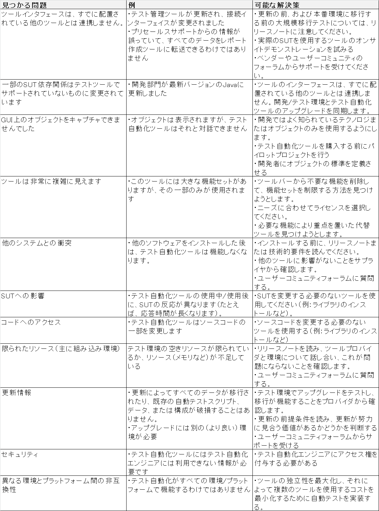
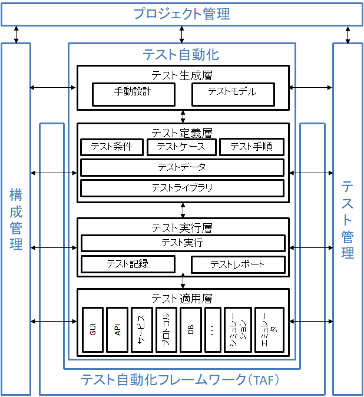

Test Automation Engineer
========================

**目的**  
このドキュメントでは、テスト自動化ソリューションの設計、開発、および保守におけるテスト自動化エンジニア（TAE）の作業について説明します。 動的機能テストを自動化するための概念、方法、ツール、およびプロセスと、テスト管理、構成管理、欠陥管理、ソフトウェア開発プロセス、および品質保証との関係に焦点を当てています。
記載された方法は、一般に、様々なソフトウェアライフサイクルアプローチ（例えば、アジャイル、シーケンシャル、インクリメンタル、反復）、ソフトウェアの種類にわたって適用可能である。

**用語**
この文書では、次の頭字語が使用されています。
* CLI
  * コマンドラインインターフェイス
* EMTE
  * 同等の手動テストの取り組み
* gTAA
  * 汎用テスト自動化アーキテクチャー（テスト自動化ソリューションの青写真を提供）
* GUI
  * グラフィカルユーザインタフェース
* SUT
  * テスト対象のシステム、テストオブジェクトも参照
* TAA
  * テスト自動化アーキテクチャー（TASのアーキテクチャーを定義するためのgTAAのインスタンス化）
* TAE
  * テスト自動化エンジニア（結果として得られるTASの実装、その保守および技術的進化を含む、TAAの設計を担当する人）
* TAF
  * Test Automation Framework（テストハーネスやテストライブラリなどのアーティファクトを含むテスト自動化に必要な環境）
* TAM 
  * Test Automation Manager（TASの開発と進化の計画と監督を担当する人）
* TAS 
  * Test Automation Solution（テストハーネスやテストライブラリなどのアーティファクトを含む、TAAの実現/実装）
* UI
  * ユーザーインターフェース

## 1.テスト自動化の紹介と目的 -  30分

**キーワード**
APIテスト、CLIテスト、GUIテスト、テスト対象システム、テスト自動化アーキテクチャ、テスト自動化
フレームワーク、テスト自動化戦略、テスト自動化、テストスクリプト、テストウェア

**導入のための学習目的とテスト自動化の目的**

**1.1 テスト自動化の目的**
* ALTA-E-1.1.1（K2）テスト自動化の目的、利点、不利な点、および制限を説明する

**1.2 テスト自動化における成功要因**
* ALTA-E-1.2.1（K2）テスト自動化プロジェクトの技術的成功要因の特定

### 1.1 テスト自動化の目的

ソフトウェアテストでは、テストの自動化（テストの自動実行を含む）は、以下のうちの1つ以上のタスクです。
* テストの前提条件を制御および設定するための専用のソフトウェアツールの使用
* テストを実行する
* 実際の結果と予測された結果との比較

干渉を最小限に抑えるために、テストに使用するソフトウェアをテスト対象システム（SUT）自体から分離することをお勧めします。 テストソフトウェアをSUTに配置する必要がある組み込みシステムなど、例外があります。

テストの自動化は、さまざまなバージョンのSUTや環境で多くのテストケースを一貫して繰り返し実行するのに役立ちます。 しかし、テストの自動化は、人間の介入なしにテストスイートを実行するためのメカニズム以上のものです。 それには、テストウェアを設計するプロセスが含まれます。
* ソフトウェア
* ドキュメント
* テストケース
* テスト環境
* テストデータ

テストウェアは、次のようなテスト活動に必要です。
* 自動テストケースの実装
* 自動テストの実行を監視および制御する
* 自動テスト結果の解釈、報告、記録

テスト自動化には、SUTと対話するためのさまざまなアプローチがあります。
* SUTのクラス、モジュール、またはライブラリへのパブリックインタフェースを介したテスト（APIテスト）
* SUTのユーザーインターフェイスを介したテスト（GUIテストやCLIテストなど）
* サービスまたはプロトコルによるテスト

テスト自動化の目的は次のとおりです。
* テスト効率の向上
* より広い機能範囲を提供する
* 総テストコストを削減する
* 手動テスターでは不可能なテストの実行
* テスト実行期間の短縮
* テスト頻度の増加/テストサイクルに必要な時間の短縮

テスト自動化の利点は次のとおりです。
* ビルドごとにより多くのテストを実行できます
* 手動では実行できないテストを作成する可能性（リアルタイム、リモート、並行テスト）
* テストはより複雑になる可能性があります
* テストの実行速度が向上
* テストはオペレータエラーの影響を受けにくい
* テストリソースのより効果的かつ効率的な使用
* ソフトウェア品質に関する素早いフィードバック
* システムの信頼性（再現性、一貫性など）の向上
* テストの一貫性の向上

テスト自動化の短所は次のとおりです。
* 追加費用がかかる
* TASをセットアップするための初期投資
* 追加のテクノロジが必要
* チームには開発と自動化のスキルが必要
* 進行中のTASメンテナンス要件
* テストの実行を犠牲にしてテストケースの自動化に焦点を合わせるなど、テストの目的から気を散らす可能性がある
* テストはより複雑になる可能性があります
* 自動化によって追加のエラーが発生する可能性があります

テスト自動化の制限は次のとおりです。
* すべての手動テストを自動化できるわけではありません
* 自動化は機械で解釈可能な結果のみを確認できます
* 自動化は、自動テストオラクルによって検証できる実際の結果のみを確認できます。
* 探索的テストの代わりにはならない

#### 1.2テスト自動化における成功要因

次の成功要因は、稼働中のテスト自動化プロジェクトに適用されるため、プロジェクトの長期的な成功に影響を与える影響に焦点が当てられています。 試験段階でテスト自動化プロジェクトの成功に影響を与える要因は、ここでは考慮されません。

テスト自動化の主な成功要因は次のとおりです。

* テスト自動化アーキテクチャー（TAA）
  * テスト自動化アーキテクチャー（TAA）は、ソフトウェア製品のアーキテクチャーと非常に密接に連携しています。 アーキテクチャがどの機能要件および非機能要件をサポートする必要があるかは明らかであるはずです。 通常これが最も重要な要件になります。
  * 多くの場合、TAAは保守性、パフォーマンス、および習得性のために設計されています。 （これらおよびその他の非機能特性の詳細については、ISO / IEC 25000：2014を参照してください。）SUTのアーキテクチャーを理解しているソフトウェアエンジニアを巻き込むことは有用です。

* SUTテスタビリティ
  * SUTは自動テストをサポートするテスト容易性のために設計される必要があります。 GUIテストの場合、これはSUTが可能な限りGUIの相互作用とデータをグラフィカルインタフェースの外観から切り離すことを意味します。 APIテストの場合、これをテストできるようにするには、より多くのクラス、モジュール、またはコマンドラインインターフェイスをパブリックとして公開する必要がある可能性があります。
  * SUTのテスト可能部分を最初にターゲットにする必要があります。 一般に、テスト自動化の成功における重要な要素は、自動テストスクリプトの実装の容易さにあります。 この目標を念頭に置いて、また概念実証を成功させるために、テスト自動化エンジニア（TAE）は、自動化で簡単にテストされ、そこから開始するSUTのモジュールまたはコンポーネントを識別する必要があります。

* テスト自動化戦略
  * SUTの保守性と一貫性に対処する、実用的で一貫性のあるテスト自動化戦略。
  * SUTの新旧両方の部分に同じ方法でテスト自動化戦略を適用することは不可能かもしれません。 自動化戦略を作成するときは、コードのさまざまな部分に適用することのコスト、利点、およびリスクを考慮してください。
  * 結果の一貫性を確認するために、自動テストケースを使用してユーザーインターフェイスとAPIの両方をテストすることを検討する必要があります。

* テスト自動化フレームワーク（TAF）
  * テスト自動化フレームワーク（TAF）は、使いやすく、文書化されており、保守が容易で、テストを自動化するための一貫したアプローチをサポートしています。
  * 使いやすく保守可能なTAFを確立するためには、次のことを実行する必要があります。
    * 報告機能を実装する：テスト報告は、SUTの品質に関する情報（合格/不合格/エラー/未実行/中止、統計など）を提供する必要があります。 報告は関係するテスター、テスト管理者、開発者、プロジェクト管理者および他の利害関係者に品質の概要を得るための情報を提供するべきです。
    * 簡単なトラブルシューティングを可能にする：テストの実行とログ記録に加えて、TAFは失敗したテストをトラブルシューティングするための簡単な方法を提供する必要があります。 テストは次の理由で失敗する可能性があります。
      * SUTで見つかった障害
      * TASで見つかった障害
      * テスト自体またはテスト環境に問題がある
    * テスト環境に適切に対処する：テストツールはテスト環境の一貫性に依存しています。 自動テストでは、専用のテスト環境を用意する必要があります。 テスト環境とテストデータの制御がない場合、テストの設定がテスト実行の要件を満たしていない可能性があり、誤った実行結果が生じる可能性があります。
    * 自動テストケースの文書化：テスト自動化の目標、たとえば、アプリケーションのどの部分をどの程度テストするか、どの属性をテストするか（機能的および非機能的）を明確にする必要があります。 これは明確に説明され文書化されなければならない。
    * 自動テストの追跡：TAFは、テスト自動化エンジニアがテストケースまでの個々のステップを追跡するための追跡をサポートするものとします。
    * 容易なメンテナンスを可能にする：理想的には、メンテナンスがテスト自動化作業の重要な部分を消費しないように、自動テストケースは容易にメンテナンスされるべきです。 さらに、保守作業はSUTに加えられた変更の規模に比例する必要があります。 これを行うには、ケースを簡単に分析可能、変更可能、および拡張可能にする必要があります。 さらに、テストウェアの自動再利用は、変更が必要なアイテムの数を最小限に抑えるために高い必要があります。
    * 自動テストを常に最新の状態に保ちます。新しい要件または変更された要件によってテストまたはテストスイート全体が失敗する場合は、失敗したテストを無効にしないでください。修正してください。
    * 展開を計画する：テストスクリプトを簡単に展開、変更、および再展開できるようにします。
    * 必要に応じてテストを廃止する：自動テストスクリプトが不要になった場合でも簡単に廃止できるようにします。
    * SUTの監視と復元：実際には、テストケースまたは一連のテストケースを継続的に実行するには、SUTを継続的に監視する必要があります。 SUTに致命的なエラー（クラッシュなど）が発生した場合、TAFには回復し、現在のケースをスキップして、次のケースでテストを再開する機能が必要です。

テスト自動化コードは保守が複雑になる可能性があります。 SUT用のコードと同じくらいテスト用のコードがあるのは珍しいことではありません。 そのため、テストコードを保守可能にすることが最も重要です。 これは、使用されているテストツール、使用されている検証の種類、および保守が必要なテストウェアの成果物（テスト入力データ、テストオラクル、テストレポートなど）が異なるためです。

これらの保守上の考慮事項を念頭に置いて、実行する必要がある重要な項目に加えて、次のように実行してはいけないことがいくつかあります。

* インターフェースに敏感なコードを作成しないでください（つまり、グラフィカルインターフェースの変更やAPIの重要ではない部分の変更による影響を受けます）。
* データの変更に敏感なテスト自動化、または特定のデータ値への依存度が高い（たとえば、他のテスト出力に依存するテスト入力）テスト作成を自動化しないでください。
* 状況（オペレーティングシステムの日付と時刻、オペレーティングシステムのローカリゼーションパラメータ、他のアプリケーションの内容など）に敏感な自動化環境を作成しないでください。 この場合は、環境を制御できるように、必要に応じてテストスタブを使用することをお勧めします。

成功要因が多ければ多いほど、テスト自動化プロジェクトは成功する可能性が高くなります。 すべての要因が必要なわけではなく、実際にはすべての要因が満たされることはめったにありません。 テスト自動化プロジェクトを開始する前に、適切な要因、および選択したアプローチのリスクを考慮に入れていないこと、およびプロジェクトの状況を考慮して、プロジェクトの成功の可能性を分析することが重要です。 TAAが整備されたら、どの品目が不足しているか、まだ作業が必要かを調査することが重要です。

## 2. テスト自動化の準備 -  165分

**キーワード**
テスタビリティ、ドライバ、侵入レベル、スタブ、テスト実行ツール、テストフック、テスト自動化マネージャ
テスト自動化の準備のための学習目標

**2.1 テスト自動化に影響するSUT要因**
* ALTA-E-2.1.1（K4）テスト中のシステムを分析して適切な自動化ソリューションを決定する

**2.2 ツールの評価と選択**
* ALTA-E-2.2.1（K4）特定プロジェクトのテスト自動化ツールを分析し、技術的発見事項と推奨事項を報告する

**2.3 テスタビリティと自動化のための設計**
* ALTA-E-2.3.1（K2）SUTに適用可能な「テスト容易化設計」および「テスト自動化設計」方法を理解する

### 2.1 テスト自動化に影響するSUT要因

SUTのコンテキストとその環境を評価する際には、テストの自動化に影響を与える要因を特定し、適切な解決策を決定する必要があります。 これらには次のものがあります。

* SUTインターフェース
  * 自動テストケースはSUTに対してアクションを起動します。 このために、ＳＵＴはそれを介してＳＵＴを制御することができるインターフェースを提供しなければならない。 これはUIコントロールを介して行うことができますが、低レベルのソフトウェアインターフェースを介しても行うことができます。 さらに、いくつかのテストケースは、通信レベルで（例えば、ＴＣＰ ／ ＩＰ、ＵＳＢ、または独自のメッセージングインターフェースを使用して）インターフェースすることが可能であり得る。
  * SUTの分解により、テストの自動化が異なるテストレベルでSUTと連動することが可能になります。 SUTがこれを適切にサポートしている場合に限り、特定のレベル（たとえばコンポーネントおよびシステムレベル）でテストを自動化することが可能です。 たとえば、コンポーネントレベルでは、テストに使用できるユーザーインターフェイスがない可能性があるため、カスタマイズ可能な別のソフトウェアインターフェイス（テストフックとも呼ばれる）を使用できる必要があります。
* サードパーティ製ソフトウェア
  * 多くの場合、SUTは、自組織で書かれたソフトウェアで構成されているだけでなく、第三者によって提供されたソフトウェアも含んでいます。 場合によっては、このサードパーティソフトウェアでテストが必要になることがあります。テストの自動化が正当化される場合は、APIの使用など、別のテスト自動化ソリューションが必要になることがあります。
* 侵入のレベル
  * さまざまなテスト自動化アプローチ（さまざまなツールを使用）では、さまざまなレベルの侵入があります。 特に自動テストのためにSUTに必要な変更の数が多いほど、侵入のレベルが高くなります。 専用のソフトウェアインターフェイスを使用すると、高レベルの侵入が必要ですが、既存のUI要素を使用すると、低レベルの侵入が発生します。 SUTのハードウェア要素（キーボード、ハンドスイッチ、タッチスクリーン、通信インタフェースなど）を使用すると、さらに高いレベルの侵入を受けることになります。
  * より高いレベルの侵入に伴う問題は、誤警報の危険性です。 TASはテストによって課される侵入のレベルが原因であるかもしれない失敗を示すことができますがソフトウェアシステムが実際のライブ環境で使用されているときこれらは起こりそうもありません。 高レベルの侵入によるテストは通常、テスト自動化アプローチのためのより簡単な解決策です。
* 異なるSUTアーキテクチャ
  * SUTのアーキテクチャが異なれば、異なるテスト自動化ソリューションが必要になる可能性があります。 COMテクノロジを使用してC ++で書かれたSUTには、Pythonで書かれたSUTとは異なるアプローチが必要です。 これらの異なるアーキテクチャを同じテスト自動化戦略で処理することは可能かもしれませんが、それにはそれらをサポートする機能を備えたハイブリッド戦略が必要です。
* SUTのサイズと複雑さ
  * 現在のSUTのサイズと複雑さ、および将来の開発計画を検討してください。 小規模でシンプルなSUTの場合、複雑で非常に柔軟なテスト自動化アプローチは保証されません。 単純なアプローチがより適しているかもしれません。 逆に、非常に大きく複雑なSUTに対して小さくて単純なアプローチを実装するのは賢明ではないかもしれません。 しかし時には、複雑なSUTに対しても小さくて単純なものから始めるのが適切ですが、これは一時的なアプローチであるべきです（第3章以前の詳細を参照）。

ＵＴが既に利用可能である場合、ここで説明されるいくつかの要因（例えば、サイズおよび複雑さ、利用可能なソフトウェアインターフェース）が知られているが、ほとんどの場合、テスト自動化の開発はＳＵＴが利用可能になる前に始まるべきである。 これが起こるときいくつかの事柄が推定される必要があるかまたはTAEは必要とされるソフトウェアインタフェースを指定することができます。 （詳細はセクション2.3を参照）

SUTがまだ存在しない場合でも、テスト自動化計画を立てることができます。 例えば：
* 要件（機能的または非機能的）が分かっている場合、それらをテストするための手段を識別することと共に、それらの要件から自動化の候補を選択することができる。 自動化の要件の特定やテスト自動化戦略の決定など、これらの候補の自動化の計画を立てることができます。
* アーキテクチャおよび技術設計が開発されているとき、テストをサポートするためのソフトウェアインターフェースの設計を引き受けることができる。

### 2.2 ツールの評価と選択

ツールの選択と評価プロセスの主な責任は、Test Automation Manager（TAM）にあります。 しかし、TAEはTAMに情報を提供し、多数の評価および選択活動を実施することに関与します。 ツールの評価と選択のプロセスの概念はFoundation Levelで導入され、このプロセスの詳細はAdvancedLevel  -  Test Manager Syllabus [ISTQB-AL-TM]に記載されています。

TAEは、ツールの評価と選択のプロセス全体に関与しますが、以下の活動に特定の貢献をします。

* 組織の成熟度の評価とテストツールサポートの機会の特定
* テストツールサポートのための適切な目的の評価
* 潜在的に適切なツールに関する情報の識別と収集
* 目的やプロジェクトの制約に対してツール情報を分析する
* 堅実なビジネスケースに基づく費用対効果の比率の推定
* 適切なツールに関する推奨事項の作成
* ツールとSUTコンポーネントとの互換性の確認

機能テスト自動化ツールは、自動化プロジェクトによって発生するすべての期待や状況を満たすことができないことがよくあります。 以下は、これらの種類の問題の一連の例です（ただし、これは完全なリストではありません）。

### 2.3 テスタビリティと自動化のための設計

ＳＵＴのテスト容易性（例えば、ＳＵＴの制御および観察可能性を可能にするための試験をサポートするソフトウェアインターフェースの利用可能性）は、ＳＵＴの他の機能の設計および実装と並行して設計および実装されるべきである。 これはソフトウェア設計者によって（テスト容易性はシステムの非機能的要件の１つにすぎないので）行うことができるが、しばしばこれはＴＡＥによって、またはＴＡＥの関与によって行われる。

テスト容易化のための設計は、いくつかの部分で構成されています。
* 可観測性：SUTはシステムへの洞察を与えるインターフェースを提供する必要があります。 テストケーススキャンでは、これらのインタフェースを使用して、たとえば、予想される動作が実際の動作と等しいかどうかを確認します。
* 制御（能力）：SUTは、SUTに対してアクションを実行するために使用できるインターフェースを提供する必要がある。 これは、ＵＩ要素、ファンクションコール、通信要素（例えば、ＴＣＰ ／ ＩＰまたはＵＳＢプロトコル）、電子信号（物理的スイッチ用）などであり得る。
* 明確に定義されたアーキテクチャ：テスト容易性のための設計の3番目に重要な部分は、すべてのテストレベルで制御と可視性を提供する明確でわかりやすいインタフェースを提供するアーキテクチャです。

TAEは、自動テストを含め、SUTを効果的に（適切な領域をテストして重大なバグを見つける）、効率的に（あまり手間をかけずに）テストする方法を検討します。 特定のソフトウェアインターフェイスが必要な場合は、TAEによって指定され、開発者によって実装される必要があります。 開発作業を計画し予算を組むことができるように、プロジェクトの早い段階でテスト容易性と必要に応じて追加のソフトウェアインタフェースを定義することが重要です。

テストをサポートするソフトウェアインタフェースの例は次のとおりです。

* 現代のスプレッドシートの強力なスクリプト機能。
* 入手できない、または購入するには高すぎるソフトウェアおよび/またはハードウェア（電子金融取引、ソフトウェアサービス、専用サーバー、電子ボード、機械部品など）をシミュレートするためにスタブまたはモックを適用することで、特定のインタフェースでソフトウェアがない場合でもテストできます。 
* ソフトウェアインターフェイス（またはスタブとドライバ）を使用してエラー状態をテストできます。 内蔵ハードディスクドライブ（ＨＤＤ）を有する装置を考える。 このHDDを制御するソフトウェア（ドライバと呼ばれる）は、HDDの故障や消耗についてテストする必要があります。 HDDが故障するのを待つことによってこれを行うことは非常に効率的ではありません（または信頼できません）。 欠陥のあるまたは遅いＨＤＤをシミュレートするソフトウェアインターフェースを実装することは、ドライバソフトウェアが正しく動作することを検証することができる（例えば、エラーメッセージを提供し、再試行する）。
* まだ利用可能なUIがないときにSUTをテストするために別のソフトウェアインタフェースを使用することができます（そしてこれはとにかくより良いアプローチであると考えられています）。 技術システム内の組込みソフトウェアは、装置内の温度を監視し、温度があるレベルを超えたときに冷却機能を開始させることをしばしば必要とする。 これは、温度を特定するためにソフトウェアインタフェースを使用してハードウェアなしでテストすることができる。
* 状態遷移テストは、SUTの状態動作を評価するために使用されます。 SUTが正しい状態にあるかどうかを確認する方法は、この目的のために設計されたカスタマイズされたソフトウェアインターフェースを介してSUTに問い合わせることです（これにはリスクも含まれますが、セクション2.1の侵入レベルを参照）。

自動化のための設計は、次のことを考慮する必要があります。
* 既存のテストツールとの互換性を早期に確立する必要があります。
* テストツールの互換性の問題は、重要な機能のテストを自動化する機能に影響を与える可能性があるため重要です（たとえば、グリッドコントロールとの互換性がないと、そのコントロールを使用するすべてのテストが妨げられます）。
* 解決策には、プログラムコードの開発とAPIの呼び出しが必要な場合があります。

テスト容易化のための設計は、優れたテスト自動化アプローチにとって最も重要であり、そして手動テスト実行にも利益をもたらし得る。

## 3.汎用テスト自動化アーキテクチャ -  270分

**キーワード**
キャプチャ/再生、データ駆動型テスト、汎用テスト自動化アーキテクチャ、キーワード駆動型テスト、線形
スクリプティング、モデルベーステスト、プロセス駆動型スクリプティング、構造化スクリプティング、テストアダプテーションレイヤ、テスト
自動化アーキテクチャ、テスト自動化フレームワーク、テスト自動化ソリューション、テスト定義層、テスト
実行層、テスト生成層

**汎用テスト自動化アーキテクチャの学習目標**

**3.1 gTAAの紹介**
* ALTA-E-3.1.1（K2）gTAAの構造を説明する

**3.2 TAA設計**
* ALTA-E-3.2.1（K4）特定のプロジェクトに適したTAAを設計する
* ALTA-E-3.2.2（K2）TAA内でレイヤが果たす役割を説明する
* ALTA-E-3.2.3（K2）TAAの設計上の考慮事項を理解する
* ALTA-E-3.2.4（K4）特定のTASの実装、使用、およびメンテナンス要件の要因を分析する

**3.3 TAS開発**
* ALTA-E-3.3.1（K3）汎用TAA（gTAA）のコンポーネントを適用して専用のTAAを作成する
* ALTA-E-3.3.2（K2）部品の再利用性を確認する際に考慮すべき要素を説明する

### 3.1 gTAAの紹介

テスト自動化エンジニア（TAE）は、テスト自動化ソリューション（TAS）を設計、開発、実装、および保守する役割を担っています。 各解決策が開発されるにつれて、同様のタスクが行われる必要があり、同様の質問に答えられる必要があり、同様の問題に対処し優先順位を付ける必要がある。 テストを自動化する際のこれらの繰り返しの概念、ステップ、およびアプローチは、gTAAと呼ばれる一般的なテスト自動化アーキテクチャの基礎となるものです。

gTAAは、gTAAのレイヤ、コンポーネント、およびインタフェースを表します。これらは、特定のTASの具体的なTAAにさらに再定義されます。 これにより、次の方法でテスト自動化ソリューションを構築するための構造化されたモジュール式のアプローチが可能になります。
* TASの概念空間、レイヤー、サービス、およびインターフェイスを定義して、社内外で開発されたコンポーネントと同様にTASを実現できるようにする。
テスト自動化を効果的かつ効率的に開発するための簡素化されたコンポーネントのサポート
* ソフトウェア製品ラインおよびファミリ、そしてソフトウェアテクノロジおよびツール全体で、さまざまなTASまたは進化するTASにテスト自動化コンポーネントを再利用する
* TASの保守と進化を容易にする
* TASのユーザーにとって不可欠な機能を定義する

TASは、テスト環境（およびその成果物）とテストスイート（テストデータを含む一連のテストケース）の両方で構成されています。 テスト自動化フレームワーク（TAF）を使用してTASを実現できます。 テスト環境の実現をサポートし、ツール、テストハーネス、またはサポートライブラリを提供します。

TASのTAAは、TASの容易な開発、進化、および保守をサポートする以下の原則に準拠することが推奨されています。

* 単一の責任：すべてのTASコンポーネントは単一の責任を負う必要があり、その責任はそのコンポーネントに完全にカプセル化されている必要があります。 言い換えれば、TASのすべてのコンポーネントは、たとえばキーワードやデータの生成、テストシナリオの作成、テストケースの実行、結果の記録、実行レポートの生成など、厳密に1つのことを担当する必要があります。
* 拡張（例えば、Ｂ．Ｍｙｅｒによるオープン／クローズの原則を参照）：すべてのTASコンポーネントは拡張のためにオープンでなければならないが、修正のためにクローズされる。 この原則は、下位互換性のある機能を損なうことなく、コンポーネントの動作を変更または拡張することが可能であるべきであることを意味します。
* 置き換え（例えば、Ｂ．Ｌｉｓｋｏｖによる置き換えの原則を参照）：すべてのＴＡＳコンポーネントは、ＴＡＳの全体的な振る舞いに影響を与えずに置き換え可能でなければならない。 構成要素は、１つまたは複数の代替構成要素によって置き換えることができるが、示される挙動は同じでなければならない。
* 構成要素の分離（例えば、R.C. Martinによるインターフェース分離の原理を参照）：一般的な多目的構成要素よりもより具体的な構成要素を持たせる方がよい。 これにより、不要な依存関係を排除して、置換と保守が容易になります。
* 依存性の逆転：TASの構成要素は、低レベルの詳細ではなく抽象化に依存する必要があります。 言い換えれば、コンポーネントは特定の自動テストシナリオに依存するべきではありません。

通常、gTAAに基づくTASは、一連のツール、それらのプラグイン、および/またはコンポーネントによって実装されます。gTAAはベンダーに依存しないことに注意することが重要です。具体的な方法、テクノロジ、またはツールは定義されていません。 TASの実現のために。 gTAAは、構造化、オブジェクト指向、サービス指向、モデル駆動などの任意のソフトウェア工学手法、ならびに任意のソフトウェア技術およびツールによって実装することができる。 実際、TASはしばしば既製のツールを使用して実施されるが、典型的には追加のＳＵＴ特有の追加および／または適応を必要とするであろう。

TASに関するその他のガイドラインと参照モデルは、選択されたSDLC（Software Development Lifecycle）のソフトウェア工学標準、プログラミング技術、フォーマット標準などです。ソフトウェア工学一般を教えることはこのシラバスの範囲にはありませんが、TAEにはソフトウェア工学のスキル、経験、および専門知識を持っていることが期待されます 。

さらに、TAEは、TASを開発しながらそれらを利用するために、業界のコーディングおよびドキュメンテーションの標準とベストプラクティスを認識する必要があります。 これらの慣行は、保守性、信頼性、およびTASのセキュリティを向上させることができます。 そのような標準は通常ドメイン固有です。 一般的な基準は次のとおりです。
* CまたはC ++用のMISRA
* C ++のJSFコーディング標準
* MathWorks Matlab /Simulink®のAUTOSARルール

#### 3.1.1 gTAAの概要

gTAAは、以下のような水平レイヤーで構造化されています。
* テスト生成
* テスト定義
* テスト実行
* テストの適応

gTAA（図1：一般的なテスト自動化アーキテクチャを参照）には、以下が含まれます。
* **テストケースの手動または自動設計をサポートするテスト生成層。** それはテストケースを設計するための手段を提供します。
* **テストスイートやテストケースの定義と実装をサポートするテスト定義層。** テスト定義をSUTやテストシステムのテクノロジやツールから分離します。 これには、テストデータ、テストケース、テスト手順、テストライブラリコンポーネント、またはそれらの組み合わせで処理される高レベルテストと低レベルテストを定義する手段が含まれています。
* **テストケースの実行とテストロギングをサポートするテスト実行層。** 選択されたテストを自動的に実行するためのテスト実行ツールと、ロギングおよびレポート作成コンポーネントを提供します。
* **SUTのさまざまなコンポーネントまたはインタフェースに自動テストを適応させるために必要なコードを提供するテスト適応層。** API、プロトコル、サービスなどを介してSUTに接続するためのさまざまなアダプタを提供します。
* **テストの自動化に関連して、プロジェクト管理、構成管理、テスト管理のためのインタフェースもあります。** 例えば、テスト管理層とテスト適応層との間のインタフェースは、選択されたテスト構成に関して適切なアダプタの選択および構成に対処する。

gTAA層とそれらの構成要素との間の界面は、典型的には特定的であり、したがって、ここではさらに詳述しない。

これらの層は任意のTASに存在しても存在しなくてもよいことを理解することが重要です。 例えば：
* テストの実行を自動化する場合は、テストの実行とテスト適応層を活用する必要があります。 それらは分離される必要はなく、例えば単体テストフレームワークにおいて一緒に実現され得る。
* テスト定義を自動化する場合は、テスト定義層が必要です。
* テスト生成を自動化する場合は、テスト生成層が必要です。

ほとんどの場合、下から上にTASを実装することから始めますが、手動テスト用の自動テスト生成などの他のアプローチも同様に便利です。 一般に、できるだけ早くTASを使用し、TASの付加価値を証明するために、TASを段階的に（例えばスプリントで）実装することをお勧めします。 また、概念実証はテスト自動化プロジェクトの一部として推奨されます。

テスト自動化プロジェクトはすべて、ソフトウェア開発プロジェクトとして理解、設定、および管理する必要があり、専用のプロジェクト管理が必要です。 TAF開発のためのプロジェクト管理（すなわち、会社全体、製品ファミリーまたは製品ラインのためのテスト自動化サポート）は、TASのためのプロジェクト管理（すなわち、具体的な製品のためのテスト自動化）から分離することができる。

図1：一般的なテスト自動化アーキテクチャ

#### 3.1.2 テスト生成層

テスト生成層は、以下のツールサポートで構成されています。
* テストケースを手動で設計する
* テストデータの開発、取得、または導出
* SUTおよび/またはその環境を定義するモデルからテストケースを自動的に生成する（つまり、モデルベースの自動テスト）

このレイヤーのコンポーネントは以下の目的で使用されます。
* テストスイート構造の編集と移動
* テストケースをテスト目的またはSUT要件に関連付けます。
* テスト設計を文書化する

自動テスト生成のために、以下の機能も含まれるかもしれません：
* SUT、その環境、および/またはテストシステムをモデル化する機能
* テスト方針を定義し、テスト生成アルゴリズムを設定/パラメータ化する機能
* 生成されたテストをモデル（要素）までトレースする機能

#### 3.1.3 テスト定義層

テスト定義層は、以下のツールサポートで構成されています。
* テストケースの指定（高レベルおよび/または低レベル）
* 低レベルのテストケースのテストデータを定義する
* テストケースまたは一連のテストケースに対するテスト手順の指定
* テストケースを実行するためのテストスクリプトを定義する
* 必要に応じてテストライブラリへのアクセスを提供する（たとえば、キーワード駆動型のアプローチで）

このレイヤーのコンポーネントは以下の目的で使用されます。
* テストデータの分割/制限、パラメータ化、またはインスタンス化
* テストシーケンスまたは本格的なテスト動作（制御ステートメントや式を含む）を指定して、それらをパラメータ化したりグループ化したりする。
* テストデータ、テストケース、および/またはテスト手順を文書化する

#### 3.1.4 テスト実行層

テスト実行層は、以下のツールサポートで構成されています。
* テストケースを自動的に実行する
* テストケース実行のログ記録
* テスト結果を報告する

テスト実行層は、次の機能を提供するコンポーネントで構成されています。
* テスト実行のためにSUTを設定して破棄する
* テストスイート（テストデータを含む一連のテストケース）の設定と解除
* テスト設定を構成してパラメータ化する
* テストデータとテストケースの両方を解釈し、それらを実行可能スクリプトに変換する
* テスト実行の（フィルター処理された）ログ記録および/またはフォルトインジェクションのために、テストシステムおよび/またはSUTを計装する
* テスト実行中にSUTの応答を分析して、後続のテスト実行を誘導する
* テストケースの自動実行結果についてSUTの回答（期待結果と実際の結果の比較）を検証する
* 時間内に自動テスト実行を制御する

#### 3.1.5 テスト適応層

テスト適応層は、以下のツールサポートで構成されています。
* テストハーネスを制御する
* SUTとの対話
* SUTの監視
* SUT環境をシミュレートまたはエミュレートする

テスト適応層は以下の機能を提供します。
* テクノロジに依存しないテスト定義と、SUTおよびテストデバイスの特定のテクノロジ要件との間の調整
* SUTと対話するためのさまざまなテクノロジ固有のアダプタの適用
* テスト実行を複数のテストデバイス/テストインターフェイスに分散させる、またはローカルでテストを実行する

#### 3.1.6 TASの構成管理
通常、TASはさまざまな反復/バージョンで開発されており、SUTの反復/バージョンと互換性がある必要があります。 TASの構成管理には、次のものが含まれる必要があります。
* テストモデル
* テストデータ、テストケース、およびライブラリを含むテスト定義/仕様
* テストスクリプト
* テスト実行エンジンと補助的なツールやコンポーネント
* SUT用のテストアダプタ
* シミュレータとエミュレータ
* テスト結果とテストレポート

これらの項目はテストウェアを構成し、SUTのバージョンと一致する正しいバージョンでなければなりません。 状況によっては、以前のバージョンのTASに戻す必要がある場合があります。たとえば、フィールドの問題を古いSUTバージョンで再現する必要がある場合などです。 適切な構成管理によってこの機能が有効になります。

#### 3.1.7 TASのプロジェクト管理

テスト自動化プロジェクトはソフトウェアプロジェクトなので、他のソフトウェアプロジェクトと同じプロジェクト管理が必要です。 TAEは、TASを開発する際に、確立されたSDLC方法論のすべてのフェーズに対してタスクを実行する必要があります。 また、TAEは、TASの開発環境は、ステータス情報（メトリック）を簡単に抽出できるように、または自動的にTASのプロジェクト管理に報告できるように設計する必要があることを理解する必要があります。

#### 3.1.8 TASによるテスト管理のサポート

TASはSUTのテスト管理をサポートしなければなりません。 テストログおよびテスト結果を含むテストレポートは、抽出されることが容易であるか自動的にＳＵＴのテスト管理（人またはシステム）に提供されることを必要とされています。

### 3.2 TAA設計

#### 3.2.1 TAA設計の紹介

テスト自動化プロジェクトまたは組織のニーズに応じて注文することができる、TAAを設計するために必要な多数の主要な活動があります。 これらの活動については、以下のセクションで説明します。TAAの複雑さに応じて、より多くのまたはより少ない活動が必要になる場合があります。

**適切なTAAを定義するために必要なキャプチャ要件**

テスト自動化アプローチの要件は、以下を考慮する必要があります。
* テスト管理、テスト設計、テスト生成、テスト実行など、テストプロセスのどのアクティビティまたはフェーズを自動化する必要があるか。 テスト自動化は、テストデザインとテスト実装の間にテスト生成を挿入することによって基本的なテストプロセスを改良することに注意してください。
* どのテストレベルをサポートすべきか（コンポーネントレベル、統合レベル、システムレベルなど）
* 機能テスト、適合性テスト、相互運用性テストなど、どの種類のテストをサポートする必要があるか
* テスト実行者、テストアナリスト、テストアーキテクト、テストマネージャなど、どのテストロールをサポートする必要があるか
* 実装されたTASの期間と有効期間を定義するためなど、どのソフトウェア製品、ソフトウェア製品ライン、ソフトウェア製品ファミリをサポートする必要があるか
* SUTテクノロジとの互換性を考慮してTASを定義するなど、どのSUTテクノロジをサポートする必要があるか

**異なるデザイン/アーキテクチャアプローチを比較・対照する**

TAAは、TAAの選択された層を設計するときに、さまざまなアプローチの長所と短所を分析する必要があります。 これらには以下が含まれますが、これらに限定されません。

テスト生成層に関する考慮事項
* 手動または自動テスト生成の選択
* 要件ベース、データベース、シナリオベース、または行動ベースのテスト生成などの選択
* テスト生成戦略の選択（たとえば、データベースベースのアプローチの分類ツリー、シナリオベースのアプローチのユースケース/例外ケースのカバレッジ、行動ベースのアプローチの遷移/状態/パスのカバレッジなど）
* テスト選択戦略の選択 実際には、テストケースの急増につながる可能性があるため、完全な組み合わせテスト生成は実行不可能です。 したがって、実際の適用範囲の基準、重み、リスク評価などを使用して、テスト生成とその後のテスト選択をガイドする必要があります。

テスト定義層に関する考慮事項
* データ駆動型、キーワード駆動型、パターンベース、またはモデル駆動型のテスト定義の選択
* スプレッドシート、ドメイン固有のテスト言語、テストおよびテスト管理を使用したテスト定義の表記法（テーブル、状態ベースの表記法、確率的表記法、データフロー表記法、ビジネスプロセス表記法、シナリオベースの表記法など）の選択 表記法（TTCN-3）、UMLテストプロファイル（UTP）など）
* 高品質テストの定義に関するスタイルガイドとガイドラインの選択
* テストケースリポジトリ（スプレッドシート、データベース、ファイルなど）の選択

テスト実行層に関する考慮事項
* テスト実行ツールの選択
* テスト手順を実行するための解釈の選択（仮想マシンの使用による）またはコンパイル方法 - 通常、この選択は選択したテスト実行ツールによって異なります。
* テスト手順を実装するための実装テクノロジの選択（Cなどの必須、HaskellやErlangなどの関数型、C ++、C＃、Javaなどのオブジェクト指向、PythonやRubyなどのスクリプト、またはツール固有のテクノロジ） - この選択は通常選択されたテスト実行ツールに依存します
* テストの実行を容易にするためのヘルパーライブラリの選択（テストデバイスライブラリ、エンコード/デコードライブラリなど）

テスト適応層に関する考慮事項
* SUTへのテストインターフェイスの選択
* テストインタフェースを刺激して観察するためのツールの選択
* テスト実行中にSUTを監視するためのツールの選択
* テストの実行を追跡するためのツールの選択（テスト実行のタイミングなど）

**抽象化が利益をもたらすことができる分野を特定する**

TAAでの抽象化は、同じテストスイートを異なるテスト環境および異なるターゲットテクノロジで使用できるという点で、テクノロジに依存しないことを可能にします。 テスト成果物の移植性が向上します。 さらに、TASへのロックインの影響を回避するベンダー中立性が保証されています。 抽象化はまた、保守性および新規または発展中のＳＵＴ技術への適応性を改善する。 さらに、テストスイートは（グラフィカルな手段を含む）詳細な説明が付いているため、抽象化によってTAA（およびTASによるインスタンス化）を非技術者にとってよりわかりやすくし、読みやすさと理解しやすさが向上します。

TAEは、ソフトウェア開発、品質保証、およびテストの分野で、TASのどの領域で使用する抽象化レベルを使用するかについて関係者と協議する必要があります。 たとえば、テスト適応層および/またはテスト実行層のどのインタフェースを外部化し、正式に定義し、TAAの有効期間を通じて安定に保つ必要があるか。 また、抽象テスト定義が使用されている場合、またはTAAがテストスクリプトのみを使用してテスト実行層を使用している場合についても説明する必要があります。 同様に、テスト生成がテストモデルおよびモデルベースのテストアプローチの使用によって抽象化されているかどうかを理解する必要があります。 TAEは、全体的な機能性、保守性、および拡張性に関して、TAAの洗練された実装と直接的な実装の間にはトレードオフがあることに注意する必要があります。 TAAで使用する抽象化に関する決定は、これらのトレードオフを考慮に入れる必要があります。

抽象化がTAAに使用されればされるほど、さらなる進化や新しいアプローチや技術への移行に関してより柔軟になります。 これは、初期投資の遅延を遅らせるが長期的には見返り得る、より大きな初期投資（例えば、より複雑な自動化アーキテクチャおよびツール、より高いスキルセット要件、より大きな学習曲線）を犠牲にしてもたらされる。 また、TASのパフォーマンスが低下する可能性があります。

ROI（投資収益率）の詳細な考慮事項はTAMの責任ですが、TAEは、タイミング、コスト、努力、および利益に関するさまざまな最新の自動化アーキテクチャおよびアプローチの技術的評価と比較を提供してROI分析にインプットを提供する必要があります。

**SUTテクノロジと、これらがTASとどのように相互接続するかを理解する**

SUTのテストインターフェースへのアクセスは、自動テスト実行の中心です。 アクセスは以下のレベルで利用可能です。
* ソフトウェアレベル（SUTとテストソフトウェアなど）が相互にリンクされている
* APIレベル、例えばTASは、（リモート）アプリケーションプログラミングインターフェースで提供される機能/操作/メソッドを呼び出す。
* プロトコルレベル、例えばＴＡＳは、ＨＴＴＰ、ＴＣＰなどを介してＳＵＴと相互作用する。
* サービスレベル、たとえばTASは、Webサービス、RESTfulサービスなどを介してSUTサービスと対話します。

さらに、ＴＡＳとＳＵＴがＡＰＩ、プロトコルまたはサービスによって分離されるときはいつでも、ＴＡＥは、ＴＡＳとＳＵＴとの間の相互作用のために使用されるべきＴＡＡの相互作用のパラダイムについて決定する必要がある。 これらのパラダイムは次のとおりです。
* イベントバスで交換されるイベントを介して対話を推進する、イベント駆動型のパラダイム
* クライアントサーバーパラダイム。サービスリクエスタからサービスプロバイダへのサービス呼び出しによる対話を推進します。
* ピアツーピアパラダイム。どちらかのピアからのサービス呼び出しを介して対話を推進します。

多くの場合、パラダイムの選択はSUTアーキテクチャに依存し、SUTアーキテクチャに影響を与える可能性があります。 ２つのシステム間で将来安全なアーキテクチャを選択するためには、ＳＵＴとＴＡＡとの間の相互接続を注意深く分析し設計する必要がある。

**SUT環境を理解する**

ＳＵＴは、独立型ソフトウェア、または他のソフトウェア（たとえばシステムのシステム）、ハードウェア（たとえば組み込みシステム）、または環境コンポーネント（たとえばサイバーフィジカルシステム）に関してのみ機能するソフトウェアとすることができる。 TASは、自動テスト設定の一部としてSUT環境をシミュレートまたはエミュレートします。

テスト環境と使用例の例は次のとおりです。
* SUTとTASの両方を備えたコンピューター - ソフトウェアアプリケーションのテストに役立ちます。
* SUTとTASそれぞれのネットワークコンピュータ - サーバーソフトウェアのテストに役立ちます。
* SUTの技術的なインターフェースを刺激し、観察するための追加のテスト装置 - セットトップボックスなどでソフトウェアをテストするのに役立ちます。
* SUTの動作環境をエミュレートするネットワークテストデバイス - ネットワークルーターのソフトウェアをテストするのに役立ちます
* SUTの物理的環境をシミュレートするシミュレータ - 組み込み制御ユニットのソフトウェアをテストするのに役立ちます

**特定のテストウェアアーキテクチャの実装にかかる時間と複雑さ**

TASプロジェクトの工数見積もりはTAMの責任ですが、TAEはTAA設計の時間と複雑さについて適切な見積もりを提供することによってTAMをサポートする必要があります。 推定方法および例には、以下が含まれる。
* 機能点、3点推定、広帯域デルファイ、エキスパート推定などの類推ベースの推定
* 管理ソフトウェアやプロジェクトテンプレートに見られるような作業詳細構造の使用による見積もり
* 建設費モデル（COCOMO）などのパラメトリック推定
* 機能点分析、ストーリーポイント分析、またはユースケース分析などのサイズベースの見積もり
* Planning Pokerなどのグループ見積もり

**特定のテストウェアアーキテクチャ実装の使いやすさ**

TASの機能、SUTとの互換性、長期的な安定性と進化性、その作業要件、およびROIの考慮事項に加えて、TAEにはTASの使いやすさの問題に対処するという特定の責任があります。 これには以下が含まれますが、これらに限定されません。
* テスター指向のデザイン
* TASの使いやすさ
* ソフトウェア開発、品質保証、およびプロジェクト管理における他の役割に対するTASサポート
* TAS内で/ TASを使用した効果的な組織化、ナビゲーション、および検索
* TASに関する有用なドキュメント、マニュアル、およびヘルプテキスト
* TASによるおよびTASに関する実践的な報告
* TASフィードバックと経験的洞察に対処するための反復設計

#### 3.2.2 テストケースを自動化するためのアプローチ

テストケースは、SUTに対して実行される一連のアクションに変換する必要があります。 また、自動テストケースでは、SUTとの対話のためのテストデータを定義し、期待される結果が達成されたことを検証するための検証手順を含める必要があります。 SUTによって。 一連のアクションを作成するために、いくつかのアプローチを使用できます。
1. TAEはテストケースを自動テストスクリプトに直接実装します。 このオプションは抽象化されておらず、メンテナンスの負荷が増大するため、お勧めできません。
2. TAEはテスト手順を設計し、それらを自動テストスクリプトに変換します。 このオプションは抽象化されていますが、テストスクリプトを生成するための自動化に欠けています。
3. TAEはツールを使用してテスト手順を自動テストスクリプトに変換します。 このオプションは、抽象化と自動スクリプト生成の両方を組み合わせたものです。
4. TAEは、自動テスト手順を生成したりモデルからテストスクリプトを直接翻訳したりするツールを使用します。 このオプションは最高の自動化度を持ちます。

オプションはプロジェクトの状況に大きく依存することに注意してください。 これらは一般的に実装が簡単なので、それほど高度ではないオプションの1つを適用してテストの自動化を開始することも効率的かもしれません。メンテナンス性が低いソリューションにはなりますが、短期間で付加価値を提供できます。

テストケースを自動化するための確立されたアプローチは次のとおりです。
* オプション1に使用できるキャプチャ/再生アプローチ
* 構造化スクリプティングアプローチ、データ駆動型アプローチ、およびキーワード駆動型アプローチ。オプション2または3に使用できます。
* モデルベースのテスト（プロセス駆動型アプローチを含む）。オプション4に使用できます。

これらのアプローチは、主な概念と長所と短所に関して後で説明されます。

**キャプチャ/再生アプローチ**

* 主なコンセプト
  * キャプチャ／再生アプローチでは、テスト手順で定義されている一連のアクションを実行しながら、ツールを使用してSUTとのやり取りをキャプチャします。 入力がキャプチャされます。 出力は後のチェックのために記録することもできます。 イベントの再生中に、さまざまな手動および自動の出力チェックの可能性があります。
    * 手動：テスターは異常のためにSUT出力を監視する必要があります
    * 完全：キャプチャ中に記録されたすべてのシステム出力はSUTによって再現される必要があります。
    * 正確：キャプチャ中に記録されたすべてのシステム出力は、記録の詳細レベルまでSUTによって再現される必要があります。
    * チェックポイント：選択したシステム出力のみが特定のポイントで特定の値にチェックされます。

* 長所
  * キャプチャ／再生アプローチは、ＧＵＩレベルおよび／またはＡＰＩレベルでＳＵＴに使用することができる。 最初は、設定と使用が簡単です。
* 短所
  * キャプチャされたSUTの実行は、キャプチャが行われたSUTのバージョンに強く依存するため、キャプチャ/再生スクリプトは維持および進化が困難です。 例えば、ＧＵＩレベルで記録するとき、たとえそれがＧＵＩ要素の位置を変えるだけであっても、ＧＵＩレイアウトの変更はテストスクリプトに影響を与えるかもしれない。 したがって、キャプチャ/リプレイアプローチは変更に対して脆弱なままです。

テストケース（スクリプト）の実装は、SUTが利用可能になったときにのみ開始できます。

**線形スクリプト**

* 主なコンセプト
  * すべてのスクリプト手法と同様に、線形スクリプトは手動のテスト手順から始まります。 これらが文書化されていない可能性があることに注意してください - どのテストを実行するか、そしてそれらをどのように実行するかについての知識は1人以上のテストアナリストによって「知られている」かもしれません。
  * テストツールが一連の動作を記録し、場合によってはSUTから画面に表示される出力をキャプチャする間、各テストは手動で実行されます。 これは通常、各テスト手順に対して1つの（通常は大きな）スクリプトになります。 記録されたスクリプトは、読みやすさを改善するために（例えば、キーポイントで何が起こっているのかを説明するためにコメントを追加することによって）、またはツールのスクリプト言語を使用してさらなるチェックを追加するために編集され得る。
  * その後、スクリプトはツールによって再生され、スクリプトが記録されたときにツールがテスターによってとられたのと同じアクションを繰り返すようにすることができる。 これはGUIテストを自動化するために使用できますが、多数のテストを自動化する必要があり、ソフトウェアの多くのリリースに必要な場合には使用するのは適切な方法ではありません。 これは、SUTへの変更によって通常発生する高い保守コストのためです（SUTの各変更は、記録されたスクリプトへの多数の変更を必要とする場合があります）。
* 長所
  * 線形スクリプトの利点は、自動化を開始する前に準備作業がほとんどまたはまったく必要ないことにあります。 このツールの使用方法を習得したら、手動テストを記録してそれを再生するだけで済みます（ただし、記録部分では実際の出力と期待される出力との比較によってソフトウェアが正しく機能していることを確認する必要があります）。 ） プログラミングスキルは必須ではありませんが、通常は役に立ちます。
* 短所
  * 線形スクリプトの欠点は数多くあります。 任意の試験手順を自動化するのに必要な努力量は、それを実行するのに必要なサイズ（ステップ数または動作数）に大部分依存するであろう。 したがって、自動化される１０００番目の試験手順は、１００番目の試験手順と同様に比例した量の努力を要するであろう。 言い換えれば、新しい自動テストを構築するコストを削減する余地はあまりありません。
  * さらに、入力値が異なっていても同様のテストを実行する2番目のスクリプトがある場合、そのスクリプトには最初のスクリプトと同じ一連の命令が含まれます。 命令に含まれる情報（命令の引数またはパラメータと呼ばれる）のみが異なります。 複数のテスト（したがってスクリプト）がある場合、これらすべてに同じ命令シーケンスが含まれます。スクリプトが影響を受けるような方法でソフトウェアが変更された場合は、それらすべてを保守する必要があります。
  * スクリプトは自然言語ではなくプログラミング言語で書かれているため、プログラマー以外は理解しにくいと感じるかもしれません。 テストツールの中には（そのツールに固有の）独自の言語を使用しているため、その言語を習得し習熟するのには時間がかかります。
  * 記録されたスクリプトのコメントには、あるとしても一般的な記述のみが含まれています。 特に長いスクリプトには、テストの各ステップで何が行われているのかを説明するためのコメントを付けるのが最適です。これにより、メンテナンスが容易になります。 テストに多くのステップが含まれる場合、スクリプトはすぐに非常に大きくなります（多くの指示を含む）。
  * スクリプトはモジュール化されておらず、保守が困難です。 線形スクリプトは、一般的なソフトウェアの再利用性やモジュール方式のパラダイムには従っておらず、使用されているツールと密接に関係しています。

**構造化スクリプト**

* 主なコンセプト
   * 構造化スクリプト手法と線形スクリプト手法の主な違いは、スクリプトライブラリの導入です。 これには、多くのテストで共通して必要とされる一連の命令を実行する再利用可能なスクリプトが含まれています。 そのようなスクリプトの良い例は、例えばＳＵＴインターフェースの動作にインターフェースするものである。 
* 長所
   * このアプローチの利点には、必要なメンテナンスの変更が大幅に削減され、新しいテストを自動化するためのコストが削減されることが含まれます（それらをすべて最初から作成しなくても既存のスクリプトを使用できるため）。
   * 構造化スクリプトの利点は、スクリプトを再利用することによってほぼ達成されます。 リニアスクリプティングアプローチで必要とされるような大量のスクリプトを作成する必要なしに、より多くのテストを自動化することができる。 これは、構築とメンテナンスのコストに直接影響します。 2回目以降のテストでは、1回目のテストを実装するために作成されたスクリプトの中には再利用できるものがあるため、自動化にはそれほど労力がかかりません。
* 短所
   * 共有スクリプトを作成するための最初の努力はデメリットと見なすことができますが、適切にアプローチすれば、この初期投資は大きな配当を支払うはずです。 単純な記録だけでは十分ではないため、すべてのスクリプトを作成するにはプログラミングスキルが必要です。 スクリプトライブラリは適切に管理されている必要があります。つまり、スクリプトは文書化され、Technical Test Analystが必要なスクリプトを見つけるのは簡単なはずです（したがって、ここでは適切な命名規則が役立ちます）。

**データ駆動テスト**

* 主なコンセプト
   * データ駆動型スクリプト技術は、構造化スクリプト技術を基盤としています。 最も重要な違いは、テスト入力の処理方法です。 入力はスクリプトから抽出され、1つ以上の別々のファイル（通常はデータファイルと呼ばれる）に入れられます。
   * これは、メインのテストスクリプトを（単一のテストではなく）多数のテストを実装するために再利用できることを意味します。 通常、「再利用可能な」メインテストスクリプトは「制御」スクリプトと呼ばれます。 制御スクリプトは、テストを実行するのに必要な一連の命令を含むが、データファイルから入力データを読み取る。 1つの対照試験を多くの試験に使用することができるが、広い範囲の試験を自動化するには通常不十分である。 従って、多数の制御スクリプトが必要とされるであろうが、それは自動化された試験の数のほんの一部にすぎない。
* 長所
   * このスクリプト手法により、新しい自動テストを追加するコストを大幅に削減できます。この手法は、さまざまな種類の有用なテストを自動化するために使用され、特定の領域でのテストを深めます。
   * テストをデータファイルで「記述」することは、テストアナリストが1つ以上のデータファイルを入力するだけで「自動」テストを指定できることを意味します。 これにより、テストアナリストは、テクニカルテストアナリストに依存することなく自動テストを自由に指定することができます。
* 短所
   * データファイルを管理し、それらがTASによって読み取り可能であることを確認する必要があることは不利ですが、適切に対処することができます。
   * また、重要な否定的テストケースが見逃されるかもしれません。 ネガティブテストは、テスト手順とテストデータの組み合わせです。 テストデータを主に対象としたアプローチでは、「否定的テスト手順」が見逃される可能性があります。

**キーワード駆動テスト**

* 主なコンセプト
   * キーワード駆動型スクリプト技術は、データ駆動型スクリプト技術に基づいています。 ２つの主な違いがある：（１）データファイルは現在「テスト定義」ファイルまたは類似のもの（例えばアクションワードファイル）と呼ばれる。 （２）制御スクリプトが１つしかない。
   * テスト定義ファイルには、テストアナリストが理解しやすいように（同等のデータファイルよりも簡単に）テストの説明が含まれています。 通常、データファイルと同じようにデータが含まれますが、キーワードファイルには高レベルの指示（キーワード、つまり「アクションワード」）も含まれます。
   * ーワードは、テストアナリスト、テストの説明、およびテスト対象のアプリケーションにとって意味があるように選択する必要があります。 これらは主に（しかし排他的ではない）システムとの高レベルビジネス相互作用を表すために使用される（例えば「注文」）。 各キーワードは、テスト対象システムとの多数の詳細な相互作用を表します。 テストケースの指定には、キーワードのシーケンス（関連するテストデータを含む）が使用されます。 特別なキーワードを検証手順に使用することも、キーワードにアクションと検証手順の両方を含めることもできます。
   * テストアナリストの責任範囲には、キーワードファイルの作成と管理が含まれます。つまり、サポートスクリプトが実装されたら、テストアナリストはキーワードファイルでそれらを指定するだけで「自動」テストを追加できます。
* 長所
   * 制御スクリプトとキーワードのサポートスクリプトが作成されたら、このスクリプト作成手法によって新しい自動テストを追加するコストが大幅に削減されます。
   * テストをキーワードファイルで「記述」することは、テストアナリストがキーワードと関連データを使用してテストを記述するだけで「自動」テストを指定できることを意味します。これにより、テストアナリストは、テクニカルテストアナリストに依存することなく（自動化されたテストを自由に指定できるようになります）。この点で、データ駆動型アプローチよりもキーワード駆動型アプローチの利点は、キーワードの使用です。各キーワードは、意味のある結果を生み出す一連の詳細なアクションを表す必要があります。たとえば、「アカウントの作成」、「注文の発注」、「注文のステータスの確認」はすべて、オンラインショッピングアプリケーションで可能なすべてのアクションです（各ステップにはいくつかの詳細な手順が含まれます）。あるテストアナリストが別のテストアナリストにシステムテストを説明するとき、彼らは詳細な手順ではなく、これらの高レベルのアクションの観点から話す可能性があります。キーワード駆動型アプローチの目的は、これらの高レベルのアクションと詳細な手順を参照せずに、上位レベルのアクションに関して定義されています。
   * これらのテストケースは、キーワード（または構造化スクリプトアプローチの場合はライブラリ）に複雑さを隠すことができるため、保守、読み書きが容易です。 キーワードは、SUTのインターフェースの複雑さからの抽象化を妨げる可能性があります。
* 短所
   * 特にこのスクリプト技術をサポートしていないatoolを使用する場合は、キーワードを実装することがテスト自動化エンジニアにとって大きな課題となっています。 小規模なシステムでは、実装するには余りにも多くのオーバーヘッドがあるかもしれず、コストは利益を上回るでしょう。
   * 正しいキーワードが実行されるように注意する必要があります。 良いキーワードは多くの異なるテストで頻繁に使用されますが、悪いキーワードは一度か二度だけ使用される可能性があります。

**プロセス駆動型スクリプト**

* 主なコンセプト
   * プロセス駆動型アプローチは、SUTのユースケースとその変形を表すシナリオがテストデータでパラメータ化されるか、またはより高レベルのテスト定義に組み合わされるスクリプトを構成するという違いを持つキーワード駆動型スクリプト技術に基づいています。
   * このようなテスト定義は、アクション間の論理的関係、例えば、機能テストにおける「配置順序」後の「チェック順序状態」、またはロバストネス試験における「配置順序」が前の「チェック順序状態」を決定することができるので、対処しやすい。
* 長所
   * プロセスに似たシナリオベースのテストケース定義を使用することで、ワークフローの観点からテスト手順を定義することができます。 プロセス駆動型アプローチの目的は、詳細なテスト手順を表すテストライブラリを使用してこれらの高レベルのワークフローを実装することです（キーワード駆動型アプローチも参照）。
* 短所
   * SUTのプロセスは、テクニカルテストアナリストが理解するのは容易ではないかもしれません - そして特にビジネスプロセスロジックがツールによってサポートされていない場合は、プロセス指向スクリプトの実装もそうです。
   * 正しいキーワードを使用することによって、正しいプロセスが確実に実行されるように注意する必要もあります。 適切なプロセスは他のプロセスによって参照され、多くの関連テストが行われます。一方、不適切なプロセスは関連性、エラー検出機能などの点で見返りがありません。

**モデルベースのテスト**

* 主なコンセプト
   * モデルベースのテストとは、キャプチャ/再生、線形スクリプト、構造化スクリプト、データ駆動を使用したテストケースの自動実行とは対照的に、テストケースの自動生成（ISTQBによるModel-Based Tester Syllabusも参照）を指します。 スクリプトまたはプロセス主導のスクリプト。 モデルベースのテストでは、TAAのスクリプトテクノロジから派生した（半）正式モデルを使用します。 さまざまなテスト生成方法を使用して、前述のスクリプティングフレームワークのいずれかのテストを派生させることができます。
* 長所
   * モデルベースのテストでは、抽象化によってテストの本質（ビジネスロジック、データ、シナリオ、構成などのテスト対象）を絞り込むことができます。 また、テスト生成に使用されるモデルが、技術が進化するにつれて再使用され維持されることができるテストウェアの将来安全な表現を構成するように、それは異なるターゲットシステムおよびターゲット技術のためのテストを生成することを可能にする。
   * 要件が変更された場合は、テストモデルを適応させるだけで済みます。 テストケースの完全なセットが自動的に生成されます。 テストケース設計手法は、テストケースジェネレータに組み込まれています。
* 短所
   * モデルベースのテストアプローチを効果的に実行するには、モデリングの専門知識が必要です。 SUTのインターフェース、データ、および/または振る舞いを抽象化することによるモデル化の作業は、困難な場合があります。 さらに、モデリングおよびモデルベースのテストツールはまだ主流ではありませんが、成熟しています。 モデルベースのテスト手法では、テストプロセスの調整が必要です。 たとえば、テスト設計者の役割を確立する必要があります。 加えて、テスト生成に使用されるモデルは、SUTの品質保証のための重大な成果を構成し、同様に品質保証され維持される必要があります。

#### 3.2.3 SUTの技術的考察

さらに、TAAを設計する際にはSUTの技術的側面を考慮する必要があります。 これは完全なリストではありませんが、重要な側面のサンプルとして役立つはずです。いくつかを以下で説明します。

**SUTのインターフェース**

SUTには、（システム内部の）内部インタフェースと（システム環境およびユーザへの、または公開されているコンポーネントへの）外部インタフェースがあります。 ＴＡＡは、試験手順によって潜在的に影響を受けるＳＵＴのすべてのそれらのインターフェースを制御および／または観察することができる必要がある（すなわち、インターフェースは試験可能である必要がある）。 さらに、典型的にはタイムスタンプを含む、異なるレベルの詳細でＳＵＴとＴＡＳとの間の相互作用を記録する必要性もあり得る。

ＳＵＴが試験可能であるために必要な試験インターフェースまたは試験設備が利用可能であることを試験するために（試験容易化のための設計）、アーキテクチャ定義中のプロジェクトの始めに（またはアジャイル環境で継続的に）試験フォーカスが必要である。

**SUTデータ**

SUTは構成データを使用して、そのインスタンス化、構成、管理などを制御します。さらに、SUTは処理するユーザーデータを使用します。 SUTは他のシステムからの外部データを使用してタスクを完了することもできます。 SUTのテスト手順に応じて、これらすべてのタイプのデータは定義可能で、構成可能で、TAAによるインスタンス化が可能である必要があります。 ＳＵＴデータに対処する特定の方法は、ＴＡＡ設計において決定される。 アプローチによっては、データはパラメータ、テストデータシート、テストデータベース、実データなどとして扱われることがあります。

**SUT構成**

SUTは、さまざまなオペレーティングシステム、さまざまなターゲットデバイス、またはさまざまな言語設定など、さまざまな構成で展開できます。 試験手順に応じて、TAAは異なるSUT構成に対処する必要があります。 テスト手順では、特定のSUT構成と組み合わせて、TAAのさまざまなテストセットアップ（ラボ内）または仮想テストセットアップ（クラウド内）を必要とする場合があります。 それはまた、選択されたＳＵＴ態様のために選択されたＳＵＴコンポーネントのシミュレータおよび／またはエミュレータを追加することを必要とするかもしれない。

**SUTの規格と法的設定**

SUTの技術的側面に加えて、TAA設計は、互換性のある方法でTAAを設計するために、法的要件および/または標準的要件を尊重する必要があるかもしれません。 例としては、テストデータのプライバシー要件や、TAAのログ記録およびレポート機能に影響を与える機密性要件があります。

**SUTの開発に使用されたツールとツール環境**

SUTの開発とともに、要求エンジニアリング、設計とモデリング、コーディング、SUTの統合と展開のためにさまざまなツールが使用される可能性があります。 ツールの互換性、トレーサビリティ、および/または成果物の再利用を可能にするために、TAAはそれ自身のツールと一緒にSUTツール全容を考慮に入れるべきです。

**ソフトウェア製品のテストインタフェース**

製品リリースの前にすべてのテストインターフェースを削除しないことを強くお勧めします。 ほとんどの場合、これらのインタフェースは最終製品に問題を引き起こすことなくSUTに残すことができます。 所定の位置に残されると、インターフェースはサービスおよびサポートエンジニアが問題の診断やメンテナンスリリースのテストに使用できます。 インターフェイスがセキュリティ上のリスクを引き起こさないことを確認することが重要です。 必要であれば、開発者は通常これらのテストインタフェースを無効にして開発部門の外では使用できないようにすることができます。

#### 3.2.4 開発/ QAプロセスに関する考慮事項

TAAを設計する際には、SUTの開発および品質保証プロセスの側面を考慮する必要があります。 これは完全なリストではありませんが、重要な側面のサンプルとして役立つはずですが、これらのいくつかを以下に説明します。

**テスト実行制御の要件**
TAAが必要とする自動化のレベルに応じて、対話式テスト実行、バッチモードテスト実行、または完全自動テスト実行がTAAによってサポートされる必要があります。

**報告要件**
レポートの種類およびそれらの構造を含むレポート作成要件に応じて、TAAは、さまざまなフォーマットおよびレイアウトで固定、パラメータ化、または定義されたテストレポートをサポートできる必要があります。

**役割とアクセス権**
セキュリティ要件に応じて、TAAは役割とアクセス権システムを提供することを要求されるかもしれません。

**確立されたツール全容**
SUTプロジェクト管理、テスト管理、コードおよびテストリポジトリ、欠陥追跡、インシデント管理、リスク分析などはすべて、確立されたツール全容を構成するツールによってサポートされる場合があります。TAAは、シームレスに行う必要があるツールまたはツールセットによってもサポートされます。 風景の中の他のツールと統合する。 また、テストスクリプトはSUTコードのように保存されバージョン管理されるべきです。そうすれば、リビジョンは両方のための同じプロセスに従います。

### 3.3 TAS開発

#### 3.3.1 TAS開発の紹介

TASの開発は他のソフトウェア開発プロジェクトに匹敵します。 それは開発者とテスターによるピアレビューを含む同じ手順とプロセスに従うことができます。 TASに特有なのは、その互換性とSUTとの同期です。 これらはTAA設計（セクション3.2を参照）とTAS開発での考慮を必要とします。 また、ＳＵＴは、例えばテストインターフェースをＴＡＳに利用可能にしなければならないというテスト戦略の影響を受ける。

このセクションでは、ソフトウェア開発ライフサイクル（SDLC）を使用して、TAS開発プロセスと、SUTとの互換性と同期のプロセス関連の側面について説明します。 これらの側面は、SUTおよび/またはTAS開発のために選択された、または適切な他の開発プロセスにとっても同様に重要です - それらはそれに応じて適応される必要があります。

TASの基本的なSDLCを図2に示します。

図2：TASのための基本的なSDLC

TASの一連の要件を分析し収集する必要があります（図2を参照）。 要件はTAAによって定義されるようにTASの設計を導きます（セクション3.2を見てください）。 設計はソフトウェア工学ソフトウェアアプローチによってソフトウェアに変えられる。 TASは、このシラバスでは考慮されていない専用のテストデバイスハードウェアを使用することもあります。 他のソフトウェアと同様に、TASもテストする必要があります。 これは通常、TASとSUTの間の相互作用が後に続くTASの基本機能テストによって行われます。 TASを展開して使用した後、テスト機能を追加したり、テストを変更したり、変化するSUTに合わせてTASを更新したりするために、TASの進化が必要になることがよくあります。 SDLCによると、TASの進化には新しいラウンドのTAS開発が必要です。

SDLCにはTASのバックアップ、アーカイブ、破棄は表示されません。 TAS開発と同様に、これらの手順は組織内で確立された方法に従うべきです。

#### 3.3.2 TASとSUTの間の互換性

**プロセスの互換性**

SUTのテストは開発と同期させる必要があります。テスト自動化の場合は、TASの開発と同期させる必要があります。 したがって、ＳＵＴ開発、ＴＡＳ開発、およびテストのためのプロセスを調整することが有利である。 ＳＵＴとＴＡＳ開発がプロセス構造、プロセス管理およびツールサポートに関して互換性があるとき、大きな利益が達成され得る。

**チームの互換性**

チームの互換性は、TASとSUT開発間の互換性のもう1つの側面です。 TASとSUTの開発にアプローチして管理するために互換性のある考え方が使用されている場合、両チームは、問題について話し合い、互換性のある解決策を見つけることで、互いの要件、設計、開発成果物を検討します。 チームの互換性は、お互いのコミュニケーションや交流にも役立ちます。

**技術の互換性**

さらに、TASとSUTの間のテクノロジの互換性も考慮する必要があります。 最初からTASとSUTの間のシームレスな相互作用を設計および実装することは有益です。 それが不可能であっても（例えば、ＴＡＳまたはＳＵＴのいずれにも技術的解決策が利用できないため）、アダプタ、ラッパーまたは他の形態の仲介物を使用することによるシームレスな相互作用が可能であり得る。

**ツールの互換性**

TASとSUTの管理、開発、および品質保証の間のツールの互換性を考慮する必要があります。 例えば、要求管理や問題管理に同じツールを使用すると、情報の交換やTASとSUTの開発の調整が容易になります。

#### 3.3.3 TASとSUTの間の同期

**要件の同期**

要件を導き出した後、SUTとTASの両方の要件を作成することになっています。 ＴＡＳ要件は、２つの主要なグループの要件に分類することができる。（１）テスト設計、テスト仕様、テスト結果分析などのためのＴＡＳ機能の要件など、ソフトウェアベースのシステムとしてのＴＡＳの開発に取り組む要件。 TASによるSUTの試験を扱う要求事項 これらのいわゆるテスト要件はSUT要件に対応し、TASによってテストされることになっているすべてのそれらのSUT機能および特性を反映しています。 SUTまたはTAS要件が更新されるたびに、2つの間の一貫性を検証し、TASによってテストされるすべてのSUT要件がテスト要件を定義していることを確認することが重要です。

**開発フェーズの同期**

SUTのテストに必要なときにTASを準備するには、開発フェーズを調整する必要があります。 SUTとTASの要件、設計、仕様、および実装が同期していると最も効率的です。

**欠陥追跡の同期**

欠陥は、SUT、TAS、または要件/設計/仕様に関連している可能性があります。 ２つのプロジェクト間の関係のために、欠陥が一方の中で修正されるときはいつでも、その修正動作は他方に影響を及ぼし得る。 欠陥追跡および確認テストでは、TASとSUTの両方に対処する必要があります。

**SUTとTASの進化の同期**

SUTとTASはどちらも、新機能の追加や機能の無効化、不具合の修正、環境の変化（一方の環境コンポーネントとしてのSUTとTASのそれぞれの変更を含む）に対応するように進化できます。 SUTまたはTASに適用された変更は他にも影響を与える可能性があるため、これらの変更の管理はSUTとTASの両方に対処する必要があります。

SUTとTASの開発プロセス間の2つの同期アプローチを図3と図4に示します。

図3は、SUTとTASの2つのSDLCプロセスが主に2つのフェーズで同期されるアプローチを示しています。（1）TAS分析はSUT設計に基づいており、それ自体はSUT分析に基づいています。 （2）SUTは展開されたTASを利用します。

図3：TASとSUT開発プロセスの同期例1

図4は、手動テストと自動テストの両方によるハイブリッドアプローチを示しています。 テストが自動化される前に手動テストが使用されるとき、または手動テストと自動テストが一緒に使用されるときはいつでも、TAS分析はSUT設計と手動テストの両方に基づくべきです。 このようにして、TASは両方と同期します。 そのようなアプローチのための2番目の主要な同期点は以前と同じです。SUTテストはデプロイされたテストを必要とします。手動テストの場合には、従うべき手動テスト手順である可能性があります。

図4：TASとSUT開発プロセスの同期例2

#### 3.3.4 TASへの再利用の構築

TASの再利用とは、製品ライン、製品フレームワーク、製品ドメイン、および/またはプロジェクトファミリでTASアーティファクトを（そのアーキテクチャの任意のレベルから）再利用することです。 再利用の要件は、他の製品バリエーション、製品および/またはプロジェクトに対するTAS成果物の関連性から生じます。 再利用可能なTAS成果物には以下のものがあります。

* テスト目標、テストシナリオ、テストコンポーネント、またはテストデータのテストモデル（の一部）
* テストケース、テストデータ、テスト手順、またはテストライブラリ自体（の一部）
* テストエンジンまたはテストレポートフレームワーク、あるいはその両方
* SUTコンポーネントおよび/またはインターフェースへのアダプター

TAAが定義された時点で再利用の側面はすでに解決されていますが、TASは以下によって再利用の可能性を高めるのに役立ちます。
* TAAに従って、または必要に応じて改訂して更新する。
* TAS成果物を理解しやすく、新しいコンテキストに組み込めるように、それらを文書化する。
* 新しいコンテキストでの使用がその高品質によってサポートされるように、すべてのTAS成果物の正確さを保証する

再利用のための設計は主にTAAの問題ですが、再利用のための保守と改善はTASライフサイクル全体を通しての関心事であることに注意することが重要です。 それには、再利用を実現するため、再利用の付加価値を測定し実証するため、そして既存のTASを再利用するために他の人々を伝道するために、継続的な検討と努力が必要です。

#### 3.3.5 さまざまなターゲットシステムのサポート

TASがさまざまなターゲットシステムをサポートするとは、TASがソフトウェア製品のさまざまな構成をテストできることを意味します。 構成が異なると、以下のいずれかが参照されます。

* SUTコンポーネントの数と相互接続
* SUTコンポーネントが動作する環境（ソフトウェアとハードウェアの両方）
* SUTコンポーネントの実装に使用されたテクノロジ、プログラミング言語、またはオペレーティングシステム
* SUTコンポーネントが使用しているライブラリとパッケージ
* SUTコンポーネントを実装するために使用されるツール

最初の4つの側面はどのテストレベルでもTASに影響を与えますが、最後の側面は主にコンポーネントレベルの統合レベルのテストに適用されます。

異なるソフトウェア製品構成をテストするTASの能力は、TAAが定義されたときに決定されます。ただし、TASは、技術的差異を処理する能力を実装し、ソフトウェア製品の異なる構成に必要なTAS機能およびコンポーネントの管理を可能にする必要があります。 

ソフトウェア製品の多様性に関連したTAS多様性の取り扱いは、異なる方法で対処することができます。
* TASとSUTのバージョン/構成管理を使用して、互いに適合するTASとSUTのそれぞれのバージョンと構成を提供できます。
* TASパラメータ化を使用してTASをSUT構成に調整できます。

TASの変動性の設計は主にTAAの問題であるが、変動性の維持と改善はTASのライフサイクルを通しての懸案事項であることに注意することが重要です。 それには、オプションと変動の形態を修正、追加、さらには削除するための継続的な検討と努力が必要です。

## 4つの展開リスクと偶発事象 -  150分

**キーワード**
リスク、リスク軽減、リスク評価、製品リスク
展開リスクと偶発事象のための学習目標

**4.1 テスト自動化アプローチの選択と展開/ロールアウトの計画**
* ALTA-E-4.1.1（K3）効果的なテストツールのパイロット活動と展開活動を支援するガイドラインを適用する

**4.2 リスク評価と緩和戦略**
* ALTA-E-4.2.1（K4）展開リスクを分析し、テスト自動化プロジェクトの失敗につながる可能性がある技術的問題を特定し、軽減戦略を計画する

**4.3 テスト自動化保守**
* ALTA-E-4.3.1（K2）どの要素がTASの保守容易性を支持し影響するのかを理解する

### 4.1テスト自動化アプローチの選択と導入/展開の計画

TASの実装と展開には、パイロットと展開という2つの主要なアクティビティがあります。これら2つのアクティビティを構成する手順は、TASの種類と仕様によって異なります。

パイロットのために、少なくとも以下のステップが考慮されるべきです：
* 適切なプロジェクトを特定する
* パイロットを計画する
* パイロットを実施する
* パイロットを評価する

展開するには、少なくとも次の手順を検討する必要があります。
* 最初のターゲットプロジェクトを特定する
* 選択したプロジェクトにTASを展開する
* 事前定義された期間後のプロジェクトのTASを監視および評価する
* 他の組織/プロジェクトへの展開

#### 4.1.1 パイロットプロジェクト

ツールの実装は通常パイロットプロジェクトから始まります。 パイロットプロジェクトの目的は、TASが計画された利益を達成するために使用されることを確実にすることです。 パイロットプロジェクトの目的は次のとおりです。

* TASについてさらに詳しく知る。
* TASが既存のプロセス、手順、およびツールにどのように適合しているかを確認します。それらがどのように変更する必要があるかもしれないか識別しなさい。 （通常、既存のプロセス/手順に合うようにTASを修正することが望ましい。これらを「TASを支援する」ように調整する必要がある場合、これは少なくともプロセス自体の改善であるはずである）。
* テスターのニーズに合わせて自動化インターフェースを設計する。
* 構成管理および変更管理との統合を含む、TASおよびテスト資産の使用、管理、保存、および保守の標準的な方法を決定します（たとえば、ファイルおよびテストの命名規則の決定、ライブラリの作成、テストスイートのモジュール化の定義）。
* 使用性、保守性、拡張性など、使用中のテスト自動化を監視するためのメトリクスと測定方法を特定します。
* 手頃なコストで便益を達成できるかどうかを評価する。 TASが使用されたら、これは期待をリセットする機会になります。
* どのようなスキルが必要か、またどのスキルが利用可能でどれが欠けているかを判断します。

**適切なプロジェクトを特定する**

パイロットプロジェクトは、次のガイドラインに従って慎重に選択する必要があります。
* 重要なプロジェクトを選択しないでください。 TASの展開によって遅延が発生しても、これが重要なプロジェクトに大きな影響を与えることはないはずです。 TASの導入には、当初は時間がかかります。 プロジェクトチームはこれを知っておくべきです。
* 些細なプロジェクトを選択しないでください。 展開の成功は、重要でないプロジェクトでの成功を意味するものではなく、したがって展開に必要な情報が少なくなるため、簡単なプロジェクトは良い候補にはなりません。
* 選定プロセスに必要な利害関係者（管理を含む）を関与させる。
* パイロットプロジェクトのＳＵＴは、組織の他のプロジェクトのための良い参考資料であるべきであり、例えば、ＳＵＴは自動化されなければならない代表的なＧＵＩコンポーネントを含むべきである。

**パイロットを計画する**

パイロットは定期的な開発プロジェクトとして扱われるべきです：計画を立て、予算とリソースを確保し、進捗状況を報告し、マイルストーンを定義する、等です。さらに注目すべき点は、TAS展開に取り組む人々が確実にすることです。 他のプロジェクトがその活動のためにリソースを要求する場合でも、展開に十分な労力を費やすことができます。 特にすべての共有リソースに関して、管理責任を果たすことが重要です。 これらの人々は、展開にフルタイムで取り組むことができないでしょう。

TASがベンダーによって提供されていないが、社内で開発されている場合は、対応する開発者が展開活動に関与する必要があります。

**パイロットを実施する**

展開のパイロットを実行し、次の点に注意します。
* TASは機能を期待どおり（およびベンダが約束したとおり）に提供していますか。 そうでなければ、これはできるだけ早く対処される必要があります。 ＴＡＳが社内で開発されるとき、対応する開発者は、欠けている機能を提供することによって展開を支援する必要がある。
* TASと既存のプロセスは互いに支援し合っていますか。 そうでない場合は、それらを調整する必要があります。

**パイロットを評価する**

評価にはすべての利害関係者を使用してください。

#### 4.1.2 配置

パイロットが評価されると、パイロットが成功したと見なされた場合に限り、TASを部門/組織の残りの部分に展開する必要があります。 ロールアウトはインクリメンタルに行われ、よく管理されている必要があります。 展開の成功要因は次のとおりです。

* 増分ロールアウト：組織の他の部分へのロールアウトを段階的に、段階的に実行します。 このようにして、新しいユーザーへのサポートは、一斉にではなく「波」の中に入ってきます。 これにより、TASの使用量を段階的に増やすことができます。 起こり得るボトルネックは、それらが実際の問題になる前に識別され解決されることができる。 必要に応じてライセンスを追加できます。
* TASの使用に合わせてプロセスを調整および改善する：さまざまなユーザーがTASを使用すると、さまざまなプロセスがTASと連絡を取り合い、TASまたはTASに合わせて調整する必要があります。
* 新しいユーザーにトレーニングとコーチング/メンタリングを提供する：新しいユーザーには新しいTASを使用するためのトレーニングとコーチングが必要です。 これが所定の位置にあることを確認してください。 ユーザーが実際にTASを使用する前に、トレーニング/ワークショップをユーザーに提供する必要があります。
* 使用ガイドラインの定義：TASの使用に関するガイドライン、チェックリスト、およびFAQを書くことが可能です。 これは広範なサポート質問を防ぐことができます。
* 実際の使用に関する情報を収集する方法の実装：TASの実際の使用に関する情報を収集するための自動化された方法があるはずです。 使用方法自体だけでなく、TASの一部（特定の機能）も使用されていることが理想的です。 このようにして、TASの使用状況を簡単にモニターできます。
* TASの使用、利点、およびコストの監視：一定期間にわたるTASの使用状況の監視は、TASが実際に使用されているかどうかを示します。 この情報は、ビジネスケースを再計算するためにも使用することができる（例えば、どれくらいの時間が節約されたか、いくつの問題が防止されたか）。
* 特定のTASのテストおよび開発チームにサポートを提供します。
* 全チームから学んだ教訓を集める：TASを使用する異なるチームと評価/回顧会を行う。 このようにして、学んだ教訓を特定することができます。 チームは彼らの意見が必要であると感じ、TASの使用法を改善したいと思います。
* 改善点の特定と実施：チームからのフィードバックとTASの監視に基づいて、改善のためのステップを特定して実施する。 またこれをステークホルダーに明確に伝える

#### 4.1.3 ソフトウェアライフサイクル内でのTASの展開

技術的な問題は製品またはプロジェクトのリスクにつながる可能性があります。 典型的な技術的問題は次のとおりです。
* 抽象化が多すぎると、実際に行われていることを理解するのが困難になる可能性があります（キーワードなど）。
* データ駆動型：データテーブルが大きくなりすぎる、複雑になる、または面倒になる
* 特定のオペレーティングシステムライブラリまたはSUTのすべてのターゲット環境で使用できない可能性があるその他のコンポーネントを使用するためのTASの依存関係

典型的な配備プロジェクトのリスクは次のとおりです。
* 人員配置の問題：適切な人にコードベースを維持させることは難しいかもしれません
* 新しいSUT成果物により、TASが正しく動作しなくなる可能性があります。
* 自動化導入の遅れ
* SUTに対して行われた変更に基づいてTASを更新するのが遅れる
* TASが追跡しようとしている（非標準の）オブジェクトをキャプチャできない

TASプロジェクトの潜在的な失敗点は次のとおりです。
* 異なる環境への移行
* ターゲット環境への展開
* 開発からの新たな提供

これらのリスク領域に対処するために採用できるリスク軽減戦略は多数あります。 これらについては後述する。

TASは、社内で開発されたものでも買収されたソリューションでも、独自のソフトウェアライフサイクルを持っています。 覚えておくべきことは、他のソフトウェアと同様に、TASはバージョン管理下にあり、その機能は文書化されている必要があるということです。 さもなければ、それの異なる部分を展開してそれらを一緒に動作させること、または特定の環境で動作させることは非常に困難になります。

また、文書化された明確でわかりやすい展開手順が必要です。 この手順はバージョンに依存します。 そのため、バージョン管理下に含める必要があります。

TASを展開するとき、2つの異なるケースがあります。
1. 初期導入
2. メンテナンス展開 -  TASはすでに存在しており、メンテナンスが必要

TASの最初の展開から始める前に、TASが独自の環境で実行できること、ランダムな変更から隔離されていること、およびテストケースを更新および管理できることを確認することが重要です。 TASとそのインフラストラクチャの両方を維持する必要があります。

初めてデプロイする場合は、次の基本手順が必要です。
* TASが実行されるインフラストラクチャを定義する
* TAS用のインフラストラクチャを作成する
* TASとそのインフラストラクチャを維持するための手順を作成する
* TASが実行するテストスイートを保守するための手順を作成する

初回導入に関連するリスクには、次のものがあります。
* テストスイートの合計実行時間は、テストサイクルの予定実行時間よりも長くなる可能性があります。 この場合、テストスイートが次のスケジュールされたテストサイクルが始まる前に完全に実行されるのに十分な時間があることを確認することが重要です。
* テスト環境に関するインストールと構成の問題があります（データベースのセットアップと初期ロード、サービスの開始/停止など）。 一般に、TASにはテスト環境内の自動テストケースに必要な前提条件を設定するための効果的な方法が必要です。

メンテナンス展開の場合は、さらに考慮が必要です。 TAS自体は進化する必要があり、そのためのアップデートは運用環境に展開する必要があります。 TASintoプロダクションのアップデート版をデプロイする前に、他のソフトウェアと同様にテストする必要があります。 したがって、テストスイートが更新されたTASで実行できること、レポートを送信できること、およびパフォーマンスの問題やその他の機能上の問題がないことを確認するために、新しい機能を確認する必要があります。 場合によっては、テストスイート全体を新しいバージョンのTASに合わせて変更する必要があります。

メンテナンス展開が発生すると、次の手順が必要です。
* 古いバージョンと比較した新しいバージョンのTASの変更を評価します。
* 新しい機能と退行の両方についてTASをテストする
* テストスイートを新しいバージョンのTASに適合させる必要があるかどうかを確認します。

更新には、以下のリスクとそれに対応する軽減措置もあります。
* テストスイートは、更新されたTAS上で実行するように変更する必要があります。テストスイートに必要な変更を加え、それらをTASに展開する前にテストします。
* テストで使用されるスタブ、ドライバ、およびインタフェースは、更新されたTASに合わせて変更する必要があります。TASに展開する前に、テストハーネスに必要な変更を加えてテストします。
* 更新されたTASに対応するためにインフラストラクチャを変更する必要があります。変更が必要なインフラストラクチャコンポーネントの評価を行い、変更を実行して最新のTASでテストします。
* 更新されたTASには、追加の欠陥またはパフォーマンスの問題があります。リスク対利益の分析を実行します。発見された問題がTASの更新を不可能にする場合は、更新を続行しないか、またはTASの次のバージョンを待つのが最善である可能性があります。問題が利益と比較してごくわずかである場合、TASはまだ更新することができます。テスト自動化エンジニアや他の利害関係者に通知する既知の問題のリリースノートを必ず作成し、問題がいつ修正されるかについて見積もりを取得してください。

### 4.3 テスト自動化保守

テスト自動化ソリューションの開発は簡単なことではありません。 それらはモジュール式で、拡張性があり、理解しやすく、信頼性があり、そしてテスト可能である必要があります。 さらに複雑さを増すには、他のソフトウェアシステムと同様に、テスト自動化ソリューションを進化させる必要があります。 内部の変更またはそれらが動作する環境の変更のどちらが原因であろうと、メンテナンスはTASを設計する上で重要な側面です。 それを適応させることによってＴＡＳを維持することは、テストされるシステムのタイプを調整すること、新しいソフトウェア環境に対するサポートを受け入れること、または新しい法律および規制に準拠することによって、ＴＡＳの信頼でき安全な動作を確実にするのに役立つ。 また、TASの寿命と性能も最適化します。

#### 4.3.1 メンテナンスの種類

保守は既存の運用上のTASで行われ、システムの変更、移行、または廃棄によって引き起こされます。このプロセスは、次のカテゴリに分類できます。
* 予防保守 -  TASがより多くのテストタイプをサポートし、複数のインタフェースをテストし、SUTの複数のバージョンをテストし、または新しいSUTのテスト自動化をサポートするように変更されました。
* 適切なメンテナンス -  TASの障害を修正するための変更が加えられています。運用中のTASを維持するための最善の方法は、定期的な保守テストを実行することです。
* 完全なメンテナンス -  TASは最適化されており、機能しない問題は修正されています。彼らは、TASの性能、その有用性、堅牢性または信頼性に取り組むことができます。
* 適応型メンテナンス - 新しいソフトウェアシステム（オペレーティングシステム、データベースマネージャ、Webブラウザなど）が市場に投入されると、TASによるサポートが必要になることがあります。また、TASが新しい法律、規制、または業界固有の要件を順守する必要がある場合もあります。この場合、それに応じて適応させるためにTASに変更が加えられます。注：通常、法規制への準拠は、特定の規則、要件、および場合によっては監査要件を含む必須の保守を作成します。また、統合ツールが更新されて新しいバージョンが作成されると、ツール統合エンドポイントを維持し、機能し続ける必要があります。

#### 4.3.2 範囲とアプローチ
保守は、TASのすべての層とコンポーネントに影響を与える可能性があるプロセスです。 その範囲は以下によって異なります。
* TASの規模と複雑さ
* 変更の大きさ
* 変更のリスク

保守が稼働中のTASを指すという事実を考えると、システムが変更の影響を受ける可能性があるかどうかを判断するには、影響分析が必要です。 影響に応じて、TASの継続的な機能を保証するために、変更を段階的に導入し、各ステップの後にテストを実行する必要があります。 注：TASの仕様と資料が古すぎると、TASを保守するのが困難になる可能性があります。

テストの自動化を成功させるには、時間効率が主な貢献要因であるため、TASを維持するための優れたプラクティスを持つことが重要になります。
* TASの展開手順と使用方法が明確で文書化されている必要があります。
* サードパーティの依存関係を欠点と既知の問題と共に文書化する必要があります。
* TASはモジュール式でなければならないので、その一部は簡単に交換できます。
* TASは、交換可能または交換可能なコンポーネントを含む環境で実行する必要があります。
* TASはテストスクリプトをTAF自体から分離する必要があります
* TASへの変更がテスト環境に悪影響を及ぼさないように、TASは開発環境から分離して実行する必要があります。
* 環境、テストスイート、およびテストウェアの成果物と合わせたTASは、構成不足の管理である必要があります。

次のようなサードパーティ製コンポーネントや他のライブラリのメンテナンスに関する考慮事項もあります。
* TASがサードパーティのコンポーネントを使用してテストを実行することがよくあります。 ＴＡＳが第三者のライブラリ（例えば、ＵＩ自動化ライブラリ）に依存している場合もあり得る。 TASのすべてのサードパーティ構成要素は文書化され、構成管理下になければなりません。
* これらの外部コンポーネントを修正または修正する必要がある場合に備えて、計画を立てる必要があります。 TASのメンテナンスを担当する担当者は、連絡先や組織の提出先を知っておく必要があります。
* サードパーティ製コンポーネントが使用される際に使用されるライセンスに関する文書が必要です。そのため、それらを変更できるかどうか、どの程度、誰が変更できるかについての情報があります。
* 各サードパーティコンポーネントについて、更新とnewversionsに関する情報を入手する必要があります。サードパーティ製のコンポーネントやライブラリを最新の状態に保つことは、長期的な投資から利益を得る予防措置です。

命名標準およびその他の規則に関する考慮事項は、次のとおりです。
* 命名標準やその他の規則の考えには、単純な理由があります。テストスイートとtheTAS自体は、読みやすく、理解し、変更し、保守しやすいものでなければなりません。 これにより、メンテナンスプロセスの時間が節約され、さもなくば簡単に回避される可能性がある回帰または誤った修正を導入するリスクが最小限に抑えられる。
* 標準の命名規則を使用すると、テスト自動化プロジェクトに新しい人を紹介するのが簡単になります。
* 命名標準は、変数とファイル、テストシナリオ、キーワードとキーワードパラメータを参照できます。 他の規約では、テスト実行の前提条件と事後アクション、テストデータの内容、テスト環境、テスト実行のステータス、実行ログとレポートを参照します。
* すべての規格と規則は、自動認証プロジェクトを開始するときに合意し文書化する必要があります。

ドキュメントに関する考慮事項は次のとおりです。
* テストシナリオとTASの両方に関する優れた最新のドキュメントの必要性は非常に明確ですが、これに関連して2つの問題があります。誰かがそれを書かなければならず、誰かがそれを維持しなければなりません。
* テストツールのコードは自己文書化または半自動的に文書化することができますが、すべての設計、コンポーネント、サードパーティとの統合、依存関係、および展開手順は、誰かが文書化する必要があります。
* 開発プロセスの一部として文書の作成を紹介することをお勧めします。文書化されているか文書が更新されていない限り、タスクは完了したと見なされるべきではありません。

トレーニング教材の考慮事項は次のとおりです。
* TASの文書が適切に書かれている場合は、TASのトレーニング資料の基礎として使用できます。
* トレーニング資料は、TASの機能仕様、TASの設計とアーキテクチャ、TASの展開と保守、TASの使用方法（ユーザーマニュアル）、実例と演習、およびヒントとコツの組み合わせです。
* トレーニング教材のメンテナンスは、最初にそれを書いてからそれを定期的に見直すことから成ります。 これは実際にはTASのトレーナーとして指名されたチームメンバーによって行われ、それはおそらくSUTのライフサイクル反復の終わりに向かって（スプリントの終わりに、例えば）行われます。

# 5 テスト自動化レポートおよびメトリック -  165分

**キーワード**
自動化コードの欠陥密度、カバレッジ、トレーサビリティマトリクス、同等の手動テスト作業、メトリクス、テスト
ロギング、テスト報告

**テスト自動化レポート作成およびメトリクスに関する学習目標**

**5.1 TASメトリクスの選択**
* ALTA-E-5.1.1（K2）テスト自動化戦略と有効性の監視に使用できる測定基準を分類する

**5.2 測定の実施**
* ALTA-E-5.2.1（K3）技術および管理を支援するための測定基準収集方法の実施
必要条件 テスト自動化の測定をどのように実施できるかを説明する。

**5.3 TASとSUTのロギング**
* ALTA-E-5.2.1（K3）技術要件および管理要件をサポートするためにメトリクス収集方法を実装します。 テスト自動化の測定をどのように実施できるかを説明する。

**5.4 テスト自動化レポート**
* ALTA-E-5.4.1（K2）テスト実施報告書の作成および公表方法の説明

### 5.1 TASメトリクスの選択

このセクションでは、テスト自動化戦略とTASの有効性と効率性を監視するために使用できるメトリックに焦点を当てます。 これらは、SUTを監視するために使用されるSUT関連のメトリックおよびSUTの（機能的および非機能的）テストとは別のものです。 それらはプロジェクトの総合的なテストマネージャーによって選択されます。 テスト自動化メトリックにより、TAMとTAEはテスト自動化の目標に向けての進捗状況を追跡し、テスト自動化ソリューションに加えられた変更の影響を監視することができます。

TASメトリックは、外部と内部の2つのグループに分類できます。 外部測定基準は、他の活動（特にテスト活動）に対するTASの影響を測定するために使用されるものです。 内部測定基準は、その目的を達成するためにTASの有効性と効率を測定するために使用されます。

測定されたTASメトリックには、通常、以下のものが含まれます。
* 外部TASメトリックス
  * 自動化のメリット
  * 自動テストを構築するための努力
  * 自動テストインシデントを分析するための努力
  * 自動テストを維持するための努力
  * 不具合に対する失敗率
  * 自動テストを実行する時間
  * 自動テストケースの数
  * 合格および失敗の結果の数
  * 誤った失敗と誤った合格の結果の数
  * コードカバレッジ
* 内部TASメトリクス
  * ツールスクリプトメトリックス
  * オートメーションコードの欠陥密度
  * TASコンポーネントのスピードと効率

以下にそれぞれ説明します。

**自動化のメリット**

TASの利点を測定し報告することが特に重要です。 これは、コスト（一定期間内に関与している人の数に関して）がわかりやすいからです。 テスト以外の作業をしている人は、全体的なコストの印象をつけることができますが、メリットが得られないかもしれません。

利益の尺度はTASの目的によって異なります。 典型的には、これは時間の節約、実行される試験の量の増加（範囲の広さまたは範囲の深さ、または実行頻度）、あるいは再現性の向上、リソースのより多くの使用、またはより少ない手動エラーなどの他の利点である。 考えられる対策は次のとおりです。

* 手動によるテスト作業の時間数の節約
* 回帰テストの実行時間の短縮
* 達成されたテスト実行の追加サイクル数
* 実行された追加テストの数または割合
* テストケースのセット全体に関連する自動テストケースの割合（自動化を手動テストケースと簡単に比較することはできませんが）
* 対象範囲の拡大（要件、機能、構造）
* TASのために早期に発見された不具合の数（早期に発見された不具合の平均的なメリットがわかっている場合は、これを防止コストの合計に「計算」することができます）。
* 手動テストでは検出できなかったTASのために検出された欠陥の数（信頼性欠陥など）

テストの自動化は一般に手作業によるテストの手間を省きます。 この努力は他の種類の（手動の）試験（例えば探索的試験）に捧げることができる。 テストの自動化によってこれらの手動テストを実行できるため、これらの追加テストによって発見された欠陥もTASの直接的な利点と見なすことができます。 ＴＡＳがなければ、これらのテストは実行されなかったであろうし、その後追加の欠陥は発見されなかったであろう。

**自動テストを構築するための努力**

テストの自動化への取り組みは、テストの自動化に伴う主要なコストの1つです。 これは多くの場合、同じテストを手動で実行するコストよりも高く、したがってテスト自動化の使用を拡大することには不利になります。 特定の自動テストを実装するためのコストはテスト自体に大きく左右されますが、使用されるスクリプティングアプローチ、テストツールへの精通度、環境、テスト自動化エンジニアのスキルレベルなどの他の要因も影響を与えます。

大規模なテストや複雑なテストは通常、短いテストや単純なテストよりも自動化に時間がかかるため、テストの自動化にかかるビルドコストの計算は平均的なビルド時間に基づいている場合があります。 これは、同じ機能を対象とするものや所与のテストレベルのものなどの特定のテストセットについての平均コストを考慮することによってさらに定義することができる。 もう1つの方法は、テストを手動で実行するのに必要な労力の要素としてビルドコストを表すことです（等価の手動テスト労力、EMTE）。 たとえば、テストケースを自動化するには2倍の手動テスト、または2倍のEMTEが必要です。

**SUTの故障を分析するための努力**

手動テストの失敗に至るイベントは、テストを実行しているテスターによってよく知られているため、自動テスト実行によって発見されたSUTの失敗の分析は、手動で実行されたテストの場合よりもはるかに複雑です。 これは、第3.1.4章の設計レベルおよび第5.3章と第5.4章の報告レベルで説明されているように軽減できます。 この測定値は、失敗したテストケースあたりの平均として表すことも、EMTEの係数として表すこともできます。 後者は、自動テストの複雑さと実行時間が大幅に異なる場合に特に適しています。

SUTとTASの利用可能なログ記録は、障害の分析に重要な役割を果たします。 ロギングはこの分析を効率的に実行するのに十分な情報を提供するはずです。 重要なロギング機能は次のとおりです。
* SUTログとTASログを同期させる必要があります。
* TASは、予想される行動と実際の行動を記録する必要があります。
* TASは実行されるべき行動を記録するべきである

一方、SUTは、実行されたすべてのアクションをログに記録する必要があります（アクションが手動または自動テストの結果であるかどうかにかかわらず）。 内部エラーがあればログに記録し、クラッシュダンプとスタックトレースは利用できるようにします。

**自動テストを維持するための努力**

自動テストをSUTと同期させるために必要な保守作業は非常に大きくなる可能性があり、最終的にはTASによって達成される利点を上回る可能性があります。 これが多くの自動化努力の失敗の原因となっています。 したがって、保守作業を監視することは、保守作業を減らすため、または少なくとも未チェックのままになるのを防ぐために対策を講じる必要がある場合に、強調表示することが重要です。

保守作業の尺度は、SUTが新しくリリースされるたびに保守が必要なすべての自動テストの合計として表すことができます。 それらはまた、更新された自動試験当たりの平均として、またはＥＭＴＥの因子として表されてもよい。

関連する測定基準は、保守作業を必要とするテストの数または割合です。

自動テストの保守作業がわかっている（または導き出すことができる）場合、この情報は、特定の機能を実装するかどうか、または特定の欠陥を修正するかどうかを決定する際に重要な役割を果たすことがあります。 ソフトウェアの変更によるテストケースの維持に必要な労力は、SUTの変更と共に考慮されるべきです。

**不良品に対する不良率**

自動テストの一般的な問題は、それらの多くが同じ理由で失敗する可能性があるということです - ソフトウェアの単一の欠陥。 テストの目的はソフトウェアの欠陥を強調することですが、同じ欠陥を複数のテストで強調表示するのは無駄です。 失敗した各テストを分析するのに必要な労力はかなりのものになる可能性があるため、これは自動テストの場合に特に当てはまります。 所与の欠陥について失敗した自動化テストの数を測定することは、これがどこで問題となり得るかを示すのに役立ち得る。 解決策は自動テストの設計と実行のための選択にあります。

**自動テストを実行する時間**

簡単に判断できる測定基準の1つは、自動テストの実行にかかる時間です。 TASの開始時には、これは重要ではないかもしれませんが、自動テストケースの数が増えるにつれて、この測定基準は非常に重要になる可能性があります。

**自動テストケース数**

この測定基準は、テスト自動化プロジェクトによる進捗状況を示すために使用できます。 しかし、自動テストケースの数だけでは多くの情報が明らかにならないことを考慮する必要があります。 たとえば、テストカバレッジが増加したことを示すものではありません。

**合格および失敗の結果の数**

これは一般的な測定基準であり、自動テストに合格した回数と予想された結果を達成できなかった回数を追跡します。 障害がSUT内の欠陥によるものかどうかを判断するために障害を分析する必要があるか、または環境またはTAS自体に関する問題などの外部の問題によるものであったかどうか。

**false-failおよびfalse-passの結果数**

以前のいくつかのメトリクスで見られたように、テスト失敗を分析するのにかなりの時間がかかる場合があります。 それが誤警報であることが判明したとき、これはさらにイライラします。 これは、問題がTASまたはテストケースにあるがSUTにはない場合に起こります。 誤警報の数（および潜在的に無駄な努力）を少なく抑えることが重要です。 誤った失敗はTASへの信頼を低下させる可能性があります。 逆に、偽の合格結果はもっと危険かもしれません。 偽の合格が発生すると、SUTに障害がありましたが、テスト自動化によって識別されなかったため、合格結果が報告されました。 この場合、潜在的な欠陥が検出を免れる可能性がある。 これは、結果の検証が正しく行われなかった、無効なテストオラクルが使用された、またはテストケースが誤った結果を予期していたために発生する可能性があります。

誤警報はテストコードの欠陥によって引き起こされる可能性があることに留意されたい（測定基準「自動化コード欠陥密度」を参照）が、予測不可能な方法で動作している不安定なＳＵＴによって引き起こされることもある（例えば、タイムアウト）。 テストフックは、それらが引き起こしている侵入のレベルに起因して誤ったアラームを引き起こすこともあります。

**コードカバレッジ**

さまざまなテストケースによって提供されるSUTコードの適用範囲を知ることで、有用な情報が明らかになります。 これはまた、高レベル、例えば回帰テストスイートのコードカバレッジで測定することもできる。 適切なカバレッジを示す絶対的なパーセンテージはありません。100％のコードカバレッジは、最も単純なソフトウェアアプリケーション以外には達成できません。 ただし、ソフトウェア展開の全体的なリスクが軽減されるため、適用範囲が広いほどよいことが一般的に認められています。 このメトリックは、SUT内のアクティビティも示します。 例えば、コードカバレッジが低下した場合、これはおそらく機能性がSUTに追加されたが、対応するテストケースが自動テストスイートに追加されていないことを意味します。

**ツールスクリプトメトリクス**

自動化スクリプトの開発をモニターするために使用できるメトリックは多数あります。 これらのほとんどはSUTのソースコードメトリクスに似ています。 コード行数（LOC）と循環的な複雑さを使用して、大きすぎるスクリプトや複雑なスクリプトを強調表示できます（再設計の可能性があることを示唆しています）。

実行可能ステートメントに対するコメントの比率を使用して、スクリプトの文書化および注釈の程度を示す可能性があります。 スクリプティング標準への不適合の数は、それらの標準が守られている程度の指標を与えることができます。

**オートメーションコードの欠陥密度**

自動化コードは、ソフトウェアであり、欠陥が含まれるという点でSUTのコードと同じです。自動化コードは、SUTコードほど重要ではないと見なされるべきではありません。 適切なコーディング慣行と標準を適用し、これらの結果をコード欠陥密度などの測定基準で監視する必要があります。これらは、構成管理システムのサポートにより収集が容易になります。

**TASコンポーネントのスピードと効率**

同じ環境で同じテストステップを実行するのにかかる時間の違いは、SUTの問題を示している可能性があります。 SUTが同じ経過時間内に同じ機能を実行していない場合は、調査が必要です。 これは許容できないシステムの変動性と負荷の増加に伴って悪化する可能性のある変動性を示している可能性があります。TASはSUTのパフォーマンスを妨げないように十分に機能している必要があります。 SUTにとって性能が重要な要件である場合、これを考慮に入れてTASを設計する必要があります。

**トレンド指標**
これらの測定基準の多くでは、特定の時間における測定値よりも報告するほうが価値がある傾向があります（つまり、測定値が時間の経過とともに変化する方法）。 例えば、保守を必要とする自動テスト当たりの平均保守コストがSUTの前の2回のリリースの場合よりも大きいことを知っていると、増加の原因を突き止めて傾向を逆転させるための措置を講じる行動を促すかもしれません。

測定コストは可能な限り低くあるべきであり、これはしばしば収集および報告を自動化することによって達成することができる。

### 5.2 測定の実施

テスト自動化戦略はその中心にテストウェアを自動化しているので、その自動化テストウェアはその使用についての情報を記録するように強化することができる。 抽象化が構造化テストウェアと組み合わされている場合、基礎となるテストウェアに対して行われたあらゆる強化は、すべての高レベルの自動化テストスクリプトによって利用することができる。 たとえば、テストの実行の開始時間と終了時間を記録するように基礎となるテストウェアを拡張することは、すべてのテストに十分に当てはまるかもしれません。

**測定とレポート生成をサポートする自動化の機能**

多くのテストツールのスクリプト言語は、個々のテスト、テストセットおよびテストスイート全体のテスト実行の前、最中および後に情報を記録および記録するために使用することができる機能を通して測定および報告をサポートする。

一連のテスト実行のそれぞれについてのレポートには、傾向（テストの成功率の変化など）を強調できるように、前のテスト実行の結果を考慮に入れる分析機能が必要です。

テストの自動化は、通常、テスト実行とテスト検証の両方の自動化を必要とし、その後、テスト結果の特定の要素を事前に定義された期待結果と比較することによって達成される。 この比較は一般的にテストツールによって最もよく行われます。 この比較の結果として報告される情報のレベルを考慮する必要があります。 試験の状態が正しく判定されること（例えば、合格、不合格）が重要である。 失敗した状態の場合、失敗の原因についてのより多くの情報が必要とされる（例えばスクリーンショット）。

テストの実際の結果と予想される結果の予想される差異を区別することは、予想外の差異を強調表示しながら予想される差異（日付や時刻など）を無視する比較を定義するのに非常に役立ちます。

**他のサードパーティ製ツール（スプレッドシート、XML、ドキュメント、データベース、レポートツールなど）との統合**

自動化されたテストケースの実行からの情報が他のツール（追跡および報告、例えばトレーサビリティマトリクスの更新）に使用される場合、これらのサードパーティツールに適したフォーマットで情報を提供することが可能である。 これは多くの場合、既存のテストツール機能（レポート用のエクスポートフォーマット）、または他のプログラム（Excelの場合は ".xls"、Wordの場合は ".doc"、Webの場合は ".html"）と一致する形式で出力されるカスタマイズレポートを作成することによって実現できます。 等。）。

**結果の視覚化（ダッシュボード、チャート、グラフなど）**

テスト結果はチャートに表示されるべきです。 報告された情報に基づいて決定を下すことができるように、試験の実行／自動化の進行を示すために信号機のような試験実施における問題を示すために色を使用することを検討する。 経営陣は、テスト結果を一目で確認するための視覚的な要約に特に関心があります。 より多くの情報が必要な場合でも、彼らはまだ詳細に飛び込むことができます。

### 5.3 TASとSUTのロギング

ロギングはテスト自動化自体とSUTの両方のためのロギングを含むTASにおいて非常に重要です。 テストログは、潜在的な問題を分析するために頻繁に使用されるソースです。 次のセクションでは、TASまたはSUTによって分類されたテストログ記録の例を示します。

TASロギング（TAFまたはテストケース自体が情報をログに記録するかどうか）はそれほど重要ではなく、状況に応じて異なります。
* 開始時間と終了時間を含め、現在どのテストケースが実行中か。
* テストケース実行のステータス。ログファイルで障害を簡単に識別できますが、フレームワーク自体にもこの情報があり、ダッシュボードを介して報告する必要があるためです。テストケースの実行ステータスは、合格、不合格、またはTASエラーです。 TASエラーの結果は、問題がSUTにない場合に使用されます。
* タイミング情報を含む、高レベルでのテストログの詳細（重要な手順のログ記録）。
* テストケースがサードパーティのツールの助けを借りて識別できたSUTに関する動的情報（メモリリークなど）。これらの動的測定の実際の結果と失敗は、インシデントが検出されたときに実行されていたテストケースで記録されるべきです。
* 信頼性テスト/ストレステスト（多数のサイクルが実行される）の場合は、カウンターを記録する必要があるため、テストケースが何回実行されたかを簡単に判断できます。
* テストケースにランダムな部分（ランダムパラメータ、ステートマシンテストのランダムステップなど）が含まれている場合は、乱数/選択肢を記録する必要があります。
* テストケースが実行するすべてのアクションは、ログファイル（またはその一部）を再生して、まったく同じ手順と同じタイミングでテストを再実行できるように記録する必要があります。テストケースのアクション情報は、顧客が特定した問題を再現するときに使用するためにSUT自体に記録することもできます（顧客がシナリオを実行し、ログ情報が収集され、ログ情報が収集されます）。その後、問題のトラブルシューティングを行う際に開発チームが再生することができます。
* スクリーンショットやその他の視覚的なキャプチャをテスト実行中に保存して、障害分析中にさらに使用することができます。
* テストケースが失敗に遭遇したときはいつでも、TASは、問題を分析するために必要なすべての情報が、利用可能であるか保存されていることを確かめるべきです。関連するクラッシュダンプとスタックトレースは、TASによって安全な場所に保存される必要があります。また、上書きされる可能性のあるログファイル（SUTのログファイルにはサイクリックバッファがよく使用されます）も、後で分析できるようにこの場所にコピーする必要があります。
* 色を使用すると、記録されているさまざまな種類の情報（赤のエラー、緑の進行情報など）を区別できます。

SUTロギング：
* SUTが問題を識別したら、日付とタイムスタンプ、問題の出所、エラーメッセージなど、問題の分析に必要なすべての必要な情報をログに記録する必要があります。
* SUTはすべてのユーザー操作を直接記録できます（利用可能なユーザーインターフェイスを介して直接行われますが、ネットワークインターフェイスを介して行われるなど）。 このようにして、顧客によって識別された問題を適切に分析することができ、開発は問題の再現を試みることができる。
* システムの起動時に、構成情報は、異なるソフトウェア/ファームウェアバージョン、SUTの構成、オペレーティングシステムの構成などからなるファイルに記録される必要があります。

すべての異なるログ情報は簡単に検索できるはずです。 TASによってログファイル内で識別された問題は、SUTのログファイル内で容易に識別されるべきであり、その逆も同様です（追加のツールを使用して、または使用せずに）。さまざまなログをタイムスタンプと同期させると、エラーが報告されたときに何が発生したかを容易に関連付けることができます。

### 5.4 テスト自動化レポート

テストログは、テストケースおよび/またはテストスイートの実行手順、アクション、および応答に関する詳細情報を提供します。 ただし、ログだけでは全体的な実行結果の概要を把握することはできません。そのためには、レポート機能を適切に配置する必要があります。 テストスイートを実行するたびに、検証レポートを作成して公開する必要があります。 再利用可能なレポートジェネレータコンポーネントをここで使用することができます。

**報告書の内容**

テスト実行レポートには、実行結果の概要、テストされたシステム、および各ステークホルダーに適したテストが実行された環境の概要を示す要約が含まれている必要があります。

どのテストが失敗したか、および失敗の理由を知る必要があります。 トラブルシューティングを容易にするためには、テストの実行履歴とそれに対する責任者（一般に、テストの作成者または最終更新者）を知っておくことが重要です。 責任者は、失敗の原因を調査し、それに関連する問題を報告し、問題の修正を追跡し、修正が正しく実装されたことを確認する必要があります。

報告は、TAFコンポーネントの障害を診断するためにも使用されます（第7章を参照）。

**レポートを公開する**

実行結果に興味がある人は誰でもレポートを発行する必要があります。 Webサイトにアップロードしたり、メーリングリストに送ったり、テスト管理ツールなどの他のツールにアップロードしたりできます。 実用的な面からは、実行結果に興味がある人はそれを見て購読機能を与えられ、電子メールでレポートを受け取ることができるならそれを分析することが最もありそうです。

オプションはSUTの問題のある部分を識別することであり、レポートの履歴を保存することは頻繁な後退を伴うテストケースまたはテストスイートについての統計情報を集めることができるようにです。

## 6 手動テストを自動環境に移行する -  120分。

**キーワード**
確認テスト、回帰テスト

**手動テストを自動環境に移行するための学習目標**

**6.1 自動化の基準**
* ALTA-E-6.1.1（K3）自動化試験の適合性を判断するための基準の適用
* ALTA-E-6.1.2（K2）手動テストから自動テストへの移行における要因を理解する

**6.2 回帰テスト内で自動化を実装するために必要な手順を特定する**
* ALTA-E-6.2.1（K2）自動回帰テストを実施する際に考慮すべき要素を説明する

**6.3 新機能テストで自動化を実装する際に考慮する要素**
* ALTA-E-6.3.1（K2）新機能テスト内で自動化を実装する際に考慮すべき要素を説明する

**6.4 確認テストの自動化を実装する際に考慮する要素**
* ALTA-E-6.4.1（K2）自動確認テストを実施する際に考慮すべき要素を説明する

★作成中★

## 7 TASの確認 -  120分。

**キーワード**
検証

**TASを検証するための学習目標**

**7.1 自動テスト環境コンポーネントの確認**
* ALTA-E-7.1.1（K3）テストツールの設定を含む自動テスト環境の正しさを検証する

**7.2 自動テストスイートの確認**
* ALTA-E-7.2.1（K3）与えられた自動テストスクリプトやテストスイートに対する正しい振る舞いを検証する

### 7.1 自動テスト環境コンポーネントの確認

テスト自動化チームは、自動テスト環境が想定どおりに機能していることを確認する必要があります。これらのチェックは、たとえば自動テストを開始する前に行われます。

自動テスト環境のコンポーネントを検証するために実行できる手順はいくつかあります。これらのそれぞれについて、以下で詳しく説明します。

**テストツールのインストール、設定、構成、およびカスタマイズ**

TASは多くのコンポーネントで構成されています。 信頼性と再現性のあるパフォーマンスを保証するために、これらのそれぞれを考慮する必要があります。 TASの中核となるのは、実行可能コンポーネント、対応する機能ライブラリ、およびサポートデータと設定ファイルです。 TASの設定プロセスは、自動インストールスクリプトの使用から、対応するフォルダへのファイルの手動配置まで多岐にわたります。オペレーティングシステムや他のアプリケーションと同様に、テストツールには定期的にサービスパックを持つもしくは、任意のSUT環境との互換性を確保するために、オプションまたは必須のアドインを含めることができます。

中央リポジトリからの自動インストール（またはコピー）には利点があります。 異なるバージョンのSUTのテストが同じバージョンのTAS、および同じ構成のTASで実行されていることが保証されます。これが適切な場合です。 TASへのアップグレードはリポジトリから行うことができます。 TASの新しいバージョンにアップグレードするためのリポジトリ使用とプロセスは、標準開発ツールの場合と同じである必要があります。

**既知の合格と不合格でスクリプトをテストする**

テストに合格したテストケースが失敗した場合、何かが根本的に間違っていて、できるだけ早く修正されるべきであることはすぐに明らかです。 逆に、テストケースが失敗したとしてもテストケースに合格した場合は、正しく機能しなかったコンポーネントを特定する必要があります。 ログファイルとパフォーマンスメトリックの正しい生成、およびテストケース/スクリプトの自動設定と破棄を確認することが重要です。 さまざまなテストタイプやレベル（機能テスト、パフォーマンステスト、コンポーネントテストなど）からいくつかのテストを実行することも役立ちます。 これはフレームワークのレベルでも行われるべきです。

**テスト環境の設定/分解における再現性**

TASはさまざまなシステムおよびサーバーに実装されます。 TASがどの環境でも正しく機能するようにするには、TASを特定の環境からロードおよびアンロードするための体系的なアプローチが必要です。 これは、TASの構築と再構築によって、複数の環境内および複数の環境間でのTASの動作に明確な違いがない場合に、正常に達成されます。 TASコンポーネントの構成管理により、特定の構成を確実に作成できるようになります。

**テスト環境とコンポーネントの構成**

ＴＡＳを構成する様々な構成要素を理解し文書化することは、ＳＵＴ環境が変化したときにＴＡＳのどの態様が影響を受けるかまたは変更を必要とするかについての必要な知識を提供する。

**内部および外部のシステム/インターフェースに対する接続性**

TASが特定のSUT環境にインストールされ、SUTに対して実際に使用される前に、内部および外部のシステム、インターフェースなどへの接続が使用可能であることを確認するために、一連のチェッカーまたは事前条件を管理する必要があります。 自動化の前提条件を確立することは、TASが正しくインストールおよび構成されていることを確認するために不可欠です。

**自動テストツールの侵入性**

TASは多くの場合、SUTと密接に結合されます。 これは仕様によるもので、特にGUIレベルの対話に関連するため、高いレベルの互換性があります。 しかしながら、この緊密な統合もまた悪影響を及ぼし得る。 TASがSUT環境内に存在する場合、SUTは異なる動作をします。 SUTは手動で使用した場合とは動作が異なります。 SUTのパフォーマンスは、環境内のTASやSUTに対してTASを実行したときに影響を受けます。

侵入/侵入しやすさのレベルは、選択された自動テスト手法によって異なります。 例えば：
* 外部インターフェースからSUTとインターフェースする場合、侵入のレベルは非常に低くなります。外部インターフェースは、電子信号（物理スイッチ用）、USBデバイス用のUSB信号（キーボードなど）です。 このアプローチでは、エンドユーザーは最善の方法でシミュレートされます。 このアプローチでは、SUTのソフトウェアはテスト目的ではまったく変更されていません。 ＳＵＴの挙動およびタイミングは、試験手法によって影響されない。 このようにSUTとインターフェースをとることは非常に複雑になる可能性があります。 専用ハードウェアが必要な場合があり、ハードウェア記述言語がSUTとやり取りする場合などが必要です。ソフトウェアのみのシステムではこれは一般的なアプローチではありませんが、組み込みソフトウェアを使用する製品ではこのアプローチがより一般的です。
* ＧＵＩレベルでＳＵＴとインターフェースするとき、ＳＵＴ環境は、ＵＩコマンドを注入し、テストケースによって必要とされる情報を抽出するために適合される。 SUTの動作は直接的には変更されませんが、タイミングが影響を受け、動作に影響を与える可能性があります。 侵入のレベルは前のポイントよりも高くなりますが、この方法でSUTとインターフェースを取ることはそれほど複雑ではありません。 多くの場合、市販の市販のツールをこのタイプの自動化に使用できます。
* ＳＵＴとのインターフェースは、ソフトウェア内のテストインターフェースを介して、またはソフトウェアによって既に提供されている既存のインターフェースを使用することによって行うことができる。 これらのインタフェース（API）の可用性はテスト容易性のための設計の重要な部分です。 この場合、侵入のレベルはかなり高くなる可能性があります。自動テストでは、システムのエンドユーザーによってまったく使用されない可能性があるインターフェイス（テストインターフェイス）が使用されるか、またはインターフェイスが実際の環境とは異なるコンテキストで使用されることがあります。 一方、インターフェース（API）を介して自動テストを実行するのは非常に簡単で安価です。 潜在的なリスクが理解されている限り、テストインターフェースを介してSUTをテストすることは強固なアプローチになり得ます。

高レベルの侵入はテストの間に失敗を示すことができますが、それは現実の使用条件では明白ではありません。 これが自動テストで失敗を引き起こす場合、テスト自動化ソリューションへの信頼は劇的に低下する可能性があります。 開発者は、分析を支援するために、可能であれば自動テストで特定された失敗を最初に手動で再現することを要求するかもしれません。

**フレームワークコンポーネントのテスト**

他のソフトウェア開発プロジェクトと同じように、自動フレームワークコンポーネントも個別にテストして検証する必要があります。 これには、機能テストおよび非機能テスト（パフォーマンス、リソース使用率、使いやすさなど）が含まれます。

例えば、ＧＵＩシステム上でオブジェクト検証を提供する構成要素は、そのオブジェクト検証が正しく機能することを確立するために広範囲のオブジェクトクラスについてテストされる必要がある。 同様に、エラーログとレポートは、自動化とSUTの動作の状態に関する正確な情報を生成するはずです。

非機能テストの例としては、フレームワークのパフォーマンスの低下、メモリリークなどの問題を示す可能性のあるシステムリソースの利用状況の把握などがあります。 フレームワーク内および/またはフレームワーク外のコンポーネントの相互運用性。

### 7.2 自動テストスイートの確認

自動テストスイートは、完全性、一貫性、および正しい動作についてテストされる必要があります。 自動テストスイートがいつでも稼働していることを確認するため、またはそれが使用に適していると判断するために、さまざまな種類の検証チェックを適用できます。

自動テストスイートを検証するために実行できる手順はいくつかあります。 これらが含まれます：
* 既知のパスと失敗を含むテストスクリプトの実行
* テストスイートを確認する
* フレームワークの新機能に焦点を当てた新しいテストの検証
* テストの再現性を検討する
* 自動テストスイートに十分な検証ポイントがあることを確認します。

これらのそれぞれについて、以下で詳しく説明します。

**合格と失敗がわかっているテストスクリプトの実行**

テストに合格したテストケースが失敗した場合、何かが根本的に間違っていて、できるだけ早く修正されるべきであることはすぐに明らかです。 逆に、テストスイートが失敗したにもかかわらず合格した場合は、正しく機能しなかったテストケースを特定する必要があります。 ログファイル、パフォーマンスデータ、テストケース/スクリプトのセットアップおよび破棄の正しい生成を検証することが重要です。 また、さまざまなテストタイプやレベル（機能テスト、パフォーマンステスト、コンポーネントテストなど）からいくつかのテストを実行するのにも役立ちます。

**テストスイートをチェックする**

テストスイートの完全性をチェックし（テストケースにはすべて期待される結果があり、テストデータが存在します）、フレームワークとSUTを使用して修正します。

**フレームワークの新機能に焦点を当てた新しいテストの検証**

TASの新しい機能が実際にテストケースで使用されるのは初めてです。機能が正しく機能していることを確認するために、TASの新しい機能を綿密に検証および監視する必要があります。

**テストの再現性を考える**

テストを繰り返すとき、テストの結果/評決は常に同じであるべきです。 信頼できる結果（例えば競合状態）を与えないテストセット内のテストケースを有することは、アクティブな自動化テストスイートから移動され、根本的な原因を見つけるために別々に分析され得る。 さもなければ問題を分析するために時間がこれらのテストランに繰り返し費やされるでしょう。

断続的な障害を分析する必要があります。 問題はテストケース自体またはフレームワークにある可能性があります（oritはSUTの問題であるかもしれません）。 ログファイル分析（テストケース、フレームワークおよびSUTの）は問題の根本的な原因を識別できます。 デバッグも必要かもしれません。 根本的な原因を見つけるには、テストアナリスト、ソフトウェア開発者、およびドメインエキスパートによるサポートが必要な場合があります。

**自動テストスイートやテストケースに十分な検証ポイントがあることを確認する**

自動テストスイートが実行され、期待される結果を達成したことを検証することが可能でなければならない。 テストスイートやテストケースが期待どおりに実行されたことを確認するための証拠を提供する必要があります。 この証拠には、各テストケースの開始時と終了時のログ記録、完了したテストケースごとのテスト実行ステータスの記録、事後条件が達成されたことの確認などが含まれます。

## 8 継続的改善 -  150分

**キーワード**
メンテナンス

**継続的改善のための学習目標**

**8.1 テスト自動化を改善するためのオプション**
* ALTA-E-8.1.1（K4）配備されたテスト自動化ソリューションの技術的側面を分析し、改善のための推奨事項を提供する

**8.2 テスト自動化を環境とSUTの変更に適応させる**
* ALTA-E-8.2.1（K4）特定の一連のテスト環境またはSUTの変更後にどこで統合および更新を行うべきかを理解するために、テスト環境のコンポーネント、ツール、およびサポート関数ライブラリを含む自動テストウェアを分析する

### 8.1 テスト自動化を改善するためのオプション

TASをSUTと同期させるために必要な継続的なメンテナンス作業に加えて、TASを改善する機会は通常多くあります。 TASの改善は、より高い効率性（さらなる手動の介入の削減）、より良い使いやすさ、追加の機能、およびテスト活動に対する改善されたサポートなど、さまざまな利点を達成するために行われる可能性があります。 TASがどのように改善されるかに関する決定は、プロジェクトに最大の価値を付加するであろう利点によって影響されます。

改善が考えられるTASの具体的な分野には、スクリプト作成、検証、アーキテクチャー、前後処理、文書化、およびツールサポートが含まれます。 これらについては、後で詳しく説明します。

**スクリプティング**

セクション3.2.2で説明されているように、スクリプトによるアプローチは単純な構造化されたアプローチからデータ主導のアプローチ、さらに洗練されたキーワード主導のアプローチまでさまざまです。 すべての新しい自動テストのための現在のTASスクリプト手法を改善することは適切かもしれません。 このアプローチは、既存のすべての自動化されたテスト、または少なくとも最大量の保守作業を伴うテストに後付けすることができます。

TASの改良では、スクリプトによるアプローチを完全に変更するのではなく、スクリプトの実装に重点を置くことがあります。 例えば：
* 自動テストを統合するために、テストケース/ステップ/手順の重複を評価します。同様の一連のアクションを含むテストケースでは、これらのステップを複数回実装しないでください。 これらのステップは、再利用できるように関数にしてライブラリに追加する必要があります。 これらのライブラリ関数は、さまざまなテストケースで使用できます。 これによりテストウェアの保守性が向上する。 テストステップが同一ではなく類似している場合、パラメータ化が必要になるかもしれません。
  * 注：これはキーワード駆動テストの典型的な方法です。
* TASとSUTのエラー回復プロセスを確立します。テストケースの実行中にエラーが発生した場合、TASは次のテストケースを続行できるように、このエラー状態から回復できる必要があります。 ＳＵＴにエラーが発生した場合、ＴＡＳはＳＵＴに対して必要な回復動作を実行することができる必要がある（例えば、完全なＳＵＴの再起動）。
* 最適なタイプが使用されていることを確認するために待機メカニズムを評価してください。一般的な待機メカニズムは3つあります。
  1. ハードコーディングされた待機（特定のミリ秒数の待機）は、多くのテスト自動化問題の根本的な原因となる可能性があります。
  2. ポーリングによる動的待機、例えば特定の状態変化または動作が行われたことの確認は、はるかに柔軟で効率的である。
     * 必要な時間だけ待機し、テスト時間を無駄にしません。
     * 何らかの理由で処理に時間がかかる場合、ポーリングは条件が満たされるまで待機するだけです。 タイムアウトメカニズムを含めることを忘れないでください、そうでなければテストは問題の場合には永遠に待つかもしれません。
  3. さらに良い方法は、SUTのイベントメカニズムに加入することです。 これは他の2つのオプションよりもはるかに信頼性がありますが、テストスクリプト言語はイベントサブスクリプションをサポートする必要があり、SUTはこれらのイベントをテストアプリケーションに提供する必要があります。 タイムアウトメカニズムを含めるのを忘れないでください。
* テストウェアをソフトウェアとして扱うテストウェアの開発と保守は、単なるソフトウェア開発の一形態です。 そのような優れたコーディング慣行（例えば、コーディングガイドライン、静的分析、コードレビューの使用）が適用されるべきです。 テストウェアの特定の部分（例えばライブラリ）を開発するために（テストエンジニアの代わりに）ソフトウェア開発者を使用することさえ良い考えかもしれません。
* 既存のスクリプトを改訂/排除のために評価します。いくつかのスクリプトは面倒であるかもしれません（例えば、時々失敗したり、高いメンテナンス費用）、そしてこれらのスクリプトを再設計することは賢明かもしれません。 他のテストスクリプトはスイートから削除することができます。それらはもはや値を追加していないからです。

**テスト実行**

自動回帰テストスイートが一晩で終わらない場合、これは驚くべきことではありません。テストに時間がかかりすぎる場合、異なるシステムで同時にテストする必要があるかもしれませんが、これは常に可能というわけではありません。 高価なシステム（ターゲット）がテストに使用される場合、すべてのテストが単一のターゲットで行われなければならないという制約があります。 回帰テストスイートを複数の部分に分割し、それぞれを定義された期間内に（たとえば、一晩で）実行することが必要な場合がある。 自動テストの適用範囲をさらに分析すると、重複が明らかになる可能性があります。 重複を排除することは実行時間を短縮することができ、さらなる効率を生み出すことができる。 自動テストカバレッジのさらなる分析は重複を明らかにするかもしれません。 重複を削除すると、実行時間が短縮され、効率がさらに向上します。

**検証**

新しい検証関数を作成する前に、自動テストで使用するための一連の標準検証方法を採用してください。 これにより、複数のテストにわたる検証アクションの再実装が回避されます。 検証方法が同一ではないが類似している場合、パラメータ化を使用すると、関数を複数の種類のオブジェクトにわたって使用できるようになります。

**アーキテクチャ**

ＳＵＴの試験容易性の改善をサポートするためにアーキテクチャを変更することが必要かもしれない。 これらの変更は、ＳＵＴのアーキテクチャおよび／または自動化のアーキテクチャにおいて行われ得る。 これによりテストの自動化が大幅に改善されますが、SUT / TASへの大幅な変更と投資が必要になる可能性があります。 たとえば、SUTがテスト用のAPIを提供するように変更される予定の場合は、それに応じてTASもリファクタリングする必要があります。 後の段階でこれらの種類の機能を追加することは、かなり費用がかかる可能性があります。 自動化の開始時（およびSUTの開発の初期段階 - セクション2.3テスト容易性と自動化の設計を参照）にこのことを考えるほうがはるかに良いです。

**前後処理**

標準のセットアップ作業とティアダウン作業を行います。 これらは前処理（セットアップ）および後処理（ティアダウン）とも呼ばれます。 これにより、メンテナンスコストを削減するだけでなく、新しい自動テストを実装するために必要な作業も削減されるだけでなく、自動テストごとに繰り返し実行されるタスクが節約されます。

**ドキュメンテーション**

これには、スクリプト文書（スクリプトの機能、使用方法など）、TASのユーザー文書、およびTASによって作成されたレポートとログのすべての形式の文書が含まれます。

**TASの機能**

詳細な報告、ログ、他のシステムへの統合などのTAS機能を追加します。 これらが実際に使用されるときにのみ新しい機能を追加してください。 未使用の機能を追加しても、複雑さが増すだけで、信頼性と保守性が低下します。

**TASのアップデートとアップグレード**

TASを新しいバージョンに更新またはアップグレードすることで、テストケースで使用できる新しい機能が使用可能になることがあります（または障害が修正されることがあります）。 リスクは、既存のテストツールをアップグレードするか新しいツールを導入することによってフレームワークを更新すると、既存のテストケースに悪影響を及ぼす可能性があることです。 新しいバージョンをロールアウトする前に、サンプルテストを実行して新しいバージョンのテストツールをテストします。 サンプルテストは、さまざまなアプリケーション、さまざまなテストタイプ、および適切な場合はさまざまな環境の自動テストを代表するものでなければなりません。

### 8.2 テスト自動化改善の実施計画

既存のTASを変更するには、慎重な計画と調査が必要です。 TAFとコンポーネントライブラリからなる堅牢なTASを増やすために多くの努力が費やされてきました。 どんな変化でも、たとえどんなにささいなことであっても、TASの信頼性と性能に広範囲の影響を与える可能性があります。

**テスト環境コンポーネントの変更を特定する**

どのような変更と改善を行う必要があるのかを評価します。 これらはテストソフトウェア、カスタマイズされた関数ライブラリ、OSへの変更を必要としますか？ これらはそれぞれ、TASのパフォーマンスに影響を与えます。 全体的な目標は、自動テストを効率的に実行し続けることです。 TASへの影響を限られた数のテストスクリプトで測定できるように、変更を増分的に行う必要があります。 有害な影響がないことが判明したら、変更を完全に実施できます。 完全な回帰分析は、変更が自動スクリプトに悪影響を及ぼさなかったことを検証するための最後のステップです。 これらの回帰スクリプトの実行中に、エラーが発生する可能性があります。 これらのエラーの根本的な原因を（レポート、ログ、データ分析などを通じて）特定することは、それらが自動化改善活動に起因しないことを保証するための手段を提供します。

**コアのTAS関数ライブラリの効率と有効性を高める**

TASが成熟するにつれて、タスクをより効率的に実行するための新しい方法が発見されました。 これらの新しい技法（関数内のコードの最適化、新しいオペレーティングシステムライブラリの使用など）は、現在のプロジェクトとすべてのプロジェクトで使用されるコア関数ライブラリに組み込む必要があります。

**連結のために同じ管理タイプに作用する複数の機能を対象とする**

自動テスト実行中に発生することの大部分は、GUI内のコントロールへの問い合わせです。この問い合わせは、その制御に関する情報（例えば、可視／不可視、有効／無効、サイズおよび寸法、データなど）を提供するのに役立つ。この情報を使用して、自動テストはドロップダウンリストから項目を選択したり、フィールドにデータを入力したり、フィールドから値を読み取ったりすることができます。この情報を引き出すための制御機能があります。いくつかの機能は非常に特殊化されていますが、他の機能はより一般的なものです。たとえば、ドロップダウンリストでのみ機能する特定の機能がある場合があります。あるいは、パラメータの1つとして機能を指定することによって複数の機能で機能する機能（またはTAS内で作成および使用される場合があります）があります。したがって、ＴＡＥは、より少ない機能に統合することができ、同じ結果を達成し、保守要件を最小限に抑えることができるいくつかの機能を使用することができる。

**SUTの変更に対応するためにTAAをリファクタリングする**

TASの存続期間を通じて、SUTの変更に対応するために変更を加える必要があります。 SUTが進化し成熟するにつれて、その基礎となるTAAもまた、その能力がSUTをサポートすることを保証するために進化しなければならないだろう。 機能を完全に実装するのではなく、自動化ソリューションのアーキテクチャレベルで分析および変更するように機能を拡張する場合は注意が必要です。これらの新しい自動テストに対応するために、新しいSUT機能に追加のスクリプトが必要になるため、互換コンポーネントが確実になります。 

**命名規則と標準化**

変更が導入された場合、新しいオートメーションコードと関数ライブラリの命名規則は、以前に定義された標準と一致する必要があります（セクション4.3.2範囲とアプローチを参照）。

**SUTの修正/削除のための既存のスクリプトの評価**

変更と改善のプロセスには、既存のスクリプト、それらの使用、および継続価値の評価も含まれます。 たとえば、特定のテストが複雑で実行に時間がかかる場合は、minをいくつかの小さなテストに分解すると、より実行可能で効率的になります。 実行頻度が低い、またはまったく実行しないテストを対象とすることで、TASの複雑さが軽減され、維持する必要がある内容が明確になります。