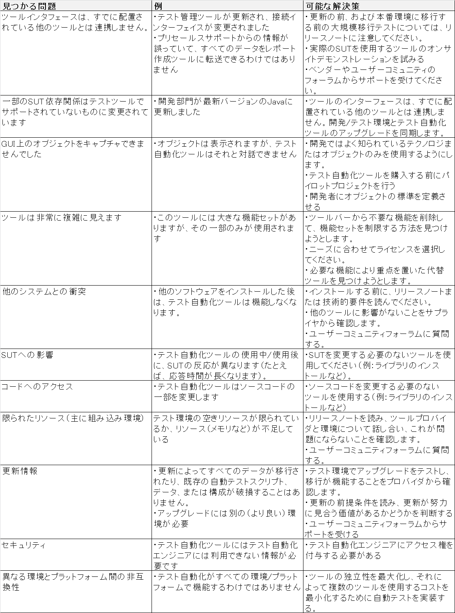

Test Automation Engineer
========================

**目的**  
このドキュメントでは、テスト自動化ソリューションの設計、開発、および保守におけるテスト自動化エンジニア（TAE）の作業について説明します。 動的機能テストを自動化するための概念、方法、ツール、およびプロセスと、テスト管理、構成管理、欠陥管理、ソフトウェア開発プロセス、および品質保証との関係に焦点を当てています。
記載された方法は、一般に、様々なソフトウェアライフサイクルアプローチ（例えば、アジャイル、シーケンシャル、インクリメンタル、反復）、ソフトウェアの種類にわたって適用可能である。

**用語**
この文書では、次の頭字語が使用されています。
* CLI
  * コマンドラインインターフェイス
* EMTE
  * 同等の手動テストの取り組み
* gTAA
  * 汎用テスト自動化アーキテクチャー（テスト自動化ソリューションの青写真を提供）
* GUI
  * グラフィカルユーザインタフェース
* SUT
  * テスト対象のシステム、テストオブジェクトも参照
* TAA
  * テスト自動化アーキテクチャー（TASのアーキテクチャーを定義するためのgTAAのインスタンス化）
* TAE
  * テスト自動化エンジニア（結果として得られるTASの実装、その保守および技術的進化を含む、TAAの設計を担当する人）
* TAF
  * Test Automation Framework（テストハーネスやテストライブラリなどのアーティファクトを含むテスト自動化に必要な環境）
* TAM 
  * Test Automation Manager（TASの開発と進化の計画と監督を担当する人）
* TAS 
  * Test Automation Solution（テストハーネスやテストライブラリなどのアーティファクトを含む、TAAの実現/実装）
* UI
  * ユーザーインターフェース

## 1.テスト自動化の紹介と目的 -  30分

**キーワード**
APIテスト、CLIテスト、GUIテスト、テスト対象システム、テスト自動化アーキテクチャ、テスト自動化
フレームワーク、テスト自動化戦略、テスト自動化、テストスクリプト、テストウェア

**導入のための学習目的とテスト自動化の目的**

**1.1 テスト自動化の目的**
* ALTA-E-1.1.1（K2）テスト自動化の目的、利点、不利な点、および制限を説明する

**1.2 テスト自動化における成功要因**
* ALTA-E-1.2.1（K2）テスト自動化プロジェクトの技術的成功要因の特定

### 1.1 テスト自動化の目的

ソフトウェアテストでは、テストの自動化（テストの自動実行を含む）は、以下のうちの1つ以上のタスクです。
* テストの前提条件を制御および設定するための専用のソフトウェアツールの使用
* テストを実行する
* 実際の結果と予測された結果との比較

干渉を最小限に抑えるために、テストに使用するソフトウェアをテスト対象システム（SUT）自体から分離することをお勧めします。 テストソフトウェアをSUTに配置する必要がある組み込みシステムなど、例外があります。

テストの自動化は、さまざまなバージョンのSUTや環境で多くのテストケースを一貫して繰り返し実行するのに役立ちます。 しかし、テストの自動化は、人間の介入なしにテストスイートを実行するためのメカニズム以上のものです。 それには、テストウェアを設計するプロセスが含まれます。
* ソフトウェア
* ドキュメント
* テストケース
* テスト環境
* テストデータ

テストウェアは、次のようなテスト活動に必要です。
* 自動テストケースの実装
* 自動テストの実行を監視および制御する
* 自動テスト結果の解釈、報告、記録

テスト自動化には、SUTと対話するためのさまざまなアプローチがあります。
* SUTのクラス、モジュール、またはライブラリへのパブリックインタフェースを介したテスト（APIテスト）
* SUTのユーザーインターフェイスを介したテスト（GUIテストやCLIテストなど）
* サービスまたはプロトコルによるテスト

テスト自動化の目的は次のとおりです。
* テスト効率の向上
* より広い機能範囲を提供する
* 総テストコストを削減する
* 手動テスターでは不可能なテストの実行
* テスト実行期間の短縮
* テスト頻度の増加/テストサイクルに必要な時間の短縮

テスト自動化の利点は次のとおりです。
* ビルドごとにより多くのテストを実行できます
* 手動では実行できないテストを作成する可能性（リアルタイム、リモート、並行テスト）
* テストはより複雑になる可能性があります
* テストの実行速度が向上
* テストはオペレータエラーの影響を受けにくい
* テストリソースのより効果的かつ効率的な使用
* ソフトウェア品質に関する素早いフィードバック
* システムの信頼性（再現性、一貫性など）の向上
* テストの一貫性の向上

テスト自動化の短所は次のとおりです。
* 追加費用がかかる
* TASをセットアップするための初期投資
* 追加のテクノロジが必要
* チームには開発と自動化のスキルが必要
* 進行中のTASメンテナンス要件
* テストの実行を犠牲にしてテストケースの自動化に焦点を合わせるなど、テストの目的から気を散らす可能性がある
* テストはより複雑になる可能性があります
* 自動化によって追加のエラーが発生する可能性があります

テスト自動化の制限は次のとおりです。
* すべての手動テストを自動化できるわけではありません
* 自動化は機械で解釈可能な結果のみを確認できます
* 自動化は、自動テストオラクルによって検証できる実際の結果のみを確認できます。
* 探索的テストの代わりにはならない

#### 1.2テスト自動化における成功要因

次の成功要因は、稼働中のテスト自動化プロジェクトに適用されるため、プロジェクトの長期的な成功に影響を与える影響に焦点が当てられています。 試験段階でテスト自動化プロジェクトの成功に影響を与える要因は、ここでは考慮されません。

テスト自動化の主な成功要因は次のとおりです。

* テスト自動化アーキテクチャー（TAA）
  * テスト自動化アーキテクチャー（TAA）は、ソフトウェア製品のアーキテクチャーと非常に密接に連携しています。 アーキテクチャがどの機能要件および非機能要件をサポートする必要があるかは明らかであるはずです。 通常これが最も重要な要件になります。
  * 多くの場合、TAAは保守性、パフォーマンス、および習得性のために設計されています。 （これらおよびその他の非機能特性の詳細については、ISO / IEC 25000：2014を参照してください。）SUTのアーキテクチャーを理解しているソフトウェアエンジニアを巻き込むことは有用です。

* SUTテスタビリティ
  * SUTは自動テストをサポートするテスト容易性のために設計される必要があります。 GUIテストの場合、これはSUTが可能な限りGUIの相互作用とデータをグラフィカルインタフェースの外観から切り離すことを意味します。 APIテストの場合、これをテストできるようにするには、より多くのクラス、モジュール、またはコマンドラインインターフェイスをパブリックとして公開する必要がある可能性があります。
  * SUTのテスト可能部分を最初にターゲットにする必要があります。 一般に、テスト自動化の成功における重要な要素は、自動テストスクリプトの実装の容易さにあります。 この目標を念頭に置いて、また概念実証を成功させるために、テスト自動化エンジニア（TAE）は、自動化で簡単にテストされ、そこから開始するSUTのモジュールまたはコンポーネントを識別する必要があります。

* テスト自動化戦略
  * SUTの保守性と一貫性に対処する、実用的で一貫性のあるテスト自動化戦略。
  * SUTの新旧両方の部分に同じ方法でテスト自動化戦略を適用することは不可能かもしれません。 自動化戦略を作成するときは、コードのさまざまな部分に適用することのコスト、利点、およびリスクを考慮してください。
  * 結果の一貫性を確認するために、自動テストケースを使用してユーザーインターフェイスとAPIの両方をテストすることを検討する必要があります。

* テスト自動化フレームワーク（TAF）
  * テスト自動化フレームワーク（TAF）は、使いやすく、文書化されており、保守が容易で、テストを自動化するための一貫したアプローチをサポートしています。
  * 使いやすく保守可能なTAFを確立するためには、次のことを実行する必要があります。
    * 報告機能を実装する：テスト報告は、SUTの品質に関する情報（合格/不合格/エラー/未実行/中止、統計など）を提供する必要があります。 報告は関係するテスター、テスト管理者、開発者、プロジェクト管理者および他の利害関係者に品質の概要を得るための情報を提供するべきです。
    * 簡単なトラブルシューティングを可能にする：テストの実行とログ記録に加えて、TAFは失敗したテストをトラブルシューティングするための簡単な方法を提供する必要があります。 テストは次の理由で失敗する可能性があります。
      * SUTで見つかった障害
      * TASで見つかった障害
      * テスト自体またはテスト環境に問題がある
    * テスト環境に適切に対処する：テストツールはテスト環境の一貫性に依存しています。 自動テストでは、専用のテスト環境を用意する必要があります。 テスト環境とテストデータの制御がない場合、テストの設定がテスト実行の要件を満たしていない可能性があり、誤った実行結果が生じる可能性があります。
    * 自動テストケースの文書化：テスト自動化の目標、たとえば、アプリケーションのどの部分をどの程度テストするか、どの属性をテストするか（機能的および非機能的）を明確にする必要があります。 これは明確に説明され文書化されなければならない。
    * 自動テストの追跡：TAFは、テスト自動化エンジニアがテストケースまでの個々のステップを追跡するための追跡をサポートするものとします。
    * 容易なメンテナンスを可能にする：理想的には、メンテナンスがテスト自動化作業の重要な部分を消費しないように、自動テストケースは容易にメンテナンスされるべきです。 さらに、保守作業はSUTに加えられた変更の規模に比例する必要があります。 これを行うには、ケースを簡単に分析可能、変更可能、および拡張可能にする必要があります。 さらに、テストウェアの自動再利用は、変更が必要なアイテムの数を最小限に抑えるために高い必要があります。
    * 自動テストを常に最新の状態に保ちます。新しい要件または変更された要件によってテストまたはテストスイート全体が失敗する場合は、失敗したテストを無効にしないでください。修正してください。
    * 展開を計画する：テストスクリプトを簡単に展開、変更、および再展開できるようにします。
    * 必要に応じてテストを廃止する：自動テストスクリプトが不要になった場合でも簡単に廃止できるようにします。
    * SUTの監視と復元：実際には、テストケースまたは一連のテストケースを継続的に実行するには、SUTを継続的に監視する必要があります。 SUTに致命的なエラー（クラッシュなど）が発生した場合、TAFには回復し、現在のケースをスキップして、次のケースでテストを再開する機能が必要です。

テスト自動化コードは保守が複雑になる可能性があります。 SUT用のコードと同じくらいテスト用のコードがあるのは珍しいことではありません。 そのため、テストコードを保守可能にすることが最も重要です。 これは、使用されているテストツール、使用されている検証の種類、および保守が必要なテストウェアの成果物（テスト入力データ、テストオラクル、テストレポートなど）が異なるためです。

これらの保守上の考慮事項を念頭に置いて、実行する必要がある重要な項目に加えて、次のように実行してはいけないことがいくつかあります。

* インターフェースに敏感なコードを作成しないでください（つまり、グラフィカルインターフェースの変更やAPIの重要ではない部分の変更による影響を受けます）。
* データの変更に敏感なテスト自動化、または特定のデータ値への依存度が高い（たとえば、他のテスト出力に依存するテスト入力）テスト作成を自動化しないでください。
* 状況（オペレーティングシステムの日付と時刻、オペレーティングシステムのローカリゼーションパラメータ、他のアプリケーションの内容など）に敏感な自動化環境を作成しないでください。 この場合は、環境を制御できるように、必要に応じてテストスタブを使用することをお勧めします。

成功要因が多ければ多いほど、テスト自動化プロジェクトは成功する可能性が高くなります。 すべての要因が必要なわけではなく、実際にはすべての要因が満たされることはめったにありません。 テスト自動化プロジェクトを開始する前に、適切な要因、および選択したアプローチのリスクを考慮に入れていないこと、およびプロジェクトの状況を考慮して、プロジェクトの成功の可能性を分析することが重要です。 TAAが整備されたら、どの品目が不足しているか、まだ作業が必要かを調査することが重要です。

## 2. テスト自動化の準備 -  165分

**キーワード**
テスタビリティ、ドライバ、侵入レベル、スタブ、テスト実行ツール、テストフック、テスト自動化マネージャ
テスト自動化の準備のための学習目標

**2.1 テスト自動化に影響するSUT要因**
* ALTA-E-2.1.1（K4）テスト中のシステムを分析して適切な自動化ソリューションを決定する

**2.2 ツールの評価と選択**
* ALTA-E-2.2.1（K4）特定プロジェクトのテスト自動化ツールを分析し、技術的発見事項と推奨事項を報告する

**2.3 テスタビリティと自動化のための設計**
* ALTA-E-2.3.1（K2）SUTに適用可能な「テスト容易化設計」および「テスト自動化設計」方法を理解する

### 2.1 テスト自動化に影響するSUT要因

SUTのコンテキストとその環境を評価する際には、テストの自動化に影響を与える要因を特定し、適切な解決策を決定する必要があります。 これらには次のものがあります。

* SUTインターフェース
  * 自動テストケースはSUTに対してアクションを起動します。 このために、ＳＵＴはそれを介してＳＵＴを制御することができるインターフェースを提供しなければならない。 これはUIコントロールを介して行うことができますが、低レベルのソフトウェアインターフェースを介しても行うことができます。 さらに、いくつかのテストケースは、通信レベルで（例えば、ＴＣＰ ／ ＩＰ、ＵＳＢ、または独自のメッセージングインターフェースを使用して）インターフェースすることが可能であり得る。
  * SUTの分解により、テストの自動化が異なるテストレベルでSUTと連動することが可能になります。 SUTがこれを適切にサポートしている場合に限り、特定のレベル（たとえばコンポーネントおよびシステムレベル）でテストを自動化することが可能です。 たとえば、コンポーネントレベルでは、テストに使用できるユーザーインターフェイスがない可能性があるため、カスタマイズ可能な別のソフトウェアインターフェイス（テストフックとも呼ばれる）を使用できる必要があります。
* サードパーティ製ソフトウェア
  * 多くの場合、SUTは、自組織で書かれたソフトウェアで構成されているだけでなく、第三者によって提供されたソフトウェアも含んでいます。 場合によっては、このサードパーティソフトウェアでテストが必要になることがあります。テストの自動化が正当化される場合は、APIの使用など、別のテスト自動化ソリューションが必要になることがあります。
* 侵入のレベル
  * さまざまなテスト自動化アプローチ（さまざまなツールを使用）では、さまざまなレベルの侵入があります。 特に自動テストのためにSUTに必要な変更の数が多いほど、侵入のレベルが高くなります。 専用のソフトウェアインターフェイスを使用すると、高レベルの侵入が必要ですが、既存のUI要素を使用すると、低レベルの侵入が発生します。 SUTのハードウェア要素（キーボード、ハンドスイッチ、タッチスクリーン、通信インタフェースなど）を使用すると、さらに高いレベルの侵入を受けることになります。
  * より高いレベルの侵入に伴う問題は、誤警報の危険性です。 TASはテストによって課される侵入のレベルが原因であるかもしれない失敗を示すことができますがソフトウェアシステムが実際のライブ環境で使用されているときこれらは起こりそうもありません。 高レベルの侵入によるテストは通常、テスト自動化アプローチのためのより簡単な解決策です。
* 異なるSUTアーキテクチャ
  * SUTのアーキテクチャが異なれば、異なるテスト自動化ソリューションが必要になる可能性があります。 COMテクノロジを使用してC ++で書かれたSUTには、Pythonで書かれたSUTとは異なるアプローチが必要です。 これらの異なるアーキテクチャを同じテスト自動化戦略で処理することは可能かもしれませんが、それにはそれらをサポートする機能を備えたハイブリッド戦略が必要です。
* SUTのサイズと複雑さ
  * 現在のSUTのサイズと複雑さ、および将来の開発計画を検討してください。 小規模でシンプルなSUTの場合、複雑で非常に柔軟なテスト自動化アプローチは保証されません。 単純なアプローチがより適しているかもしれません。 逆に、非常に大きく複雑なSUTに対して小さくて単純なアプローチを実装するのは賢明ではないかもしれません。 しかし時には、複雑なSUTに対しても小さくて単純なものから始めるのが適切ですが、これは一時的なアプローチであるべきです（第3章以前の詳細を参照）。

ＵＴが既に利用可能である場合、ここで説明されるいくつかの要因（例えば、サイズおよび複雑さ、利用可能なソフトウェアインターフェース）が知られているが、ほとんどの場合、テスト自動化の開発はＳＵＴが利用可能になる前に始まるべきである。 これが起こるときいくつかの事柄が推定される必要があるかまたはTAEは必要とされるソフトウェアインタフェースを指定することができます。 （詳細はセクション2.3を参照）

SUTがまだ存在しない場合でも、テスト自動化計画を立てることができます。 例えば：
* 要件（機能的または非機能的）が分かっている場合、それらをテストするための手段を識別することと共に、それらの要件から自動化の候補を選択することができる。 自動化の要件の特定やテスト自動化戦略の決定など、これらの候補の自動化の計画を立てることができます。
* アーキテクチャおよび技術設計が開発されているとき、テストをサポートするためのソフトウェアインターフェースの設計を引き受けることができる。

### 2.2 ツールの評価と選択

ツールの選択と評価プロセスの主な責任は、Test Automation Manager（TAM）にあります。 しかし、TAEはTAMに情報を提供し、多数の評価および選択活動を実施することに関与します。 ツールの評価と選択のプロセスの概念はFoundation Levelで導入され、このプロセスの詳細はAdvancedLevel  -  Test Manager Syllabus [ISTQB-AL-TM]に記載されています。

TAEは、ツールの評価と選択のプロセス全体に関与しますが、以下の活動に特定の貢献をします。

* 組織の成熟度の評価とテストツールサポートの機会の特定
* テストツールサポートのための適切な目的の評価
* 潜在的に適切なツールに関する情報の識別と収集
* 目的やプロジェクトの制約に対してツール情報を分析する
* 堅実なビジネスケースに基づく費用対効果の比率の推定
* 適切なツールに関する推奨事項の作成
* ツールとSUTコンポーネントとの互換性の確認

機能テスト自動化ツールは、自動化プロジェクトによって発生するすべての期待や状況を満たすことができないことがよくあります。 以下は、これらの種類の問題の一連の例です（ただし、これは完全なリストではありません）。

### 2.3 テスタビリティと自動化のための設計

ＳＵＴのテスト容易性（例えば、ＳＵＴの制御および観察可能性を可能にするための試験をサポートするソフトウェアインターフェースの利用可能性）は、ＳＵＴの他の機能の設計および実装と並行して設計および実装されるべきである。 これはソフトウェア設計者によって（テスト容易性はシステムの非機能的要件の１つにすぎないので）行うことができるが、しばしばこれはＴＡＥによって、またはＴＡＥの関与によって行われる。

テスト容易化のための設計は、いくつかの部分で構成されています。
* 可観測性：SUTはシステムへの洞察を与えるインターフェースを提供する必要があります。 テストケーススキャンでは、これらのインタフェースを使用して、たとえば、予想される動作が実際の動作と等しいかどうかを確認します。
* 制御（能力）：SUTは、SUTに対してアクションを実行するために使用できるインターフェースを提供する必要がある。 これは、ＵＩ要素、ファンクションコール、通信要素（例えば、ＴＣＰ ／ ＩＰまたはＵＳＢプロトコル）、電子信号（物理的スイッチ用）などであり得る。
* 明確に定義されたアーキテクチャ：テスト容易性のための設計の3番目に重要な部分は、すべてのテストレベルで制御と可視性を提供する明確でわかりやすいインタフェースを提供するアーキテクチャです。

TAEは、自動テストを含め、SUTを効果的に（適切な領域をテストして重大なバグを見つける）、効率的に（あまり手間をかけずに）テストする方法を検討します。 特定のソフトウェアインターフェイスが必要な場合は、TAEによって指定され、開発者によって実装される必要があります。 開発作業を計画し予算を組むことができるように、プロジェクトの早い段階でテスト容易性と必要に応じて追加のソフトウェアインタフェースを定義することが重要です。

テストをサポートするソフトウェアインタフェースの例は次のとおりです。

* 現代のスプレッドシートの強力なスクリプト機能。
* 入手できない、または購入するには高すぎるソフトウェアおよび/またはハードウェア（電子金融取引、ソフトウェアサービス、専用サーバー、電子ボード、機械部品など）をシミュレートするためにスタブまたはモックを適用することで、特定のインタフェースでソフトウェアがない場合でもテストできます。 
* ソフトウェアインターフェイス（またはスタブとドライバ）を使用してエラー状態をテストできます。 内蔵ハードディスクドライブ（ＨＤＤ）を有する装置を考える。 このHDDを制御するソフトウェア（ドライバと呼ばれる）は、HDDの故障や消耗についてテストする必要があります。 HDDが故障するのを待つことによってこれを行うことは非常に効率的ではありません（または信頼できません）。 欠陥のあるまたは遅いＨＤＤをシミュレートするソフトウェアインターフェースを実装することは、ドライバソフトウェアが正しく動作することを検証することができる（例えば、エラーメッセージを提供し、再試行する）。
* まだ利用可能なUIがないときにSUTをテストするために別のソフトウェアインタフェースを使用することができます（そしてこれはとにかくより良いアプローチであると考えられています）。 技術システム内の組込みソフトウェアは、装置内の温度を監視し、温度があるレベルを超えたときに冷却機能を開始させることをしばしば必要とする。 これは、温度を特定するためにソフトウェアインタフェースを使用してハードウェアなしでテストすることができる。
* 状態遷移テストは、SUTの状態動作を評価するために使用されます。 SUTが正しい状態にあるかどうかを確認する方法は、この目的のために設計されたカスタマイズされたソフトウェアインターフェースを介してSUTに問い合わせることです（これにはリスクも含まれますが、セクション2.1の侵入レベルを参照）。

自動化のための設計は、次のことを考慮する必要があります。
* 既存のテストツールとの互換性を早期に確立する必要があります。
* テストツールの互換性の問題は、重要な機能のテストを自動化する機能に影響を与える可能性があるため重要です（たとえば、グリッドコントロールとの互換性がないと、そのコントロールを使用するすべてのテストが妨げられます）。
* 解決策には、プログラムコードの開発とAPIの呼び出しが必要な場合があります。

テスト容易化のための設計は、優れたテスト自動化アプローチにとって最も重要であり、そして手動テスト実行にも利益をもたらし得る。

## 3.汎用テスト自動化アーキテクチャ -  270分

**キーワード**
キャプチャ/再生、データ駆動型テスト、汎用テスト自動化アーキテクチャ、キーワード駆動型テスト、線形
スクリプティング、モデルベーステスト、プロセス駆動型スクリプティング、構造化スクリプティング、テストアダプテーションレイヤ、テスト
自動化アーキテクチャ、テスト自動化フレームワーク、テスト自動化ソリューション、テスト定義層、テスト
実行層、テスト生成層

**汎用テスト自動化アーキテクチャの学習目標**

**3.1 gTAAの紹介**
* ALTA-E-3.1.1（K2）gTAAの構造を説明する

**3.2 TAAデザイン**
* ALTA-E-3.2.1（K4）特定のプロジェクトに適したTAAを設計する
* ALTA-E-3.2.2（K2）TAA内でレイヤが果たす役割を説明する
* ALTA-E-3.2.3（K2）TAAの設計上の考慮事項を理解する
* ALTA-E-3.2.4（K4）特定のTASの実装、使用、およびメンテナンス要件の要因を分析する

**3.3 TAS開発**
* ALTA-E-3.3.1（K3）汎用TAA（gTAA）のコンポーネントを適用して専用のTAAを作成する
* ALTA-E-3.3.2（K2）部品の再利用性を確認する際に考慮すべき要素を説明する

★作成中★

## 4つの展開リスクと偶発事象 -  150分

**キーワード**
リスク、リスク軽減、リスク評価、製品リスク
展開リスクと偶発事象のための学習目標

**4.1 テスト自動化アプローチの選択と展開/ロールアウトの計画**
* ALTA-E-4.1.1（K3）効果的なテストツールのパイロット活動と展開活動を支援するガイドラインを適用する

**4.2 リスク評価と緩和戦略**
* ALTA-E-4.2.1（K4）展開リスクを分析し、テスト自動化プロジェクトの失敗につながる可能性がある技術的問題を特定し、軽減戦略を計画する

**4.3 テスト自動化保守**
* ALTA-E-4.3.1（K2）どの要素がTASの保守容易性を支持し影響するのかを理解する

★作成中★

# 5 テスト自動化レポートおよびメトリック -  165分

**キーワード**
自動化コードの欠陥密度、カバレッジ、トレーサビリティマトリクス、同等の手動テスト作業、メトリクス、テスト
ロギング、テスト報告

**テスト自動化レポート作成およびメトリクスに関する学習目標**

**5.1 TASメトリクスの選択**
* ALTA-E-5.1.1（K2）テスト自動化戦略と有効性の監視に使用できる測定基準を分類する

**5.2 測定の実施**
* ALTA-E-5.2.1（K3）技術および管理を支援するための測定基準収集方法の実施
必要条件 テスト自動化の測定をどのように実施できるかを説明する。

**5.3 TASとSUTのロギング**
* ALTA-E-5.2.1（K3）技術要件および管理要件をサポートするためにメトリクス収集方法を実装します。 テスト自動化の測定をどのように実施できるかを説明する。

**5.4 テスト自動化レポート**
* ALTA-E-5.4.1（K2）テスト実施報告書の作成および公表方法の説明

★作成中★

## 6 手動テストを自動環境に移行する -  120分。

**キーワード**
確認テスト、回帰テスト

**手動テストを自動環境に移行するための学習目標**

**6.1 自動化の基準**
* ALTA-E-6.1.1（K3）自動化試験の適合性を判断するための基準の適用
* ALTA-E-6.1.2（K2）手動テストから自動テストへの移行における要因を理解する

**6.2 回帰テスト内で自動化を実装するために必要な手順を特定する**
* ALTA-E-6.2.1（K2）自動回帰テストを実施する際に考慮すべき要素を説明する

**6.3 新機能テストで自動化を実装する際に考慮する要素**
* ALTA-E-6.3.1（K2）新機能テスト内で自動化を実装する際に考慮すべき要素を説明する

**6.4 確認テストの自動化を実装する際に考慮する要素**
* ALTA-E-6.4.1（K2）自動確認テストを実施する際に考慮すべき要素を説明する

★作成中★

## 7 TASの確認 -  120分。

**キーワード**
検証

**TASを検証するための学習目標**

**7.1 自動テスト環境コンポーネントの確認**
* ALTA-E-7.1.1（K3）テストツールの設定を含む自動テスト環境の正しさを検証する

**7.2 自動テストスイートの確認**
* ALTA-E-7.2.1（K3）与えられた自動テストスクリプトやテストスイートに対する正しい振る舞いを検証する

★作成中★

## 8 継続的改善 -  150分

**キーワード**
メンテナンス

**継続的改善のための学習目標**

**8.1 テスト自動化を改善するためのオプション**
* ALTA-E-8.1.1（K4）配備されたテスト自動化ソリューションの技術的側面を分析し、改善のための推奨事項を提供する

**8.2 テスト自動化を環境とSUTの変更に適応させる**
* ALTA-E-8.2.1（K4）特定の一連のテスト環境またはSUTの変更後にどこで統合および更新を行うべきかを理解するために、テスト環境のコンポーネント、ツール、およびサポート関数ライブラリを含む自動テストウェアを分析する

★作成中★